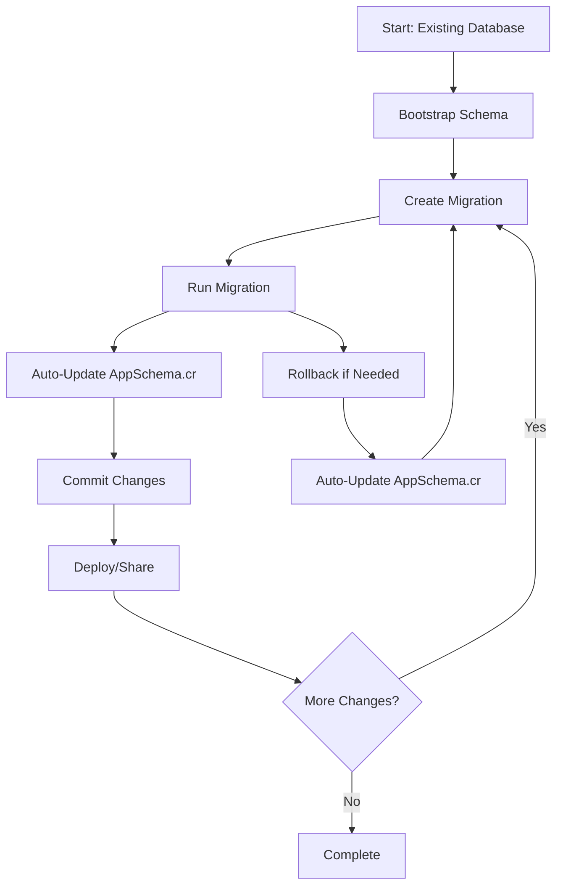

# CQL Schema Migration Integration Guide

This document describes the integration between CQL's SchemaDump and Migration systems, which together provide a complete solution for managing database schema evolution while maintaining an up-to-date AppSchema.cr file.

## Architecture Overview

The integration consists of three core components working together:

### 1. **SchemaDump** - Schema Reverse Engineering

- **Purpose**: Reverse-engineers existing database schemas
- **Primary Use Cases**:
  - Bootstrapping new projects from existing databases
  - Creating schema snapshots
  - Generating base schemas for comparison
- **Key Features**:
  - Supports SQLite, PostgreSQL, and MySQL
  - Generates type-safe Crystal schema definitions
  - Handles tables, columns, indexes, and foreign keys

### 2. **Migrator** - Schema Change Management

- **Purpose**: Manages incremental schema changes through versioned migrations
- **Primary Use Cases**:
  - Applying schema modifications in development/production
  - Rolling back problematic changes
  - Tracking migration history
- **Key Features**:
  - Version-tracked migrations
  - Rollback capability
  - Transaction safety
  - **NEW**: Automatic schema file synchronization

### 3. **AppSchema.cr** - Current Schema State

- **Purpose**: Central file representing the current database schema state
- **Primary Use Cases**:
  - Type-safe database interactions in application code
  - Team synchronization of schema changes
  - Production deployment validation
- **Key Features**:
  - Auto-generated from current database state
  - Always reflects post-migration schema
  - Version-controlled alongside application code

## Integration Workflow

### Typical Development Workflow



### Step-by-Step Process

#### 1. **Initial Bootstrap** (One-time setup)

```crystal
# Configure the migrator
config = CQL::MigratorConfig.new(
  schema_file_path: "src/schemas/app_schema.cr",
  schema_name: :AppSchema,
  schema_symbol: :app_schema,
  auto_sync: true
)

migrator = MyDB.migrator(config)

# Bootstrap from existing database
migrator.bootstrap_schema
```

#### 2. **Development Cycle**

```crystal
# Create migration classes
class AddUserRoles < CQL::Migration(5)
  def up
    schema.alter :users do
      add_column :role, String, default: "user"
    end
  end

  def down
    schema.alter :users do
      drop_column :role
    end
  end
end

# Apply migrations (auto-updates AppSchema.cr)
migrator.up

# AppSchema.cr is now updated automatically!
```

#### 3. **Team Synchronization**

```crystal
# New team member or after pulling changes
migrator.up                           # Apply any new migrations
migrator.verify_schema_consistency    # Ensure everything is in sync
```

#### 4. **Production Deployment**

```crystal
# Production config (manual control)
prod_config = CQL::MigratorConfig.new(
  auto_sync: false  # Manual control in production
)

migrator = ProdDB.migrator(prod_config)
migrator.up                           # Apply migrations
migrator.verify_schema_consistency    # Verify consistency
migrator.update_schema_file          # Update if needed
```

## Configuration Options

### MigratorConfig

```crystal
config = CQL::MigratorConfig.new(
  schema_file_path: "src/schemas/app_schema.cr",  # Where to save schema file
  schema_name: :AppSchema,                        # Constant name in schema file
  schema_symbol: :app_schema,                     # Symbol name for schema
  auto_sync: true                                 # Auto-update after migrations
)
```

### Environment-Specific Configurations

```crystal
# Development: Auto-sync enabled for rapid iteration
dev_config = CQL::MigratorConfig.new(
  schema_file_path: "src/schemas/app_schema.cr",
  auto_sync: true
)

# Production: Manual control for safety
prod_config = CQL::MigratorConfig.new(
  schema_file_path: "src/schemas/production_schema.cr",
  schema_name: :ProductionSchema,
  auto_sync: false
)

# Testing: Separate schema file for test isolation
test_config = CQL::MigratorConfig.new(
  schema_file_path: "src/schemas/test_schema.cr",
  schema_name: :TestSchema,
  auto_sync: true
)
```

## Key Integration Features

### 1. **Automatic Schema Synchronization**

- **After Up Migrations**: AppSchema.cr automatically updated to reflect new schema state
- **After Rollbacks**: Schema file updated to reflect rolled-back state
- **Manual Control**: Option to disable auto-sync for production environments

### 2. **Schema Consistency Verification**

```crystal
# Verify current database matches schema file
consistent = migrator.verify_schema_consistency
if !consistent
  puts "Schema out of sync - run migrator.update_schema_file"
end
```

### 3. **Bootstrap from Existing Database**

```crystal
# Start with existing database, generate initial AppSchema.cr
migrator.bootstrap_schema
```

### 4. **Manual Schema Updates**

```crystal
# Force update schema file to match current database
migrator.update_schema_file
```

## Enhanced Migration Methods

The integrated Migrator provides several new methods:

```crystal
# Bootstrap schema from existing database
migrator.bootstrap_schema

# Manually update schema file
migrator.update_schema_file

# Verify schema file matches database
consistent = migrator.verify_schema_consistency

# All existing methods work with auto-sync
migrator.up                  # Auto-updates schema file
migrator.down               # Auto-updates schema file
migrator.rollback           # Auto-updates schema file
migrator.redo               # Auto-updates schema file
```

## Best Practices

### 1. Version Control Integration

Always commit both migrations and updated schema files:

```bash
git add migrations/005_add_user_roles.cr
git add src/schemas/app_schema.cr
git commit -m "Add user roles migration and update schema"
```

### 2. Team Workflow

- **Before starting work**: `migrator.up` to apply any new migrations
- **After creating migrations**: Verify schema file is updated
- **Before committing**: Ensure both migration and schema file are included

### 3. Production Deployment

- Use `auto_sync: false` in production
- Apply migrations first: `migrator.up`
- Verify consistency: `migrator.verify_schema_consistency`
- Update schema file if needed: `migrator.update_schema_file`

### 4. Conflict Resolution

When schema file conflicts occur:

1. Pull latest changes
2. Run `migrator.up` to apply migrations
3. Run `migrator.update_schema_file` to regenerate schema
4. Commit the updated schema file

### 5. Database Consistency

- Always run pending migrations before using schema file
- AppSchema.cr represents the expected post-migration state
- Use `verify_schema_consistency` in CI/CD pipelines

## Important Considerations

### 1. **Schema File Accuracy**

The AppSchema.cr file represents the database state **after** all applied migrations. It's generated by inspecting the actual database, ensuring accuracy.

### 2. **Rollback Safety**

When rolling back migrations, the schema file is automatically updated to reflect the rolled-back state, ensuring consistency.

### 3. **Team Synchronization**

The schema file serves as a source of truth for the current database schema, making it easier for teams to stay synchronized.

### 4. **Production Safety**

Production environments should use `auto_sync: false` for manual control over when schema files are updated.

### 5. **Database-First vs Code-First**

This integration supports a **database-first** approach where the actual database state (after migrations) determines the schema file content.

## Troubleshooting

### Schema File Out of Sync

```crystal
# Check if schema file matches database
consistent = migrator.verify_schema_consistency

# If not consistent, update it
if !consistent
  migrator.update_schema_file
end
```

### Migration Conflicts

```bash
# After resolving migration conflicts
migrator.up
migrator.update_schema_file
git add src/schemas/app_schema.cr
git commit -m "Update schema after resolving conflicts"
```

### Production Deployment Issues

```crystal
# Verify before deployment
migrator.verify_schema_consistency

# Apply migrations
migrator.up

# Verify again
migrator.verify_schema_consistency
```

## Example Implementation

See `examples/schema_migration_workflow.cr` for a complete working example demonstrating:

- Initial bootstrap
- Migration creation and application
- Automatic schema updates
- Rollback scenarios
- Team workflows
- Configuration examples

## Benefits of Integration

### ✅ **Always Up-to-Date Schema Files**

No manual maintenance required - schema files automatically reflect database state.

### ✅ **No Schema Drift**

Schema file always matches actual database structure after migrations.

### ✅ **Type-Safe Database Interactions**

Generated schema files provide compile-time type safety for database operations.

### ✅ **Team Synchronization Made Easy**

Schema files in version control ensure all team members have consistent database schemas.

### ✅ **Production-Ready Deployment Process**

Manual control options for production with verification capabilities.

### ✅ **Rollback Safety with Schema Consistency**

Rolling back migrations automatically updates schema files to maintain consistency.

This integration provides a robust, automated solution for managing database schema evolution while maintaining type safety and team synchronization throughout the development lifecycle.
