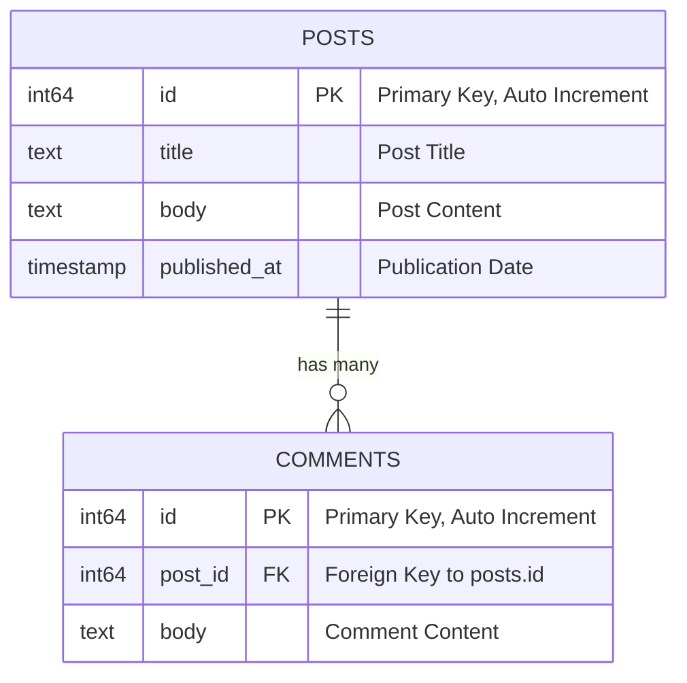

# HasMany

## CQL Active Record: `HasMany` Relationship Guide

In this guide, we'll focus on the `HasMany` relationship using CQL's Active Record syntax. This describes a one-to-many connection between models.

## **What is a `HasMany` Relationship?**

The `HasMany` relationship indicates that one entity (a record) is related to multiple other entities. For example, a **Post** can have many **Comments**. This relationship is a one-to-many mapping between two entities.

### Example Scenario: Posts and Comments



In a blogging system:

- A **Post** can have many **Comments**.
- Each **Comment** belongs to one **Post**.

This is a common one-to-many relationship where one post can have multiple comments, but each comment refers to only one post.

---

## Defining the Schema

We'll define the `posts` and `comments` tables in the schema using CQL's DSL.

```crystal
AcmeDB = CQL::Schema.define(
  :acme_db,
  adapter: CQL::Adapter::Postgres,
  uri: ENV["DATABASE_URL"]
) do
  table :posts do
    primary :id, Int64, auto_increment: true
    text :title
    text :body
    timestamp :published_at
  end

  table :comments do
    primary :id, Int64, auto_increment: true
    bigint :post_id
    text :body
  end
end
```

- **posts** table: Stores post details like `title`, `body`, and `published_at`.
- **comments** table: Stores comment details with a foreign key `post_id` that references the `posts` table.

---

## Defining the Models

Let's db_context the `Post` and `Comment` models and establish the `HasMany` and `BelongsTo` relationships in CQL.

### **Post Model**

```crystal
struct Post
  include CQL::ActiveRecord::Model(Int64)
  db_context AcmeDB, :posts

  property id : Int64?
  property title : String
  property body : String
  property published_at : Time?

  # Initializing a new post
  def initialize(@title : String, @body : String, @published_at : Time? = Time.utc)
  end

  # Association: A Post has many Comments
  # The `foreign_key` option specifies the column on the `comments` table
  # that references the `posts` table.
  has_many :comments, foreign_key: :post_id
end
```

- The `has_many :comments, Comment, foreign_key: :post_id` association in the `Post` model defines that each post can have multiple comments. The `comments` table must have a `post_id` column.

### **Comment Model**

```crystal
struct Comment
  include CQL::ActiveRecord::Model(Int64)
  db_context AcmeDB, :comments

  property id : Int64?
  property post_id : Int64?
  property body : String

  # Initializing a comment. Post can be associated later or by the collection.
  def initialize(@body : String, @post_id : Int64? = nil)
  end

  # Association: A Comment belongs to one Post
  belongs_to :post, Post, :post_id
end
```

- The `belongs_to :post, Post, :post_id` in the `Comment` model links each comment back to its post.

## Working with the `HasMany` Collection

When you access a `has_many` association (e.g., `post.comments`), you get a collection proxy object that offers several methods to query and manipulate the associated records.

### **Creating and Adding Records**

```crystal
# Fetch or create a Post
post = Post.find_or_create_by(title: "HasMany Guide Post", body: "Content for HasMany.")
post.save! if !post.persisted? # Ensure post is saved and has an ID

# Option 1: Using `create` on the collection (builds, sets FK, saves, adds to collection)
comment1 = post.comments.create(body: "First comment via create!")
puts "Comment 1: #{comment1.body}, Post ID: #{comment1.post_id}"

# Option 2: Using `build` on the collection (builds, sets FK, but does NOT save yet)
comment2 = post.comments.build(body: "Second comment via build.")
# comment2 is now associated with post (comment2.post_id == post.id) but not saved.
puts "Comment 2 (unsaved): #{comment2.body}, Post ID: #{comment2.post_id}"
comment2.save!
puts "Comment 2 (saved): #{comment2.id}"

# Option 3: Using `<<` operator (creates a new record from an instance and saves it)
# The Comment instance should ideally not have post_id set if `<<` handles it,
# or it should match the parent post. Behavior may vary; `create` is often clearer.
comment3 = Comment.new(body: "Third comment via << operator.")
post.comments << comment3 # This will save comment3 and associate it.
puts "Comment 3: #{comment3.body}, ID: #{comment3.id}, Post ID: #{comment3.post_id}"

# Option 4: Manual creation and association (less common for adding to existing parent)
# comment4 = Comment.new(body: "Fourth comment, manual.", post_id: post.id.not_nil!)
# comment4.save!
# post.comments.reload # Important to see it in the cached collection
```

### **Retrieving Records from the Collection**

The collection is enumerable and provides methods to access its records.

```crystal
# Fetch the post again to ensure a clean comments collection or use post.comments.reload
loaded_post = Post.find!(post.id.not_nil!)

puts "\nComments for Post: '#{loaded_post.title}'"
# Iterating through the collection (implicitly loads if not already loaded)
loaded_post.comments.each do |comment|
  puts "- #{comment.body} (ID: #{comment.id})"
end

# Get all comments as an array
all_comments_array = loaded_post.comments.all
puts "Total comments in array: #{all_comments_array.size}"

# Find a specific comment within the association
found_comment = loaded_post.comments.find_by(body: "First comment via create!")
if c = found_comment
  puts "Found comment by body: #{c.id}"
end

# Check for existence
is_present = loaded_post.comments.exists?(body: "Second comment via build.")
puts "Does 'Second comment via build.' exist? #{is_present}"

# Get size and check if empty
puts "Number of comments: #{loaded_post.comments.size}"
puts "Are there any comments? #{!loaded_post.comments.empty?}"

# Get first comment
first_comment = loaded_post.comments.first
puts "First comment body: #{first_comment.try(&.body)}"

# Get array of IDs
comment_ids = loaded_post.comments.ids
puts "Comment IDs: #{comment_ids}"
```

### **Reloading the Collection**

If the database might have changed, reload the collection:

```crystal
loaded_post.comments.reload # Fetches fresh data from DB
# or for a specific association on a model instance:
# loaded_post.reload_comments # if such a specific reloader is generated by has_many macro
```

The `has_many` macro generates `reload_{{association_name}}` (e.g., `reload_comments`).

### **Removing and Deleting Records**

**Deleting a specific comment from the association (and database):**

```crystal
comment_to_delete = loaded_post.comments.find_by(body: "Third comment via << operator.")
if ctd = comment_to_delete
  if loaded_post.comments.delete(ctd) # Pass instance or its ID
    puts "Successfully deleted comment ID: #{ctd.id}"
  else
    puts "Could not delete comment ID: #{ctd.id}"
  end
end
# Verify deletion
puts "Comment count after delete: #{loaded_post.comments.size}"
```

Note: The `delete` method on the collection typically removes the record from the database.

**Clearing the association (deletes all associated comments):**

```crystal
# First, add some comments if cleared previously
loaded_post.comments.create(body: "Temp comment 1 for clear test")
loaded_post.comments.create(body: "Temp comment 2 for clear test")
puts "Comments before clear: #{loaded_post.comments.size}"

loaded_post.comments.clear # Deletes all comments associated with this post from the database
puts "Comments after clear: #{loaded_post.comments.size}" # Should be 0
```

- `clear` usually implies deleting the associated records from the database. Be cautious with this method.

If you delete the parent record (`post.delete`), associated comments are _not_ automatically deleted unless `cascade: true` was specified in the `has_many` definition or database-level cascade rules are in place.

---

## Eager Loading

To avoid N+1 query problems when loading many posts and their comments, use joins:

```crystal
# Fetches all posts and their associated comments in a more optimized way (typically 2 queries)
posts_with_comments = Post.query.join(:comments).all(Post)

posts_with_comments.each do |p|
  puts "Post: #{p.title} has #{p.comments.size} comments (already loaded):"
  p.comments.each do |c| # Accesses the already loaded comments
    puts "  - #{c.body}"
  end
end
```

- `join(:comments)` tells CQL to fetch all comments for the retrieved posts using efficient JOIN operations.

---

## Summary

In this guide, we've explored the `HasMany` relationship in CQL. We covered:

- Defining `Post` and `Comment` models with `has_many` and `belongs_to` associations, including the `foreign_key` option.
- Interacting with the `has_many` collection using methods like `create`, `build`, `<<`, `all`, `find_by`, `exists?`, `size`, `delete`, and `clear`.
- Eager loading associations with `includes`.

### Next Steps

In the next guide, we'll build upon this ERD and cover the `ManyToMany` relationship.
