# CQL Performance Monitoring Architecture

## Overview

The CQL Performance Monitoring system has been refactored to follow SOLID principles and implement well-established design patterns, resulting in a more maintainable, extensible, and testable codebase.

## Architecture Diagram

The following diagram illustrates the overall architecture, showing the main components, their relationships, and how the design patterns are implemented:

```mermaid
classDiagram
    %% Core Interfaces
    class EventPublisher {
        <<interface>>
        +publish(event: MonitoringEvent): Void
        +subscribe(listener: EventListener): Void
    }

    class EventListener {
        <<abstract>>
        +handle_event(event: MonitoringEvent): Void
    }

    class QueryAnalyzer {
        <<abstract>>
        +analyze(sql: String, params: Array): AnalysisResult?
        +supports?(adapter: Adapter): Bool
    }

    class ReportGenerator {
        <<abstract>>
        +generate(data: ReportData): String
        +format(): String
    }

    class DatabasePlanStrategy {
        <<abstract>>
        +analyze(sql: String, params: Array, schema: Schema): QueryPlanResult
        +supports?(adapter: Adapter): Bool
    }

    %% Core Implementation Classes
    class PerformanceMonitor {
        -event_bus: EventPublisher
        -query_analyzer: QueryAnalyzer?
        -n_plus_one_detector: PerformanceDetector
        -query_profiler: EventListener
        -config: PerformanceConfig
        +after_query(sql: String, params: Array, execution_time: Time::Span): Void
        +generate_comprehensive_report(format: String): String
        +configure(): Void
        +initialize_with_schema(schema: Schema): Void
    }

    class EventBus {
        -listeners: Array~EventListener~
        +publish(event: MonitoringEvent): Void
        +subscribe(listener: EventListener): Void
    }

    %% Strategy Pattern - Database Analysis
    class StrategyBasedQueryAnalyzer {
        -strategies: Array~DatabasePlanStrategy~
        -schema: Schema
        +add_strategy(strategy: DatabasePlanStrategy): Void
        +analyze(sql: String, params: Array): AnalysisResult?
        +find_strategy(adapter: Adapter): DatabasePlanStrategy?
    }

    class PostgresPlanStrategy {
        +analyze(sql: String, params: Array, schema: Schema): QueryPlanResult
        +supports?(adapter: Adapter): Bool
    }

    class MySQLPlanStrategy {
        +analyze(sql: String, params: Array, schema: Schema): QueryPlanResult
        +supports?(adapter: Adapter): Bool
    }

    class SQLitePlanStrategy {
        +analyze(sql: String, params: Array, schema: Schema): QueryPlanResult
        +supports?(adapter: Adapter): Bool
    }

    %% Observer Pattern - Event Listeners
    class NPlusOneDetector {
        -query_history: Array~QueryExecutionEvent~
        -detection_window: Time::Span
        +handle_event(event: MonitoringEvent): Void
        -analyze_for_n_plus_one(event: QueryExecutionEvent): Void
    }

    class QueryProfiler {
        -execution_stats: Hash~String, ExecutionStats~
        +handle_event(event: MonitoringEvent): Void
        +get_stats(sql_pattern: String): ExecutionStats?
    }

    %% Strategy Pattern - Report Generation
    class TextReportGenerator {
        +generate(data: ReportData): String
        +format(): String
    }

    class JsonReportGenerator {
        +generate(data: ReportData): String
        +format(): String
    }

    class HtmlReportGenerator {
        +generate(data: ReportData): String
        +format(): String
    }

    class LoggerReportGenerator {
        +generate(data: ReportData): String
        +format(): String
        +log_beautiful_report(data: ReportData): Void
        +colorize(text: String, color: Symbol): String
        +generate_recommendations(issues: Array): Void
    }

    %% Factory Pattern
    class ReportGeneratorFactory {
        -generators: Hash~String, ReportGenerator~
        +create(format: String): ReportGenerator
        +register_generator(generator: ReportGenerator): Void
        +available_formats(): Array~String~
    }

    %% Data Classes
    class MonitoringEvent {
        <<abstract>>
        +timestamp: Time
        +context: Hash~String, String~
    }

    class QueryExecutionEvent {
        +sql: String
        +params: Array~DB::Any~
        +execution_time: Time::Span
        +result_count: Int32?
    }

    class PerformanceConfig {
        +query_profiling_enabled: Bool
        +n_plus_one_detection_enabled: Bool
        +plan_analysis_enabled: Bool
        +detection_window: Time::Span
    }

    %% Relationships
    PerformanceMonitor --> EventPublisher : uses
    PerformanceMonitor --> QueryAnalyzer : uses
    PerformanceMonitor --> EventListener : uses
    PerformanceMonitor --> PerformanceConfig : has
    PerformanceMonitor --> ReportGeneratorFactory : uses

    EventBus --|> EventPublisher : implements
    NPlusOneDetector --|> EventListener : implements
    QueryProfiler --|> EventListener : implements

    StrategyBasedQueryAnalyzer --|> QueryAnalyzer : implements
    StrategyBasedQueryAnalyzer --> DatabasePlanStrategy : uses

    PostgresPlanStrategy --|> DatabasePlanStrategy : implements
    MySQLPlanStrategy --|> DatabasePlanStrategy : implements
    SQLitePlanStrategy --|> DatabasePlanStrategy : implements

    TextReportGenerator --|> ReportGenerator : implements
    JsonReportGenerator --|> ReportGenerator : implements
    HtmlReportGenerator --|> ReportGenerator : implements
    LoggerReportGenerator --|> ReportGenerator : implements

    ReportGeneratorFactory --> ReportGenerator : creates

    EventBus --> EventListener : notifies
    QueryExecutionEvent --|> MonitoringEvent : extends

    %% SOLID Principle Annotations
    class PerformanceConfig {
        <<SRP: Configuration Only>>
    }

    class NPlusOneDetector {
        <<SRP: N+1 Detection Only>>
    }

    class QueryProfiler {
        <<SRP: Query Profiling Only>>
    }
```



### Key Components Shown in the Diagram:

1. **Facade Pattern**: `PerformanceMonitor` serves as the main entry point
2. **Observer Pattern**: `EventPublisher`/`EventListener` for loose coupling
3. **Strategy Pattern**: Multiple implementations for database analysis and report generation
4. **Factory Pattern**: `ReportGeneratorFactory` for creating report generators
5. **Dependency Injection**: All major components depend on abstractions, not concrete classes

## File Organization and Modularity

The CQL Performance Monitoring system follows a modular file organization structure that promotes maintainability and separation of concerns:

### Report Generators Structure

```
src/performance/reports/
├── report_generators.cr          # Main entry point with requires
├── text_report_generator.cr      # Text format generator
├── json_report_generator.cr      # JSON format generator
├── html_report_generator.cr      # HTML format generator
├── logger_report_generator.cr    # Logger format generator (Developer-focused)
└── report_generator_factory.cr   # Factory pattern implementation
```

### Benefits of This Organization:

1. **🎯 Single Responsibility**: Each file focuses on one specific report format
2. **📦 Modularity**: Easy to add new report generators without touching existing code
3. **🔧 Maintainability**: Changes to one format don't affect others
4. **📖 Readability**: Smaller, focused files are easier to understand
5. **🧪 Testability**: Each generator can be tested independently
6. **🚀 Performance**: Only required generators are loaded

### Adding New Report Generators

To add a new report generator, simply:

1. Create a new file: `src/performance/reports/my_report_generator.cr`
2. Implement the `ReportGenerator` interface
3. Add the require statement to `report_generators.cr`
4. Register it in the factory (optional - can be done dynamically)

```crystal
# src/performance/reports/my_report_generator.cr
require "../interfaces"

module CQL::Performance::Reports
  class MyReportGenerator < ReportGenerator
    def format : String
      "my_format"
    end

    def generate(data : ReportData) : String
      # Your implementation here
    end
  end
end

# Register in factory
ReportGeneratorFactory.register_generator(MyReportGenerator.new)
```

## SOLID Principles Implementation

### 1. Single Responsibility Principle (SRP)

Each class has a single, well-defined responsibility:

- **`EventListener`**: Only handles monitoring events
- **`QueryAnalyzer`**: Only analyzes query plans
- **`PerformanceDetector`**: Only detects performance issues
- **`ReportGenerator`**: Only generates reports in specific formats
- **`EventPublisher`**: Only manages event publication and subscription

**Before**: The original `PerformanceMonitor` class had multiple responsibilities:

```crystal
class PerformanceMonitor
  # Query plan analysis
  # N+1 detection
  # Profiling
  # Report generation
  # Configuration management
  # Context tracking
end
```

**After**: Responsibilities are separated:

```crystal
class PerformanceMonitor    # Orchestration only
class NPlusOneDetector      # N+1 detection only
class QueryProfiler         # Profiling only
class StrategyBasedQueryAnalyzer  # Query analysis only
class TextReportGenerator   # Text report generation only
```

### 2. Open/Closed Principle (OCP)

The system is open for extension but closed for modification:

#### Database Plan Analysis

New database adapters can be added without modifying existing code:

```crystal
# Adding support for a new database
class OracleStrategy < DatabasePlanStrategy
  def supports?(adapter : Adapter) : Bool
    adapter == Adapter::Oracle
  end

  def analyze(sql : String, params : Array(DB::Any), schema : Schema) : QueryPlanResult
    # Oracle-specific implementation
  end
end

# Register the new strategy
analyzer.add_strategy(OracleStrategy.new)
```

#### Report Formats

New report formats can be added without changing existing generators:

```crystal
class XmlReportGenerator < ReportGenerator
  def format : String
    "xml"
  end

  def generate(data : ReportData) : String
    # XML generation logic
  end
end

# Register the new generator
ReportGeneratorFactory.register_generator(XmlReportGenerator.new)
```

### 3. Liskov Substitution Principle (LSP)

All derived classes can be substituted for their base classes without affecting correctness:

```crystal
# Any ReportGenerator can be used interchangeably
def generate_report(generator : ReportGenerator, data : ReportData)
  generator.generate(data)  # Works with Text, JSON, HTML, or any future generator
end

# Any EventListener can handle events
def process_events(listener : EventListener, events : Array(MonitoringEvent))
  events.each { |event| listener.handle_event(event) }
end
```

### 4. Interface Segregation Principle (ISP)

Interfaces are focused and clients depend only on what they need:

```crystal
# Focused interfaces
abstract class EventListener
  abstract def handle_event(event : MonitoringEvent) : Void
end

abstract class QueryAnalyzer
  abstract def analyze(sql : String, params : Array(DB::Any)) : AnalysisResult?
  abstract def supports?(adapter : Adapter) : Bool
end

abstract class ReportGenerator
  abstract def generate(data : ReportData) : String
  abstract def format : String
end
```

**Before**: Monolithic interface would have forced unnecessary dependencies:

```crystal
# Bad - violates ISP
interface PerformanceComponent
  abstract def analyze_query(sql)
  abstract def detect_n_plus_one(sql)
  abstract def profile_execution(sql)
  abstract def generate_report(format)
end
```

### 5. Dependency Inversion Principle (DIP)

High-level modules don't depend on low-level modules; both depend on abstractions:

#### Constructor Injection

```crystal
class PerformanceMonitor
  def self.create_with_dependencies(
    event_bus : EventPublisher,
    query_analyzer : QueryAnalyzer?,
    n_plus_one_detector : PerformanceDetector,
    query_profiler : EventListener,
    config : PerformanceConfig
  )
    # Dependencies are injected, not created internally
  end
end
```

#### Abstraction Dependencies

```crystal
class StrategyBasedQueryAnalyzer
  @strategies : Array(DatabasePlanStrategy)  # Depends on abstraction

  def add_strategy(strategy : DatabasePlanStrategy)  # Not concrete implementation
    @strategies << strategy
  end
end
```

## Design Patterns Implementation

### 1. Observer Pattern (Event System)

**Purpose**: Loose coupling between performance monitoring components

**Implementation**:

```crystal
# Publisher
class EventBus < EventPublisher
  @listeners : Array(EventListener) = []

  def publish(event : MonitoringEvent) : Void
    @listeners.each { |listener| listener.handle_event(event) }
  end

  def subscribe(listener : EventListener) : Void
    @listeners << listener
  end
end

# Observers
class NPlusOneDetector < EventListener
  def handle_event(event : MonitoringEvent) : Void
    case event
    when QueryExecutionEvent
      analyze_for_n_plus_one(event)
    end
  end
end
```

**Benefits**:

- Components don't need to know about each other
- Easy to add/remove monitoring components
- Supports both synchronous and asynchronous processing

### 2. Strategy Pattern (Query Analysis & Reports)

**Purpose**: Interchangeable algorithms for different databases and report formats

**Implementation**:

```crystal
# Strategy interface
abstract class DatabasePlanStrategy
  abstract def analyze(sql : String, params : Array(DB::Any), schema : Schema) : QueryPlanResult
end

# Concrete strategies
class PostgresPlanStrategy < DatabasePlanStrategy
class MySQLPlanStrategy < DatabasePlanStrategy
class SQLitePlanStrategy < DatabasePlanStrategy

# Context
class StrategyBasedQueryAnalyzer
  @strategies : Array(DatabasePlanStrategy)

  def analyze(sql : String, params : Array(DB::Any)) : AnalysisResult?
    strategy = find_strategy(@schema.adapter)
    strategy.analyze(sql, params, @schema)
  end
end
```

**Benefits**:

- Easy to add support for new databases
- Database-specific optimizations
- Runtime strategy selection

### 3. Factory Pattern (Report Generation)

**Purpose**: Centralized creation of report generators

**Implementation**:

```crystal
class ReportGeneratorFactory
  @@generators = {
    "text" => TextReportGenerator.new,
    "json" => JsonReportGenerator.new,
    "html" => HtmlReportGenerator.new,
    "logger" => LoggerReportGenerator.new
  }

  def self.create(format : String) : ReportGenerator
    @@generators[format.downcase] || @@generators["text"]
  end

  def self.register_generator(generator : ReportGenerator) : Void
    @@generators[generator.format] = generator
  end

  def self.available_formats : Array(String)
    @@generators.keys
  end
end
```

**Benefits**:

- Centralized generator creation
- Easy registration of new formats
- Consistent interface for all generators

### 4. Facade Pattern (Performance Monitor)

**Purpose**: Simplified interface to complex subsystem

**Implementation**:

```crystal
class PerformanceMonitor
  @event_bus : EventPublisher
  @query_analyzer : QueryAnalyzer?
  @n_plus_one_detector : PerformanceDetector
  @query_profiler : EventListener

  def after_query(sql : String, params : Array(DB::Any), execution_time : Time::Span) : Void
    event = QueryExecutionEvent.new(sql, params, execution_time)
    @event_bus.publish(event)  # Delegates to subsystem
  end

  def generate_comprehensive_report(format : String) : String
    generator = ReportGeneratorFactory.create(format)
    generator.generate(collect_report_data())
  end
end
```

**Benefits**:

- Simple API for complex operations
- Hides subsystem complexity
- Centralized configuration

### 5. Template Method Pattern (Report Generation)

**Purpose**: Define algorithm skeleton with customizable steps

**Implementation**:

```crystal
abstract class ReportGenerator
  abstract def generate(data : ReportData) : String
  abstract def format : String

  # Template method (if we had common structure)
  def generate_with_header(data : ReportData) : String
    header = generate_header(data)
    content = generate(data)
    footer = generate_footer(data)
    "#{header}\n#{content}\n#{footer}"
  end
end
```

## Architecture Benefits

### 1. Maintainability

- **Single Responsibility**: Easy to locate and fix issues
- **Loose Coupling**: Changes in one component don't affect others
- **Clear Interfaces**: Well-defined contracts between components

### 2. Extensibility

- **Open/Closed**: Add new features without modifying existing code
- **Strategy Pattern**: Easy to add new databases and report formats
- **Observer Pattern**: Easy to add new monitoring components

### 3. Testability

- **Dependency Injection**: Easy to mock dependencies
- **Focused Classes**: Unit tests can focus on single responsibilities
- **Clear Interfaces**: Easy to create test doubles

### 4. Performance

- **Event-Driven**: Non-blocking event processing
- **Lazy Loading**: Components created only when needed
- **Configurable**: Enable/disable features as needed

## Usage Examples

### Basic Setup

```crystal
# Create monitor with default configuration
monitor = CQL::Performance::PerformanceMonitor.new

# Initialize with schema for query plan analysis
monitor.initialize_with_schema(schema)

# Configure monitoring
monitor.configure do |config|
  config.query_profiling_enabled = true
  config.n_plus_one_detection_enabled = true
  config.plan_analysis_enabled = true
end
```

### Advanced Setup with Dependency Injection

```crystal
# Create custom components
event_bus = CQL::Performance::AsyncEventBus.new
analyzer = CQL::Performance::Analyzers::StrategyBasedQueryAnalyzer.new(schema)
detector = CQL::Performance::Detectors::NPlusOneDetector.new
profiler = CQL::Performance::Profilers::QueryProfiler.new

# Inject dependencies
monitor = CQL::Performance::PerformanceMonitor.create_with_dependencies(
  event_bus, analyzer, detector, profiler
)
```

### Adding Custom Components

```crystal
# Custom performance detector
class CustomMetricsDetector < CQL::Performance::EventListener
  def handle_event(event : MonitoringEvent) : Void
    # Custom detection logic
  end
end

# Register with event bus
monitor.event_bus.subscribe(CustomMetricsDetector.new)
```

### Custom Report Format

```crystal
class MarkdownReportGenerator < CQL::Performance::ReportGenerator
  def format : String
    "markdown"
  end

  def generate(data : ReportData) : String
    # Markdown generation logic
  end
end

# Register the new format
CQL::Performance::Reports::ReportGeneratorFactory.register_generator(
  MarkdownReportGenerator.new
)
```

### Built-in Logger Report Generator

The LoggerReportGenerator is specifically designed for developers, providing beautiful, colorful console output during development and debugging. It's located in its own dedicated file: `src/performance/reports/logger_report_generator.cr`

```crystal
# Enable debug logging to see logger reports
::Log.setup(:debug)

# Generate beautiful console output
monitor.generate_comprehensive_report("logger")
```

**Key Features:**

- 🎨 **Beautiful Visual Design**: Colorful ANSI output with emojis and professional formatting
- 🔍 **Smart Categorization**: Issues grouped by severity (🔥 Critical, ⚠️ High, ⚡ Medium, ℹ️ Low)
- 💡 **Intelligent Recommendations**: Context-aware suggestions based on detected issue types
- 📊 **Comprehensive Summaries**: Event statistics and performance overviews
- ⚡ **Zero Production Overhead**: Only activates when LOG_LEVEL=debug
- 🎯 **Developer Experience**: Proper text wrapping, clear hierarchies, and celebration messaging
- 🚀 **Real-time Feedback**: Perfect for development workflow integration

**Sample Output:**

```
════════════════════════════════════════════════════════════════════════════════
🚀 CQL PERFORMANCE MONITORING REPORT
════════════════════════════════════════════════════════════════════════════════

📊 OVERVIEW
────────────────────
  ⏰ Generated: 2025-06-25 21:29:54 UTC
  ⚡ Uptime: 00:00:00.000805000
  🔍 Monitoring: true

✅ EXCELLENT PERFORMANCE!
──────────────────────────────
  🎉 No performance issues detected
  🚀 Your application is running smoothly
  💪 Keep up the great work!
```

**Automatic Activation:**
The LoggerReportGenerator integrates seamlessly with Crystal's logging system:

```bash
# Via environment variable
LOG_LEVEL=debug crystal run your_app.cr

# Via code
::Log.setup(:debug)
```

**Development Integration:**

```crystal
# In test suites
describe "Performance Tests" do
  it "should detect N+1 queries" do
    ::Log.setup(:debug)  # Enable debug logging

    # Test code that might have performance issues
    User.all.each { |user| user.posts.to_a }

    # Beautiful console report for debugging
    CQL.performance_monitor.generate_comprehensive_report("logger")
  end
end

# In development middleware
class PerformanceMiddleware
  def call(context)
    # Check if debug logging is enabled
    if ::Log.level <= ::Log::Severity::Debug
      CQL.performance_monitor.clear_data
      response = call_next(context)
      CQL.performance_monitor.generate_comprehensive_report("logger")
      response
    else
      call_next(context)
    end
  end
end
```

## Migration Guide

### From Old Architecture

1. **Replace direct instantiation** with dependency injection
2. **Update event handling** from direct method calls to event publishing
3. **Replace switch statements** with strategy pattern
4. **Update configuration** to use new structure

### Configuration Changes

```crystal
# Old
config.n_plus_one_detection = true
config.query_profiling = true

# New
config.n_plus_one_detection_enabled = true
config.query_profiling_enabled = true
```

## Recent Improvements (v0.0.333)

### Enhanced Modularity

- **File Organization**: Each report generator now lives in its own dedicated file
- **Improved Separation**: Cleaner boundaries between different report formats
- **Easier Extension**: Adding new report generators requires minimal changes to existing code

### Developer Experience Enhancements

- **LoggerReportGenerator**: Beautiful, colorful console output designed specifically for developers
- **Crystal Log Integration**: Seamless integration with Crystal's native logging system using `LOG_LEVEL=debug`
- **Zero Production Overhead**: Debug features only activate during development

### Architecture Benefits

- **📁 Modular Structure**: Each component is self-contained and focused
- **🔧 Easy Maintenance**: Changes to one format don't affect others
- **🧪 Better Testing**: Individual components can be tested in isolation
- **📈 Performance**: Only required components are loaded
- **🚀 Developer Workflow**: Real-time performance feedback during development

## Conclusion

The refactored architecture provides:

- **Better separation of concerns** through SOLID principles
- **Improved extensibility** through design patterns
- **Enhanced testability** through dependency injection
- **Cleaner code** that's easier to understand and maintain
- **Developer-focused tooling** with beautiful console output
- **Modular file organization** for better maintainability

This architecture supports future growth while maintaining backward compatibility and provides a solid foundation for advanced performance monitoring features. The addition of the LoggerReportGenerator makes development and debugging more intuitive and visually appealing, encouraging proactive performance monitoring during the development cycle.
