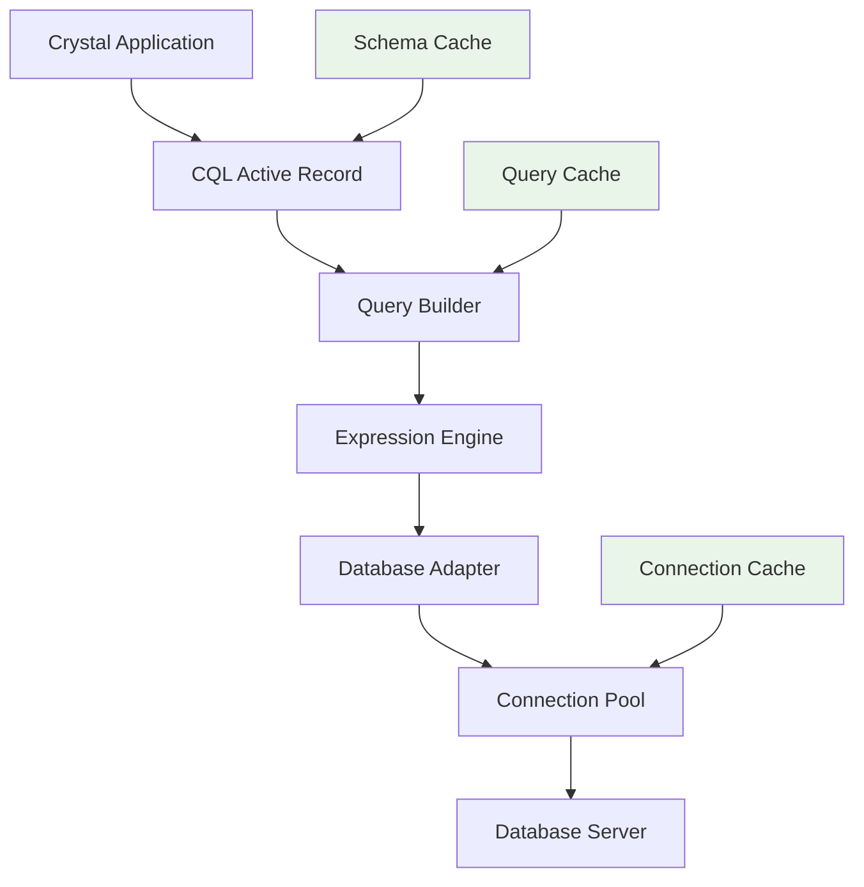
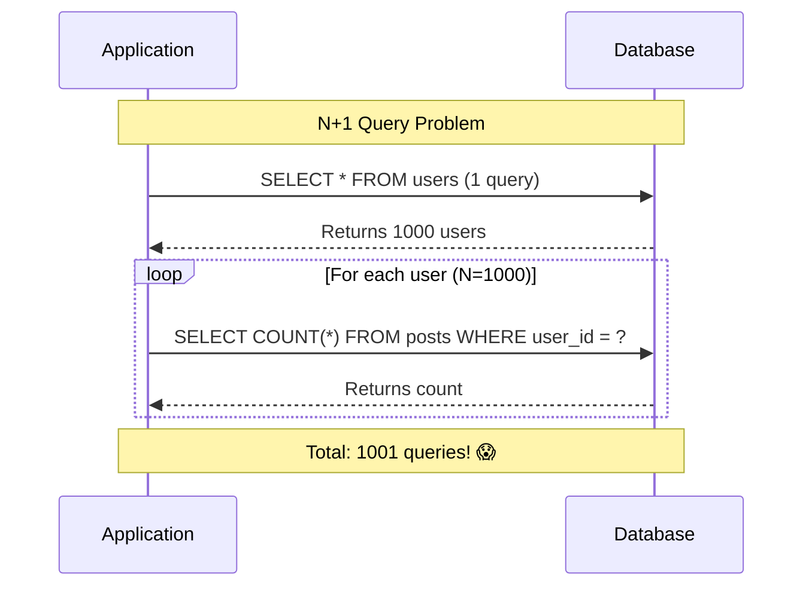
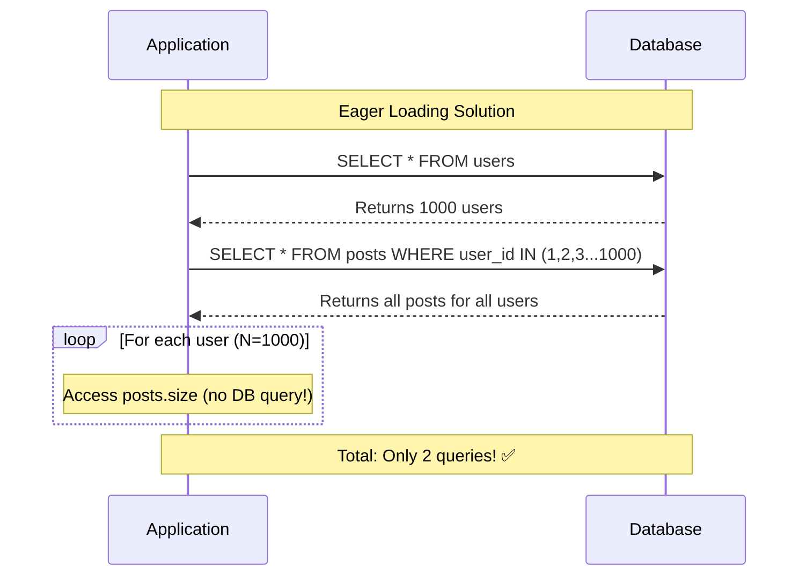
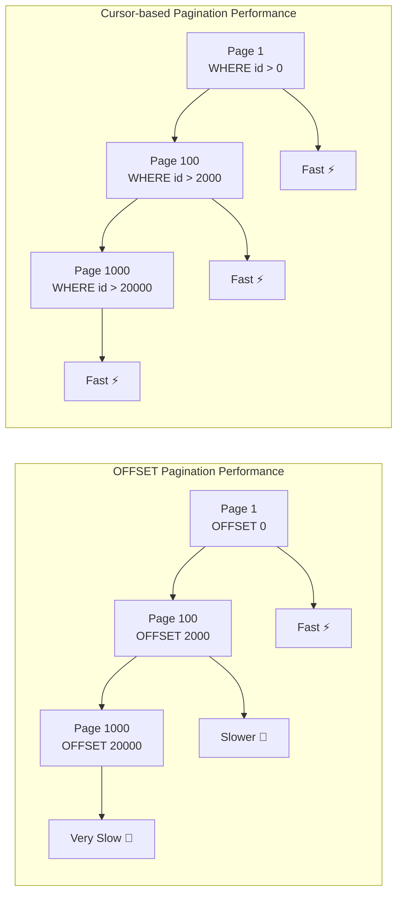
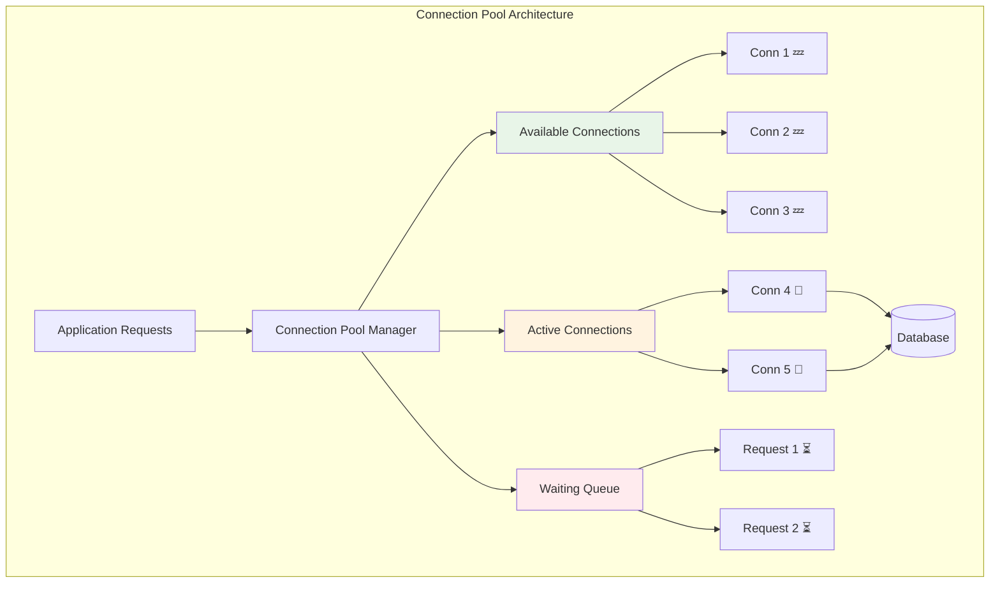
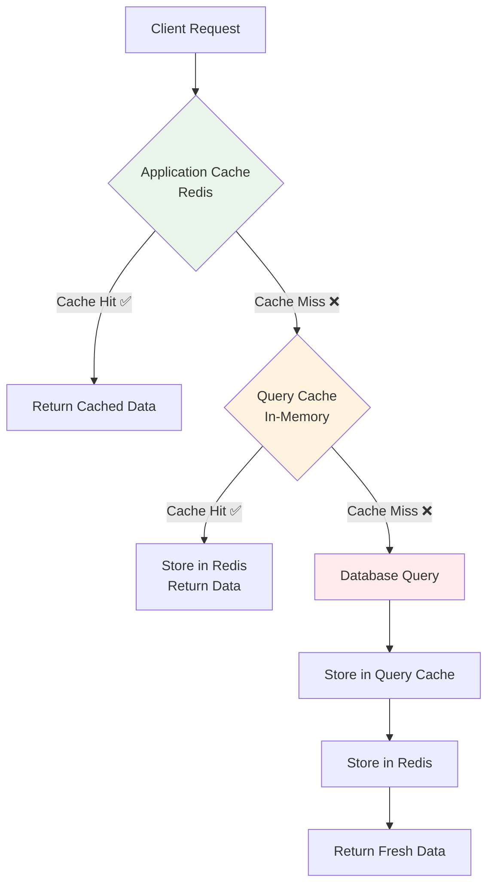

# Performance Optimization

> **Scale your CQL application** - Master query optimization, database scaling, and performance monitoring for production-ready Crystal applications

Performance is crucial for production applications. This comprehensive guide covers everything you need to know about optimizing CQL applications for speed, efficiency, and scalability at any size.

## Table of Contents

* [Performance Fundamentals](performance-optimization.md#performance-fundamentals)
* [Query Optimization](performance-optimization.md#query-optimization)
* [Database Indexing](performance-optimization.md#database-indexing)
* [Connection Management](performance-optimization.md#connection-management)
* [Caching Strategies](performance-optimization.md#caching-strategies)
* [Scaling Techniques](performance-optimization.md#scaling-techniques)
* [Monitoring and Profiling](performance-optimization.md#monitoring-and-profiling)
* [Performance Patterns](performance-optimization.md#performance-patterns)
* [Benchmarking](performance-optimization.md#benchmarking)

***

## Performance Fundamentals

### Architecture Overview

Understanding CQL's performance characteristics helps you make informed optimization decisions:



### Performance Metrics That Matter

**Query Performance:**

* Query execution time
* Number of queries per request
* Database round trips
* Memory usage per query

**Connection Performance:**

* Connection pool utilization
* Connection acquisition time
* Idle connection overhead
* Connection timeout rates

**Application Performance:**

* Memory allocation patterns
* Garbage collection impact
* Type safety overhead (minimal in Crystal)
* Compilation optimizations

***

## Query Optimization

### The N+1 Query Problem

**The Problem Visualization:**



**The Problem:**

```crystal
# This generates N+1 queries (1 + N where N = number of users)
users = User.all  # Query 1: SELECT * FROM users

users.each do |user|
  puts user.posts.count  # Query N: SELECT COUNT(*) FROM posts WHERE user_id = ?
end
```

**Solution 1: Eager Loading**



```crystal
# This generates only 2 queries regardless of user count
users = User.join(:posts).all  # Query 1: Users, Query 2: All related posts

users.each do |user|
  puts user.posts.size  # No additional queries - data already loaded
end
```

**Solution 2: Counter Cache**

```crystal
# Add a counter cache column
class AddPostsCountToUsers < CQL::Migration
  def up
    alter_table :users do
      add_column :posts_count, Int32, default: 0
    end

    # Update existing counts
    execute <<-SQL
      UPDATE users
      SET posts_count = (
        SELECT COUNT(*) FROM posts WHERE posts.user_id = users.id
      )
    SQL
  end
end

# Use the counter cache
struct User
  include CQL::ActiveRecord::Model(Int64)

  property posts_count : Int32 = 0

  has_many :posts, Post, counter_cache: true
end

# Now this is instant - no queries needed
users.each do |user|
  puts user.posts_count  # Reads from cached column
end
```

### Query Optimization Techniques

**1. Use Specific Selects**

```crystal
# Loads all columns (expensive for large tables)
users = User.all

# Load only needed columns
users = User.select(:id, :name, :email).all

# For associations, be specific too
posts_with_minimal_user_data = Post
  .joins(:user)
  .select("posts.*, users.name as author_name")
  .all
```

**2. Optimize WHERE Conditions**

```crystal
# Non-indexed column filtering
slow_users = User.where(description: "Developer").all

# Use indexed columns first
fast_users = User.where(active: true)
                 .where(created_at: 1.month.ago..Time.utc)
                 .where(role: "admin")
                 .all

# Use database functions efficiently
recent_active = User.where("active = ? AND created_at > ?", true, 1.week.ago).all
```

**3. Efficient Pagination**



```crystal
# OFFSET pagination (gets slower with higher page numbers)
page = params["page"]?.try(&.to_i) || 1
per_page = 20
users = User.limit(per_page).offset((page - 1) * per_page).all

# Cursor-based pagination (consistent performance)
last_id = params["last_id"]?.try(&.to_i64) || 0
users = User.where { id > last_id }
           .order(:id)
           .limit(20)
           .all

# Return next cursor for client
next_cursor = users.last?.try(&.id)
```

**4. Batch Processing**

```crystal
# Processing all records at once (memory intensive)
User.all.each { |user| process_user(user) }

# Process in batches
User.find_in_batches(batch_size: 1000) do |batch|
  batch.each { |user| process_user(user) }
  # Explicit garbage collection after each batch if needed
  GC.collect if batch.size == 1000
end

# Efficient bulk operations
# Instead of individual updates
users.each { |user| user.update!(last_login: Time.utc) }

# Use bulk updates
User.where(active: true).update_all(last_login: Time.utc)
```

### Advanced Query Patterns

**1. Subqueries for Complex Conditions**

```crystal
# Find users with posts in the last week
users_with_recent_posts = User
  .where("EXISTS (SELECT 1 FROM posts WHERE posts.user_id = users.id AND posts.created_at > ?)", 1.week.ago)
  .all

# Alternative using joins (often faster)
users_with_recent_posts = User
  .joins(:posts)
  .where("posts.created_at > ?", 1.week.ago)
  .distinct
  .all
```

**2. Window Functions (PostgreSQL)**

```crystal
# Get top 3 posts per user by view count
top_posts_per_user = Post
  .select("*, ROW_NUMBER() OVER (PARTITION BY user_id ORDER BY view_count DESC) as rank")
  .from("(#{Post.to_sql}) as ranked_posts")
  .where("rank <= 3")
  .all
```

**3. Efficient Aggregations**

```crystal
# Multiple queries for stats
user_count = User.count
active_count = User.where(active: true).count
admin_count = User.where(role: "admin").count

# Single query with conditional aggregation
stats = User.select(
  "COUNT(*) as total_count",
  "COUNT(CASE WHEN active = true THEN 1 END) as active_count",
  "COUNT(CASE WHEN role = 'admin' THEN 1 END) as admin_count"
).first

puts "Total: #{stats["total_count"]}, Active: #{stats["active_count"]}"
```

***

## Database Indexing

### Index Strategy

**1. Primary Indexes**

```crystal
# Schema definition with strategic indexes
UserSchema = CQL::Schema.define(:user_app, adapter, uri) do
  table :users do
    primary :id, Int64, auto_increment: true
    column :email, String, size: 255
    column :username, String, size: 100
    column :active, Bool, default: true
    column :role, String, size: 50
    column :created_at, Time
    column :updated_at, Time

    # Single column indexes
    index [:email], unique: true, name: "idx_users_email"
    index [:username], unique: true, name: "idx_users_username"
    index [:active], name: "idx_users_active"

    # Composite indexes (order matters!)
    index [:active, :role], name: "idx_users_active_role"
    index [:active, :created_at], name: "idx_users_active_created"

    # Partial indexes (PostgreSQL)
    index [:created_at], where: "active = true", name: "idx_active_users_created"
  end

  table :posts do
    primary :id, Int64, auto_increment: true
    column :user_id, Int64
    column :title, String
    column :status, String
    column :published_at, Time
    column :view_count, Int32, default: 0
    timestamps

    # Foreign key indexes (essential for joins)
    index [:user_id], name: "idx_posts_user_id"

    # Query-specific indexes
    index [:status, :published_at], name: "idx_posts_status_published"
    index [:user_id, :status], name: "idx_posts_user_status"

    # Covering index (includes additional columns)
    index [:status], include: [:title, :published_at], name: "idx_posts_status_covering"
  end
end
```

**2. Index Usage Analysis**

```crystal
# Monitor index usage (PostgreSQL)
def analyze_index_usage
  unused_indexes = DB.query_all(<<-SQL, as: NamedTuple)
    SELECT schemaname, tablename, indexname, idx_tup_read, idx_tup_fetch
    FROM pg_stat_user_indexes
    WHERE idx_tup_read = 0 AND idx_tup_fetch = 0
    ORDER BY schemaname, tablename, indexname
  SQL

  puts "Unused indexes:"
  unused_indexes.each do |idx|
    puts "  #{idx[:tablename]}.#{idx[:indexname]}"
  end
end

# Check query performance
def explain_query(query)
  explained = DB.query_one("EXPLAIN ANALYZE #{query}", as: String)
  puts explained
end

# Usage
explain_query(User.where(active: true).where(role: "admin").to_sql)
```

**3. Database-Specific Optimizations**

**PostgreSQL:**

```crystal
# Enable extensions for better performance
def setup_postgresql_performance
  DB.exec("CREATE EXTENSION IF NOT EXISTS pg_stat_statements")
  DB.exec("CREATE EXTENSION IF NOT EXISTS pg_trgm")  # For fuzzy text search

  # Optimize settings for your workload
  DB.exec("ALTER SYSTEM SET shared_preload_libraries = 'pg_stat_statements'")
  DB.exec("ALTER SYSTEM SET track_activity_query_size = 2048")
end

# Use PostgreSQL-specific features
# Full-text search
posts = Post.where("to_tsvector('english', title || ' ' || content) @@ plainto_tsquery('crystal programming')").all

# Array operations
users_with_tags = User.where("tags @> ARRAY['developer', 'crystal']").all

# JSONB queries
users_with_preferences = User.where("preferences->>'theme' = 'dark'").all
```

**MySQL:**

```crystal
# MySQL optimizations
def setup_mysql_performance
  # Enable query cache (if using older MySQL)
  DB.exec("SET GLOBAL query_cache_type = ON")
  DB.exec("SET GLOBAL query_cache_size = 268435456")  # 256MB

  # Optimize for your workload
  DB.exec("SET GLOBAL innodb_buffer_pool_size = #{available_memory * 0.7}")
end

# Use MySQL-specific features
# Full-text search
posts = Post.where("MATCH(title, content) AGAINST('crystal programming' IN NATURAL LANGUAGE MODE)").all
```

***

## Connection Management

### Connection Pool Optimization



```crystal
# Configure connection pools for different environments
module DatabaseConfig
  def self.production_config
    {
      pool_size: ENV["DB_POOL_SIZE"]?.try(&.to_i) || 25,
      checkout_timeout: 15.seconds,
      retry_attempts: 3,
      retry_delay: 1.second,
      idle_timeout: 10.minutes,
      max_lifetime: 1.hour
    }
  end

  def self.development_config
    {
      pool_size: 5,
      checkout_timeout: 10.seconds,
      retry_attempts: 1,
      retry_delay: 0.5.seconds
    }
  end
end

# Apply configuration
ProductionDB = CQL::Schema.define(
  :production,
  adapter: CQL::Adapter::Postgres,
  uri: ENV["DATABASE_URL"],
  **DatabaseConfig.production_config
)
```

### Connection Pool Monitoring

```crystal
# Monitor connection pool health
class ConnectionPoolMonitor
  def self.check_pool_health(schema : CQL::Schema)
    pool_stats = schema.connection_pool.stats

    metrics = {
      total_connections: pool_stats.total_connections,
      active_connections: pool_stats.active_connections,
      idle_connections: pool_stats.idle_connections,
      waiting_requests: pool_stats.waiting_count,
      pool_utilization: (pool_stats.active_connections.to_f / pool_stats.total_connections * 100).round(2)
    }

    # Alert if utilization is too high
    if metrics[:pool_utilization] > 80
      puts "High pool utilization: #{metrics[:pool_utilization]}%"
    end

    # Alert if requests are waiting
    if metrics[:waiting_requests] > 0
      puts "#{metrics[:waiting_requests]} requests waiting for connections"
    end

    metrics
  end

  def self.log_pool_metrics(schema : CQL::Schema)
    metrics = check_pool_health(schema)
    puts "Pool Stats: #{metrics}"
  end
end

# Usage in your application
spawn do
  loop do
    ConnectionPoolMonitor.log_pool_metrics(ProductionDB)
    sleep 30.seconds
  end
end
```

***

## Caching Strategies

### Multi-Level Caching



```crystal
# Application-level caching with Redis
require "redis"

class CacheManager
  @@redis = Redis.new(url: ENV["REDIS_URL"]? || "redis://localhost:6379/0")

  def self.fetch(key : String, expires_in : Time::Span = 1.hour, &block)
    # Try cache first
    cached = @@redis.get(key)
    if cached
      return JSON.parse(cached)
    end

    # Generate fresh data
    data = yield
    @@redis.setex(key, expires_in.total_seconds.to_i, data.to_json)
    data
  end

  def self.invalidate(pattern : String)
    keys = @@redis.keys(pattern)
    @@redis.del(keys) if keys.any?
  end
end

# Usage in models
struct User
  include CQL::ActiveRecord::Model(Int64)

  def self.popular_users(limit = 10)
    CacheManager.fetch("users:popular:#{limit}", expires_in: 30.minutes) do
      User.joins(:posts)
          .group("users.id")
          .order("COUNT(posts.id) DESC")
          .limit(limit)
          .all
    end
  end

  def cached_post_count
    CacheManager.fetch("user:#{id}:post_count", expires_in: 5.minutes) do
      posts.count
    end
  end

  # Invalidate cache when user changes
  after_update :invalidate_cache

  private def invalidate_cache
    CacheManager.invalidate("user:#{id}:*")
  end
end
```

### Query Result Caching

```crystal
# Query-level caching
module QueryCache
  extend self

  @@cache = Hash(String, {data: Array(NamedTuple), timestamp: Time}).new
  @@ttl = 5.minutes

  def cached_query(sql : String, &block)
    key = Digest::MD5.hexdigest(sql)

    if entry = @@cache[key]?
      if Time.utc - entry[:timestamp] < @@ttl
        return entry[:data]
      else
        @@cache.delete(key)
      end
    end

    result = yield
    @@cache[key] = {data: result, timestamp: Time.utc}
    result
  end

  def clear_cache
    @@cache.clear
  end
end

# Use in your queries
def expensive_analytics_query
  sql = <<-SQL
    SELECT users.role, COUNT(*) as count, AVG(posts.view_count) as avg_views
    FROM users
    JOIN posts ON users.id = posts.user_id
    WHERE posts.created_at > NOW() - INTERVAL '30 days'
    GROUP BY users.role
  SQL

  QueryCache.cached_query(sql) do
    DB.query_all(sql, as: NamedTuple)
  end
end
```

***

## Scaling Techniques

### Read Replicas

```crystal
# Configure read/write splitting
class DatabaseRouter
  PRIMARY_DB = CQL::Schema.define(
    :primary,
    adapter: CQL::Adapter::Postgres,
    uri: ENV["PRIMARY_DATABASE_URL"],
    pool_size: 20
  )

  REPLICA_DB = CQL::Schema.define(
    :replica,
    adapter: CQL::Adapter::Postgres,
    uri: ENV["REPLICA_DATABASE_URL"],
    pool_size: 15
  )

  def self.read(&block)
    yield REPLICA_DB
  end

  def self.write(&block)
    yield PRIMARY_DB
  end

  def self.with_fallback(&block)
    begin
      yield REPLICA_DB
    rescue ex
      puts "Replica failed, falling back to primary: #{ex.message}"
      yield PRIMARY_DB
    end
  end
end

# Usage in models
struct User
  include CQL::ActiveRecord::Model(Int64)

  def self.find_for_read(id)
    DatabaseRouter.with_fallback do |db|
      db.query.from(:users).where(id: id).first
    end
  end

  def self.analytics_query
    DatabaseRouter.read do |db|
      db.query.from(:users)
        .joins(:posts)
        .select("COUNT(*) as total_users, AVG(posts.view_count) as avg_views")
        .first
    end
  end
end
```

### Database Sharding

```crystal
# Simple sharding strategy
class ShardRouter
  SHARDS = [
    CQL::Schema.define(:shard_0, adapter, ENV["SHARD_0_URL"]),
    CQL::Schema.define(:shard_1, adapter, ENV["SHARD_1_URL"]),
    CQL::Schema.define(:shard_2, adapter, ENV["SHARD_2_URL"]),
    CQL::Schema.define(:shard_3, adapter, ENV["SHARD_3_URL"])
  ]

  def self.shard_for_user(user_id : Int64)
    SHARDS[user_id % SHARDS.size]
  end

  def self.all_shards(&block)
    SHARDS.map { |shard| yield shard }
  end
end

# Sharded model
struct ShardedUser
  include CQL::ActiveRecord::Model(Int64)

  property id : Int64?
  property name : String
  property email : String

  def self.find_sharded(user_id : Int64)
    shard = ShardRouter.shard_for_user(user_id)
    shard.query.from(:users).where(id: user_id).first
  end

  def self.create_sharded(user_data)
    # Use a global ID generator or UUID to avoid conflicts
    user_id = generate_global_id
    shard = ShardRouter.shard_for_user(user_id)

    shard.insert.into(:users)
         .values(**user_data, id: user_id)
         .commit
  end

  # Cross-shard operations
  def self.global_count
    ShardRouter.all_shards do |shard|
      shard.query.from(:users).count
    end.sum
  end
end
```

***

## Monitoring and Profiling

### Performance Monitoring

```crystal
# Performance monitoring middleware
class PerformanceMonitor
  def self.measure(operation : String, &block)
    start_time = Time.monotonic
    memory_before = GC.stats.heap_size

    result = yield

    duration = Time.monotonic - start_time
    memory_after = GC.stats.heap_size
    memory_used = memory_after - memory_before

    log_performance(operation, duration, memory_used)
    result
  end

  private def self.log_performance(operation, duration, memory_used)
    puts "#{operation}: #{duration.total_milliseconds.round(2)}ms, Memory: #{memory_used / 1024}KB"

    # Send to monitoring service (e.g., DataDog, New Relic)
    if ENV["MONITORING_ENABLED"]?
      send_metric("query.duration", duration.total_milliseconds, tags: {operation: operation})
      send_metric("query.memory", memory_used, tags: {operation: operation})
    end
  end
end

# Usage with database operations
def get_user_dashboard(user_id)
  PerformanceMonitor.measure("user_dashboard") do
    user = User.find!(user_id)
    posts = user.posts.join(:comments).limit(10).all
    stats = user.post_statistics

    {user: user, posts: posts, stats: stats}
  end
end
```

### Query Profiling

```crystal
# Detailed query profiler
class QueryProfiler
  @@enabled = ENV["QUERY_PROFILING"]? == "true"
  @@slow_query_threshold = 100.milliseconds

  def self.profile_query(sql : String, &block)
    return yield unless @@enabled

    start = Time.monotonic
    result = yield
    duration = Time.monotonic - start

    if duration > @@slow_query_threshold
      log_slow_query(sql, duration)
    end

    result
  end

  private def self.log_slow_query(sql, duration)
    puts "SLOW QUERY (#{duration.total_milliseconds.round(2)}ms): #{sql[0..200]}..."

    # Get query plan for analysis
    if sql.downcase.starts_with?("select")
      plan = DB.query_one("EXPLAIN ANALYZE #{sql}", as: String)
      puts "Query Plan:\n#{plan}"
    end
  end
end

# Integrate with CQL (custom adapter wrapper)
class ProfilingAdapter < CQL::Adapter::Postgres
  def query(sql, *args)
    QueryProfiler.profile_query(sql) do
      super(sql, *args)
    end
  end
end
```

### Load Testing

```crystal
# Simple load testing framework
class LoadTester
  def self.test_endpoint(name : String, iterations : Int32 = 100, concurrency : Int32 = 10, &block)
    puts "Load testing #{name}..."

    channel = Channel(Float64).new
    start_time = Time.monotonic

    # Spawn concurrent workers
    concurrency.times do
      spawn do
        (iterations // concurrency).times do
          worker_start = Time.monotonic

          begin
            yield
            duration = (Time.monotonic - worker_start).total_milliseconds
            channel.send(duration)
          rescue ex
            puts "Error: #{ex.message}"
            channel.send(-1.0)  # Error marker
          end
        end
      end
    end

    # Collect results
    durations = [] of Float64
    errors = 0

    iterations.times do
      result = channel.receive
      if result < 0
        errors += 1
      else
        durations << result
      end
    end

    total_time = (Time.monotonic - start_time).total_milliseconds

    # Calculate statistics
    durations.sort!
    avg = durations.sum / durations.size
    median = durations[durations.size // 2]
    p95 = durations[(durations.size * 0.95).to_i]
    p99 = durations[(durations.size * 0.99).to_i]

    puts "Results for #{name}:"
    puts "  Total time: #{total_time.round(2)}ms"
    puts "  Requests: #{iterations}, Errors: #{errors}"
    puts "  Avg: #{avg.round(2)}ms"
    puts "  Median: #{median.round(2)}ms"
    puts "  95th percentile: #{p95.round(2)}ms"
    puts "  99th percentile: #{p99.round(2)}ms"
    puts "  Throughput: #{(iterations / (total_time / 1000)).round(2)} req/sec"
  end
end

# Test your endpoints
LoadTester.test_endpoint("User lookup", iterations: 1000, concurrency: 20) do
  User.find(Random.rand(1..10000))
end

LoadTester.test_endpoint("Complex dashboard", iterations: 100, concurrency: 5) do
  get_user_dashboard(Random.rand(1..1000))
end
```

***

## Performance Patterns

### Lazy Loading Optimization

```crystal
# Smart lazy loading with batch loading
struct User
  include CQL::ActiveRecord::Model(Int64)

  @@batch_loader = Hash(Int64, User).new
  @@batch_pending = Set(Int64).new
  @@batch_fiber : Fiber? = nil

  # Batch load users to avoid N+1
  def self.batch_find(id : Int64)
    return @@batch_loader[id] if @@batch_loader.has_key?(id)

    @@batch_pending.add(id)

    # Start batch loading if not already running
    if @@batch_fiber.nil?
      @@batch_fiber = spawn do
        Fiber.yield  # Let other fibers add to batch

        ids = @@batch_pending.to_a
        @@batch_pending.clear

        users = User.where(id: ids).all
        users.each { |u| @@batch_loader[u.id!] = u }

        @@batch_fiber = nil
      end
    end

    Fiber.yield  # Allow batch to load
    @@batch_loader[id]?
  end
end
```

### Efficient Data Processing

```crystal
# Stream processing for large datasets
module DataProcessor
  def self.process_users_stream(batch_size = 1000, &block : Array(User) ->)
    User.find_in_batches(batch_size: batch_size) do |batch|
      # Process batch
      yield batch

      # Cleanup memory
      GC.collect if batch.size == batch_size
    end
  end

  # Parallel processing
  def self.parallel_process(items, workers = 4, &block)
    channel = Channel(typeof(items.first)).new(items.size)
    results = Channel(Nil).new(workers)

    # Add items to channel
    spawn do
      items.each { |item| channel.send(item) }
      channel.close
    end

    # Spawn workers
    workers.times do
      spawn do
        while item = channel.receive?
          yield item
        end
        results.send(nil)
      end
    end

    # Wait for completion
    workers.times { results.receive }
  end
end

# Usage
DataProcessor.process_users_stream do |batch|
  DataProcessor.parallel_process(batch) do |user|
    # CPU-intensive processing per user
    update_user_statistics(user)
  end
end
```

***

## Benchmarking

### Performance Benchmarks

```crystal
# Comprehensive benchmarking suite
require "benchmark"

class CQLBenchmarks
  def self.run_all
    puts "CQL Performance Benchmarks\n"

    setup_test_data

    benchmark_queries
    benchmark_inserts
    benchmark_updates
    benchmark_associations

    cleanup_test_data
  end

  def self.benchmark_queries
    puts "Query Benchmarks:"

    Benchmark.bm do |x|
      x.report("Simple find") { 1000.times { User.find(Random.rand(1..1000)) } }
      x.report("Indexed where") { 100.times { User.where(active: true).limit(10).all } }
      x.report("Complex query") { 50.times { complex_analytics_query } }
      x.report("N+1 problem") { simulate_n_plus_one }
      x.report("Eager loading") { simulate_eager_loading }
    end
  end

  def self.benchmark_inserts
    puts "\nInsert Benchmarks:"

    Benchmark.bm do |x|
      x.report("Single inserts") { 100.times { create_test_user } }
      x.report("Batch inserts") { batch_create_users(100) }
      x.report("Transaction") { transaction_create_users(100) }
    end
  end

  private def self.complex_analytics_query
    User.joins(:posts)
        .where("posts.created_at > ?", 1.month.ago)
        .group("users.id")
        .select("users.*, COUNT(posts.id) as post_count")
        .order("post_count DESC")
        .limit(10)
        .all
  end

  private def self.simulate_n_plus_one
    users = User.limit(20).all
    users.each { |user| user.posts.count }
  end

  private def self.simulate_eager_loading
    users = User.join(:posts).limit(20).all
    users.each { |user| user.posts.size }
  end
end

# Run benchmarks
CQLBenchmarks.run_all
```

### Memory Profiling

```crystal
# Memory usage tracking
class MemoryProfiler
  def self.profile(&block)
    GC.collect  # Start with clean slate

    initial_memory = GC.stats.heap_size
    initial_objects = GC.stats.total_objects

    result = yield

    GC.collect  # Clean up

    final_memory = GC.stats.heap_size
    final_objects = GC.stats.total_objects

    puts "Memory used: #{(final_memory - initial_memory) / 1024}KB"
    puts "Objects created: #{final_objects - initial_objects}"

    result
  end
end

# Profile memory usage
MemoryProfiler.profile do
  users = User.join(:posts, :comments).limit(100).all
  users.each { |user| process_user_data(user) }
end
```

***

## Performance Best Practices Summary

### Do This:

**Query Optimization:**

* Use specific column selection (`select`)
* Add appropriate database indexes
* Use eager loading for associations
* Implement cursor-based pagination
* Cache expensive queries

**Connection Management:**

* Configure appropriate pool sizes
* Monitor pool utilization
* Use connection timeouts
* Implement retry logic

**Memory Management:**

* Process large datasets in batches
* Use streaming for data processing
* Profile memory usage regularly
* Implement garbage collection hints

**Monitoring:**

* Track query performance
* Monitor connection pools
* Set up alerts for slow queries
* Use APM tools in production

### Avoid This:

* Loading all records with `all` on large tables
* N+1 query patterns without eager loading
* OFFSET-based pagination on large datasets
* Ignoring database indexes
* Oversized connection pools
* Processing large datasets without batching
* Missing query monitoring in production

***

> **Performance is a journey, not a destination** - Use these techniques strategically based on your application's specific needs and bottlenecks. Always measure before and after optimizations to ensure they provide real benefits.

**Next Steps:**

* [**Testing Guide →**](testing-strategies.md) - Test your optimizations
* [**Security Guide →**](security-guide.md) - Secure performance patterns
* [**Monitoring Guide →**](../guides/monitoring-guide.md) - Track performance in production
