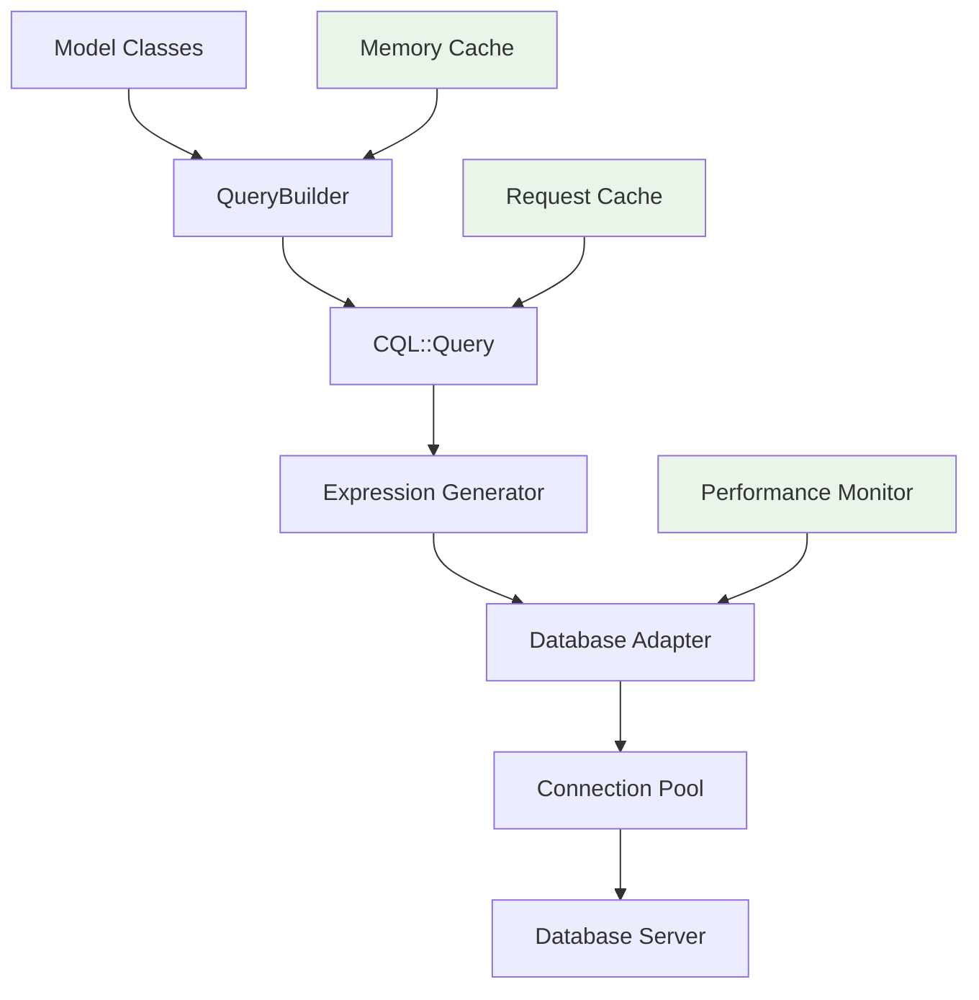

# Performance Optimization

> **Scale your CQL application** - Master query optimization, database indexing, and performance monitoring for production-ready Crystal applications

Performance is crucial for production applications. This comprehensive guide covers everything you need to know about optimizing CQL applications for speed, efficiency, and scalability based on CQL's actual implementation.

## Table of Contents

- [Performance Fundamentals](#performance-fundamentals)
- [Query Optimization](#query-optimization)
- [Database Indexing](#database-indexing)
- [Connection Management](#connection-management)
- [Caching Strategies](#caching-strategies)
- [Performance Monitoring](#performance-monitoring)
- [Batch Processing](#batch-processing)
- [Transaction Optimization](#transaction-optimization)
- [Best Practices Summary](#best-practices-summary)

---

## Performance Fundamentals

### Understanding CQL's Architecture

CQL implements the Active Record pattern with a sophisticated query builder system designed for performance:



### Key Performance Components

**Query Performance:**

- Chainable query builder with lazy evaluation
- Automatic query optimization
- Built-in N+1 detection
- Request-scoped query caching

**Connection Performance:**

- Configurable connection pooling
- Automatic connection management
- Connection timeout handling
- Database-specific optimizations

**Application Performance:**

- Compile-time type safety (minimal runtime overhead)
- Memory-efficient batch processing
- Integrated performance monitoring
- Multi-layer caching system

---

## Query Optimization

### The N+1 Query Problem

**The Problem:**

```crystal
# This generates N+1 queries (1 + N where N = number of users)
users = User.all  # Query 1: SELECT * FROM users

users.each do |user|
  puts user.posts.size  # Query N: SELECT COUNT(*) FROM posts WHERE user_id = ?
end
```

**Solution 1: Use Joins**

```crystal
# Use CQL's join capabilities
users_with_posts = User.query
  .join(:posts) { |j| j.posts.user_id.eq(j.users.id) }
  .select("users.*, COUNT(posts.id) as post_count")
  .group("users.id")
  .all

users_with_posts.each do |result|
  puts "User has #{result["post_count"]} posts"
end
```

**Solution 2: Efficient Association Queries**

```crystal
# CQL's associations handle this efficiently
users = User.all
users.each do |user|
  # This uses a single optimized query per user
  post_count = user.posts.count
  puts "User #{user.username} has #{post_count} posts"
end
```

### Query Optimization Techniques

**1. Use Specific Column Selection**

```crystal
# ❌ Loads all columns (expensive for large tables)
users = User.all

# ✅ Load only needed columns
users = User.select(:id, :username, :email).all

# ✅ With conditions and ordering
active_users = User.select(:username, :email)
                  .where(active: true)
                  .order(created_at: :desc)
                  .limit(50)
                  .all
```

**2. Optimize WHERE Conditions**

```crystal
# ✅ Use indexed columns first in compound conditions
fast_users = User.where(active: true)
                 .where(role: "admin")
                 .order(created_at: :desc)
                 .all

# ✅ Use database functions when needed
recent_active = User.query
  .where("active = ? AND created_at > ?", true, 1.week.ago)
  .all
```

**3. Efficient Pagination**

```crystal
# ✅ Basic pagination (good for small offsets)
page = params["page"]?.try(&.to_i) || 1
per_page = 20
users = User.limit(per_page)
           .offset((page - 1) * per_page)
           .order(id: :desc)
           .all

# ✅ Better: Cursor-based pagination (consistent performance)
last_id = params["last_id"]?.try(&.to_i64) || 0
users = User.query
           .where("id > ?", last_id)
           .order(id: :asc)
           .limit(20)
           .all

# Return next cursor for client
next_cursor = users.last?.try(&.id)
```

**4. Advanced Query Patterns**

```crystal
# Subqueries for complex conditions
users_with_recent_posts = User.query
  .where("EXISTS (SELECT 1 FROM posts WHERE posts.user_id = users.id AND posts.created_at > ?)", 1.week.ago)
  .all

# Efficient aggregations
stats = User.query
  .select(
    "COUNT(*) as total_users",
    "COUNT(CASE WHEN active = true THEN 1 END) as active_users",
    "AVG(EXTRACT(epoch FROM (NOW() - created_at))/86400) as avg_age_days"
  )
  .first

puts "Total: #{stats["total_users"]}, Active: #{stats["active_users"]}"
```

---

## Database Indexing

### Strategic Index Design with CQL Schemas

```crystal
UserSchema = CQL::Schema.define(:user_app, adapter, uri) do
  table :users do
    primary :id, Int64, auto_increment: true
    column :email, String, size: 255
    column :username, String, size: 100
    column :active, Bool, default: true
    column :role, String, size: 50
    column :created_at, Time
    column :updated_at, Time

    # Single column indexes
    index [:email], unique: true
    index [:username], unique: true
    index [:active]

    # Composite indexes (order matters!)
    index [:active, :role]
    index [:active, :created_at]
  end

  table :posts do
    primary :id, Int64, auto_increment: true
    column :user_id, Int64
    column :title, String
    column :status, String
    column :published_at, Time
    timestamps

    # Foreign key indexes (essential for joins)
    index [:user_id]

    # Query-specific indexes
    index [:status, :published_at]
    index [:user_id, :status]

    # Foreign key constraint
    foreign_key [:user_id], references: :users, references_columns: [:id]
  end
end
```

### Index Performance Analysis

```crystal
# Analyze query performance with EXPLAIN
def analyze_query_performance(query_builder)
  sql, params = query_builder.query.to_sql
  puts "Query: #{sql}"
  puts "Params: #{params}"

  # Use database-specific EXPLAIN
  case query_builder.model_class.adapter
  when CQL::Adapter::Postgres
    explain_sql = "EXPLAIN (ANALYZE, BUFFERS) #{sql}"
  when CQL::Adapter::SQLite
    explain_sql = "EXPLAIN QUERY PLAN #{sql}"
  else
    explain_sql = "EXPLAIN #{sql}"
  end

  # Execute EXPLAIN query
  query_builder.model_class.schema.exec_query do |conn|
    conn.query_all(explain_sql, args: params) do |row|
      puts row.to_s
    end
  end
end

# Usage
analyze_query_performance(User.where(active: true).where(role: "admin"))
```

---

## Connection Management

### CQL Configuration for Performance

```crystal
# Production-optimized configuration
CQL.configure do |config|
  config.db = ENV["DATABASE_URL"]
  config.env = "production"

  # Connection pool optimization
  config.pool_size = 25
  config.pool.initial_size = 5
  config.pool.max_idle_size = 10
  config.pool.checkout_timeout = 15.seconds
  config.pool.max_retry_attempts = 3

  # Performance monitoring
  config.monitor_performance = true
  config.performance.query_profiling_enabled = true
  config.performance.n_plus_one_detection_enabled = true

  # Caching
  config.cache.on = true
  config.cache.ttl = 1.hour
  config.cache.memory_size = 5000
end
```

### Environment-Specific Optimization

```crystal
# Environment-based configuration
case ENV["CRYSTAL_ENV"]? || "development"
when "production"
  CQL.configure do |config|
    config.pool_size = 25
    config.performance.plan_analysis_enabled = false  # Disable for performance
    config.cache.store = "redis"
    config.cache.redis_url = ENV["REDIS_URL"]
  end
when "development"
  CQL.configure do |config|
    config.pool_size = 5
    config.performance.plan_analysis_enabled = true
    config.cache.store = "memory"
  end
when "test"
  CQL.configure do |config|
    config.pool_size = 1
    config.cache.on = false
  end
end
```

---

## Caching Strategies

### Multi-Layer Caching with CQL

```crystal
# Configure CQL's built-in caching system
CQL.configure do |config|
  # Main cache configuration
  config.cache.on = true
  config.cache.ttl = 1.hour
  config.cache.memory_size = 5000

  # Request-scoped caching (eliminates duplicate queries per request)
  config.cache.request_cache = true
  config.cache.request_size = 1000

  # Fragment caching for complex operations
  config.cache.fragments = true
  config.cache.invalidation = "transaction_aware"

  # Redis for production
  if ENV["REDIS_URL"]?
    config.cache.store = "redis"
    config.cache.redis_url = ENV["REDIS_URL"]
    config.cache.redis_pool_size = 25
  end
end
```

### Query Result Caching

```crystal
# CQL automatically caches query results when enabled
# First call executes query and caches result
users = User.where(active: true).all

# Second identical call uses cached result
users = User.where(active: true).all  # Uses cache

# Manual cache control
CQL::Cache::Cache.clear  # Clear all cache
puts CQL::Cache::Cache.statistics  # Get cache stats
```

### Fragment Caching for Expensive Operations

```crystal
# Cache expensive calculations using CQL's fragment cache
class UserStatistics
  def self.calculate_for_user(user_id)
    cache_key = "user_stats:#{user_id}"

    CQL::Cache::Cache.cache(cache_key, {user_id: user_id}, ttl: 30.minutes) do
      user = User.find!(user_id)
      {
        total_posts: user.posts.count,
        total_views: user.posts.sum(:views_count) || 0,
        avg_rating: calculate_average_rating(user)
      }
    end
  end

  private def self.calculate_average_rating(user)
    # Expensive calculation here
    user.posts.where(published: true).average(:rating) || 0.0
  end
end
```

### Cache Performance Monitoring

```crystal
# Monitor cache performance
cache_stats = CQL.config.cache_stats
puts "Cache hit rate: #{cache_stats["hit_rate_percent"]}%"
puts "Cache size: #{cache_stats["cache_size"]} entries"
puts "Memory usage: #{cache_stats["memory_usage_bytes"]} bytes"

# Get detailed cache summary
puts CQL.config.cache_summary
```

---

## Performance Monitoring

### Using CQL's Built-in Performance Tools

```crystal
# Enable performance monitoring in configuration
CQL.configure do |config|
  config.monitor_performance = true

  # Configure specific monitoring features
  config.performance.query_profiling_enabled = true
  config.performance.n_plus_one_detection_enabled = true
  config.performance.plan_analysis_enabled = true
  config.performance.auto_analyze_slow_queries = true
  config.performance.context_tracking_enabled = true
end

# Set context for tracking (useful for web applications)
CQL::Performance.set_context(endpoint: "/api/users", user_id: "user_123")

# Execute queries - monitoring happens automatically
users = User.where(active: true).limit(50).all

# Get performance metrics
monitor = CQL::Performance.monitor
puts "Total queries: #{monitor.statistics.size}"
puts "Slow queries: #{monitor.slow_queries.size}"

# Generate performance report
text_report = monitor.comprehensive_report("text")
puts text_report

# Generate HTML report for detailed analysis
html_report = monitor.comprehensive_report("html")
File.write("performance_report.html", html_report)
```

### Custom Performance Tracking

```crystal
# Track specific operations
class PerformanceTracker
  def self.track_operation(operation_name, &block)
    start_time = Time.monotonic
    memory_before = GC.stats.heap_size

    result = yield

    duration = Time.monotonic - start_time
    memory_used = GC.stats.heap_size - memory_before

    puts "#{operation_name}: #{duration.total_milliseconds.round(2)}ms, #{memory_used} bytes"
    result
  end
end

# Usage
users = PerformanceTracker.track_operation("User query with joins") do
  User.query
    .join(:posts)
    .where(users: {active: true})
    .where(posts: {published: true})
    .select("users.username", "COUNT(posts.id) as post_count")
    .group("users.id")
    .all
end
```

---

## Batch Processing

### Efficient Batch Operations with CQL

```crystal
# Process large datasets efficiently using CQL's batch methods
def update_all_user_statistics
  User.find_each(batch_size: 1000) do |user|
    user.calculate_statistics!
    user.save!
  end
end

# Process in batches for bulk operations
def process_inactive_users
  User.where(active: false).find_in_batches(batch_size: 500) do |batch|
    batch.each do |user|
      cleanup_user_data(user)
    end

    # Trigger garbage collection after each batch
    GC.collect if batch.size == 500
  end
end
```

### Memory-Efficient Data Processing

```crystal
# Efficient data extraction using pluck
def extract_user_emails
  # Use pluck for single column extraction (much more efficient)
  emails = User.where(active: true).pluck(:email, as: String)

  # Much more efficient than:
  # emails = User.where(active: true).all.map(&.email)

  emails
end

# Stream processing for large datasets
def export_user_data(&block : String ->)
  User.find_each(batch_size: 1000) do |user|
    user_json = {
      id: user.id,
      username: user.username,
      email: user.email,
      created_at: user.created_at
    }.to_json

    yield user_json
  end
end
```

### Bulk Operations

```crystal
# Efficient bulk updates
def mark_users_inactive(user_ids : Array(Int64))
  # Instead of individual updates
  user_ids.each { |id| User.find(id).try(&.update!(active: false)) }

  # Use bulk operations when possible
  User.query
    .where("id IN (#{user_ids.map { "?" }.join(", ")})", *user_ids)
    .update
    .set(active: false, updated_at: Time.utc)
    .commit
end
```

---

## Transaction Optimization

### Efficient Transaction Usage

```crystal
# Include the Transactional module in your models
struct User
  include CQL::ActiveRecord::Model(Int64)
  include CQL::ActiveRecord::Transactional

  db_context UserDB, :users
  # ... model definition
end

# Keep transactions short and focused
User.transaction do |tx|
  user = User.create!(username: "newuser", email: "user@example.com")
  AuditLog.create!(action: "user_created", user_id: user.id)
end

# Batch operations in transactions for consistency
User.transaction do |tx|
  users_to_create = [
    {username: "alice", email: "alice@example.com"},
    {username: "bob", email: "bob@example.com"}
  ]

  users_to_create.each do |user_data|
    User.create!(user_data)
  end
end
```

### Nested Transactions with Savepoints

```crystal
# CQL supports nested transactions using savepoints
User.transaction do |outer_tx|
  # Outer transaction operations
  user = User.create!(username: "main_user", email: "main@example.com")

  # Nested transaction with savepoint
  User.transaction(outer_tx) do |inner_tx|
    profile = UserProfile.create!(user_id: user.id, bio: "User bio")

    # This only rolls back the inner transaction
    if profile.bio.size > 1000
      inner_tx.rollback
    end
  end

  # Outer transaction continues
  user.update!(active: true)
end
```

### Transaction Best Practices

```crystal
# ❌ Avoid long-running operations in transactions
User.transaction do |tx|
  user = User.create!(username: "user")
  send_welcome_email(user)  # External service call - avoid!
  complex_calculation(user)  # Long CPU operation - avoid!
end

# ✅ Keep transactions focused
user = nil
User.transaction do |tx|
  user = User.create!(username: "user")
end

# Do external operations outside transaction
send_welcome_email(user)
complex_calculation(user)
```

---

## Best Practices Summary

### Query Optimization

✅ **Do This:**

- Use `select()` to specify needed columns
- Add appropriate database indexes in your schema
- Use `find_each` and `find_in_batches` for large datasets
- Implement cursor-based pagination for better performance
- Use CQL's built-in caching system
- Use `pluck()` for extracting single column values
- Monitor queries with CQL's performance tools

❌ **Avoid This:**

- Loading all records with `all` on large tables
- N+1 query patterns (use joins or efficient associations)
- OFFSET-based pagination on very large datasets
- Processing large datasets without batching
- Ignoring database indexes in schema definitions

### Connection Management

✅ **Do This:**

- Configure appropriate connection pool sizes
- Use environment-specific configurations
- Monitor connection pool utilization
- Handle connection timeouts gracefully

❌ **Avoid This:**

- Creating too many connections
- Leaving connections open unnecessarily
- Ignoring connection pool configuration

### Caching Strategy

✅ **Do This:**

- Enable request-scoped caching for web apps
- Use fragment caching for expensive operations
- Monitor cache hit rates and performance
- Use Redis for production deployments with multiple instances
- Configure appropriate TTL values

❌ **Avoid This:**

- Caching everything without consideration
- Ignoring cache invalidation strategies
- Using overly long TTL values
- Not monitoring cache performance

### Performance Monitoring

✅ **Do This:**

- Enable CQL's performance monitoring in development
- Set appropriate slow query thresholds
- Generate regular performance reports
- Monitor N+1 patterns
- Use context tracking for endpoint analysis

❌ **Avoid This:**

- Ignoring slow query warnings
- Not tracking performance trends
- Disabling monitoring in development

---

> **Performance is a journey, not a destination** - Use CQL's built-in tools and these techniques strategically based on your application's specific needs and bottlenecks. Always measure before and after optimizations to ensure they provide real benefits.

**Next Steps:**

- [**Testing Strategies →**](testing-strategies.md) - Test your optimizations
- [**Security Guide →**](security-guide.md) - Secure performance patterns
- [**Performance Tools →**](performance-tools.md) - Deep dive into CQL's monitoring tools
