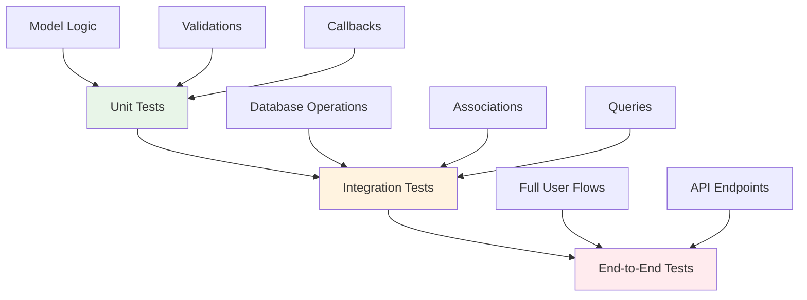

# Testing Strategies

> **Build confidence through comprehensive testing** - Master unit testing, integration testing, and mocking strategies for robust CQL applications

Testing is essential for building reliable applications. This guide covers comprehensive testing strategies for CQL applications, from unit tests to integration tests, with practical examples and best practices.

## Testing Fundamentals

### Testing Pyramid

CQL applications benefit from a well-structured testing pyramid:



### Test Types Overview

| Test Type       | Speed  | Isolation | Database | Purpose                      |
| --------------- | ------ | --------- | -------- | ---------------------------- |
| **Unit**        | Fast   | High      | Mocked   | Business logic, validations  |
| **Integration** | Medium | Medium    | Test DB  | Database operations, queries |
| **End-to-End**  | Slow   | Low       | Test DB  | Full application flows       |

***

## Test Environment Setup

### Test Database Configuration

```crystal
# spec/spec_helper.cr
require "spec"
require "../src/myapp"

# Configure test database
TestDB = CQL::Schema.define(
  :test_db,
  adapter: CQL::Adapter::SQLite,
  uri: "sqlite3://:memory:") do
  # Define your schema here
  table :users do
    primary :id, Int64, auto_increment: true
    column :name, String
    column :email, String
    column :active, Bool, default: true
    column :role, String, default: "user"
    timestamps
  end

  table :posts do
    primary :id, Int64, auto_increment: true
    column :user_id, Int64
    column :title, String
    column :content, String
    column :published, Bool, default: false
    timestamps

    foreign_key :user_id, references: :users
  end
end

# Build test database schema
TestDB.build

# Test cleanup helpers
module TestHelpers
  # Clean database between tests
  def cleanup_database
    TestDB.exec("DELETE FROM posts")
    TestDB.exec("DELETE FROM users")
    # Reset auto-increment counters
    TestDB.exec("DELETE FROM sqlite_sequence") if TestDB.adapter == CQL::Adapter::SQLite
  end

  # Transaction rollback for faster cleanup
  def with_rollback(&block)
    TestDB.transaction do |tx|
      begin
        yield
      ensure
        tx.rollback
      end
    end
  end
end

# Configure Spec hooks
Spec.before_each do
  TestHelpers.cleanup_database
end

Spec.after_suite do
  TestDB.close
end
```

### Environment-Specific Configuration

```crystal
# config/test.cr
module TestConfig
  # Test-specific database settings
  DATABASE_CONFIG = {
    adapter: CQL::Adapter::SQLite,
    uri: "sqlite3://:memory:"
  }

  # Use different configs for different test types
  def self.unit_test_db
    CQL::Schema.define(:unit_test, **DATABASE_CONFIG) do
      # Define minimal schema for unit tests
    end
  end

  def self.integration_test_db
    CQL::Schema.define(:integration_test, adapter: CQL::Adapter::SQLite, uri: "sqlite3://./tmp/integration_test.db") do
      # Define full schema for integration tests
    end
  end

  # Fast test data creation
  def self.enable_fast_tests
    # Reduce bcrypt rounds for password hashing
    ENV["BCRYPT_COST"] = "1"
  end
end
```

***

## Unit Testing

### Testing Model Logic

```crystal
# spec/models/user_spec.cr
require "../spec_helper"

describe User do
  describe "validations" do
    it "validates presence of name" do
      user = User.new(name: "", email: "test@example.com")
      user.valid?.should be_false
      user.errors.map(&.message).should contain("name must be present")
    end

    it "validates email format" do
      user = User.new(name: "Test", email: "invalid-email")
      user.valid?.should be_false
      user.errors.map(&.field).should contain(:email)
    end

    it "validates email uniqueness in database context" do
      # This requires database integration
      existing_user = User.new(name: "First", email: "test@example.com")
      existing_user.save!

      duplicate_user = User.new(name: "Second", email: "test@example.com")
      # Would need database-level unique constraint validation
      # This is typically tested in integration tests
    end
  end

  describe "business logic" do
    it "has correct full name" do
      user = User.new(name: "John Doe", email: "john@example.com")
      user.full_name.should eq("John Doe")
    end

    it "can be activated" do
      user = User.new(name: "Test", email: "test@example.com", active: false)

      user.activate!
      user.active?.should be_true
      user.activated_at.should_not be_nil
    end

    it "can be deactivated with reason" do
      user = User.new(name: "Test", email: "test@example.com", active: true)

      user.deactivate!("Terms violation")
      user.active?.should be_false
      user.deactivation_reason.should eq("Terms violation")
    end
  end
end
```

### Testing Callbacks

```crystal
# spec/models/user_callbacks_spec.cr
require "../spec_helper"

describe User do
  describe "callbacks" do
    it "normalizes email before saving" do
      user = User.new(name: "Test", email: "TEST@EXAMPLE.COM")
      user.save!
      user.email.should eq("test@example.com")
    end

    it "tracks callback execution order" do
      # Using the actual callback tracking from the codebase
      CallbackTracker.clear

      user = User.new(name: "Test", email: "test@example.com")
      user.save!

      expected_order = [
        "before_validation",
        "after_validation",
        "before_save",
        "before_create",
        "after_create",
        "after_save"
      ]

      CallbackTracker.order.should eq(expected_order)
    end

    it "updates timestamps on save" do
      user = User.new(name: "Test", email: "test@example.com")
      user.save!

      original_updated_at = user.updated_at
      sleep 0.1  # Ensure time difference

      user.touch
      user.updated_at.should be > original_updated_at
    end
  end
end
```

### Testing Custom Validators

```crystal
# spec/validators/password_validator_spec.cr
require "../spec_helper"

describe PasswordValidator do
  it "validates password complexity" do
    user = User.new(name: "Test", email: "test@example.com", password: "weak")
    validator = PasswordValidator.new(user)

    errors = validator.valid?
    errors.should_not be_empty
    errors.map(&.message).should contain("Password must be at least 8 characters")
  end

  it "accepts strong passwords" do
    user = User.new(name: "Test", email: "test@example.com", password: "StrongP@ss123")
    validator = PasswordValidator.new(user)

    errors = validator.valid?
    errors.should be_empty
  end
end
```

***

## Integration Testing

### Database Integration Tests

```crystal
# spec/integration/user_persistence_spec.cr
require "../spec_helper"

describe "User Persistence" do
  before_each do
    TestDB.users.create!
  end

  after_each do
    TestDB.users.drop!
  end

  describe "CRUD operations" do
    it "creates and retrieves users" do
      user = User.new(
        name: "John Doe",
        email: "john@example.com",
        role: "admin"
      )
      user.save!

      # Verify database persistence
      user.id.should_not be_nil
      user.persisted?.should be_true

      # Retrieve from database
      found_user = User.find!(user.id!)
      found_user.name.should eq("John Doe")
      found_user.email.should eq("john@example.com")
      found_user.role.should eq("admin")
    end

    it "updates user attributes" do
      user = User.new(name: "Original", email: "original@example.com")
      user.save!

      user.update!(name: "Updated", email: "updated@example.com")

      # Verify changes persisted
      reloaded_user = User.find!(user.id!)
      reloaded_user.name.should eq("Updated")
      reloaded_user.email.should eq("updated@example.com")
    end

    it "deletes users" do
      user = User.new(name: "To Delete", email: "delete@example.com")
      user.save!
      user_id = user.id!

      user.delete!

      # Verify deletion
      User.find?(user_id).should be_nil
    end
  end

  describe "complex queries" do
    before_each do
      # Create test data
      active_user = User.new(name: "Active", email: "active@example.com", active: true)
      active_user.save!

      inactive_user = User.new(name: "Inactive", email: "inactive@example.com", active: false)
      inactive_user.save!

      admin = User.new(name: "Admin", email: "admin@example.com", role: "admin")
      admin.save!

      # Create posts if posts table exists
      if TestDB.tables.has_key?(:posts)
        TestDB.posts.create!
        active_user.posts.create!(title: "Active Post", content: "Content")
        admin.posts.create!(title: "Admin Post", content: "Admin content", published: true)
      end
    end

    it "finds users with specific criteria" do
      active_users = User.where(active: true).all
      active_users.size.should be >= 2  # Active user + Admin
      active_users.all?(&.active?).should be_true
    end

    it "aggregates user statistics" do
      total_users = User.count
      active_users = User.where(active: true).count
      admin_users = User.where(role: "admin").count

      total_users.should eq(3)
      active_users.should eq(2)  # Active user + Admin
      admin_users.should eq(1)
    end
  end
end
```

### Transaction Testing

```crystal
# spec/integration/transaction_spec.cr
require "../spec_helper"

describe "Transactions" do
  before_each do
    TestDB.users.create!
  end

  after_each do
    TestDB.users.drop!
  end

  it "commits successful transactions" do
    User.transaction do
      User.new(name: "User 1", email: "user1@example.com").save!
      User.new(name: "User 2", email: "user2@example.com").save!
    end

    User.count.should eq(2)
  end

  it "rolls back failed transactions" do
    expect_raises(Exception) do
      User.transaction do
        User.new(name: "Valid User", email: "valid@example.com").save!
        raise "Intentional error"
        User.new(name: "Second User", email: "second@example.com").save!
      end
    end

    # No users should be created due to rollback
    User.count.should eq(0)
  end

  it "handles nested transactions" do
    User.transaction do |tx|
      user = User.new(name: "Outer", email: "outer@example.com")
      user.save!

      User.transaction(tx) do
        if TestDB.tables.has_key?(:posts)
          user.posts.create!(title: "Inner Post", content: "Content")
        end
        user.update!(name: "Updated in Inner")
      end

      user.reload!
      user.name.should eq("Updated in Inner")
    end
  end
end
```

***

## Mocking and Stubbing

### Database Mocking

```crystal
# spec/mocks/mock_database.cr
class MockDatabase
  getter queries : Array(String)
  getter results : Hash(String, Array(NamedTuple))

  def initialize
    @queries = [] of String
    @results = {} of String => Array(NamedTuple)
  end

  def expect_query(sql : String, result : Array(NamedTuple))
    @results[sql] = result
  end

  def exec(sql : String)
    @queries << sql
    @results[sql]? || [] of NamedTuple
  end

  def reset
    @queries.clear
    @results.clear
  end
end

# Usage in tests
describe "User finder" do
  it "executes correct SQL for finding by email" do
    mock_db = MockDatabase.new
    mock_db.expect_query(
      "SELECT * FROM users WHERE email = ?",
      [{id: 1, name: "Test", email: "test@example.com"}]
    )

    # Test your finder logic with mock
    # This would require dependency injection in the actual implementation
    mock_db.queries.should contain("SELECT * FROM users WHERE email = ?")
  end
end
```

### Service Mocking

```crystal
# spec/mocks/mock_services.cr
class MockEmailService
  getter sent_emails : Array(NamedTuple)

  def initialize
    @sent_emails = [] of NamedTuple
  end

  def send_email(to : String, subject : String, body : String)
    @sent_emails << {to: to, subject: subject, body: body}
    true
  end

  def reset
    @sent_emails.clear
  end
end

# Integration with models
describe "User email notifications" do
  it "sends welcome email on registration" do
    mock_email = MockEmailService.new
    # This would require dependency injection in the actual callback

    user = User.new(name: "Test", email: "test@example.com")
    user.save!

    # Verify email was sent (if callback system supports mocking)
    # This is a conceptual example
  end
end
```

***

## Test Data Factories

### Simple Factory Pattern

```crystal
# spec/factories/user_factory.cr
class UserFactory
  @@counter = 0

  def self.build(attributes = {} of Symbol => String | Bool | Int32)
    @@counter += 1

    default_attributes = {
      name: "User #{@@counter}",
      email: "user#{@@counter}@example.com",
      active: true,
      role: "user",
      age: 25
    }

    merged_attributes = default_attributes.merge(attributes)

    User.new(
      name: merged_attributes[:name].as(String),
      email: merged_attributes[:email].as(String),
      active: merged_attributes[:active].as(Bool),
      role: merged_attributes[:role].as(String),
      age: merged_attributes[:age].as(Int32)
    )
  end

  def self.create(attributes = {} of Symbol => String | Bool | Int32)
    user = build(attributes)
    user.save!
    user
  end

  def self.create_with_posts(post_count = 3, user_attributes = {} of Symbol => String | Bool | Int32)
    user = create(user_attributes)

    if TestDB.tables.has_key?(:posts)
      post_count.times do |i|
        user.posts.create!(
          title: "Post #{i + 1} by #{user.name}",
          content: "Content for post #{i + 1}",
          published: i.even?  # Alternate published status
        )
      end
    end

    user
  end
end

class PostFactory
  @@counter = 0

  def self.build(user : User? = nil, attributes = {} of Symbol => String | Bool)
    @@counter += 1

    default_attributes = {
      title: "Post #{@@counter}",
      content: "Content for post #{@@counter}",
      published: false
    }

    merged_attributes = default_attributes.merge(attributes)

    Post.new(
      title: merged_attributes[:title].as(String),
      content: merged_attributes[:content].as(String),
      published: merged_attributes[:published].as(Bool),
      user_id: user.try(&.id)
    )
  end

  def self.create(user : User? = nil, attributes = {} of Symbol => String | Bool)
    post = build(user, attributes)
    post.save!
    post
  end
end
```

***

## Database Testing Patterns

### Shared Examples

```crystal
# spec/shared/crud_examples.cr
shared_examples "CRUD operations" do |factory_class|
  describe "CRUD operations" do
    it "creates records" do
      record = factory_class.create
      record.persisted?.should be_true
      record.id.should_not be_nil
    end

    it "reads records" do
      record = factory_class.create
      found = record.class.find?(record.id!)
      found.should_not be_nil
    end

    it "updates records" do
      record = factory_class.create
      original_updated_at = record.updated_at

      sleep 0.1
      record.touch

      record.updated_at.should be > original_updated_at
    end

    it "deletes records" do
      record = factory_class.create
      record_id = record.id!

      record.delete!

      record.class.find?(record_id).should be_nil
    end
  end
end

# Usage
describe User do
  include_examples "CRUD operations", UserFactory
end

describe Post do
  include_examples "CRUD operations", PostFactory
end
```

### Database Cleaning Strategies

```crystal
# spec/support/database_cleaner.cr
module DatabaseCleaner
  extend self

  # Strategy 1: Truncation (fastest for small datasets)
  def truncate_all_tables
    TestDB.tables.each do |table_name, _|
      TestDB.exec("DELETE FROM #{table_name}")
    end
  end

  # Strategy 2: Transaction rollback (fastest overall)
  def with_clean_database(&block)
    TestDB.transaction do |tx|
      begin
        yield
      ensure
        tx.rollback
      end
    end
  end

  # Strategy 3: Selective cleanup (for specific test isolation)
  def clean_tables(*table_names)
    table_names.each do |table_name|
      TestDB.exec("DELETE FROM #{table_name}")
    end
  end
end

# Configure for different test types
module TestConfig
  def self.configure_database_cleaning
    case ENV["TEST_TYPE"]?
    when "unit"
      # Mock everything - no database cleaning needed
    when "integration"
      # Use transaction rollback for speed
      Spec.around_each { |example| DatabaseCleaner.with_clean_database { example.run } }
    when "system"
      # Use truncation for full cleanup
      Spec.after_each { DatabaseCleaner.truncate_all_tables }
    end
  end
end
```

***

## Performance Testing

### Query Performance Tests

```crystal
# spec/performance/query_performance_spec.cr
require "../spec_helper"
require "benchmark"

describe "Query Performance" do
  before_all do
    TestDB.users.create!
    # Create test data
    1000.times do |i|
      user = UserFactory.create(name: "User #{i}")
      if TestDB.tables.has_key?(:posts)
        rand(0..5).times { PostFactory.create(user) }
      end
    end
  end

  after_all do
    TestDB.users.drop!
  end

  it "finds users efficiently" do
    result = Benchmark.measure do
      100.times { User.where(active: true).limit(10).all }
    end

    # Should complete within reasonable time
    result.total.should be < 1.0  # 1 second
  end

  it "handles large result sets efficiently" do
    memory_before = GC.stats.heap_size

    # Process in batches using limit/offset
    offset = 0
    batch_size = 100

    loop do
      batch = User.limit(batch_size).offset(offset).all
      break if batch.empty?

      batch.each { |user| user.name.upcase }
      offset += batch_size
    end

    memory_after = GC.stats.heap_size
    memory_used = memory_after - memory_before

    # Should not use excessive memory
    memory_used.should be < 10_000_000  # 10MB limit
  end
end
```

***

## Testing Relationships

### Association Testing

```crystal
# spec/models/associations_spec.cr
require "../spec_helper"

describe "User associations" do
  before_each do
    TestDB.users.create!
    TestDB.posts.create! if TestDB.tables.has_key?(:posts)
  end

  after_each do
    TestDB.posts.drop! if TestDB.tables.has_key?(:posts)
    TestDB.users.drop!
  end

  describe "has_many :posts" do
    it "returns user's posts" do
      user = UserFactory.create
      post1 = PostFactory.create(user)
      post2 = PostFactory.create(user)
      other_post = PostFactory.create  # Different user

      user_posts = user.posts.all
      user_posts.should contain(post1)
      user_posts.should contain(post2)
      user_posts.should_not contain(other_post)
    end

    it "creates posts through association" do
      user = UserFactory.create

      post = user.posts.create!(title: "New Post", content: "Content")

      post.user_id.should eq(user.id)
      user.posts.all.should contain(post)
    end
  end

  describe "belongs_to :user" do
    it "returns the associated user" do
      user = UserFactory.create
      post = PostFactory.create(user)

      post.user.should eq(user)
    end
  end
end
```

***

## Testing Best Practices

### **Do This:**

**Test Organization:**

```crystal
# Group related tests logically
describe User do
  describe "validations" do
    # Test all validations together
  end

  describe "business logic" do
    # Test domain-specific methods
  end

  describe "associations" do
    # Test relationships
  end
end
```

**Clear Test Names:**

```crystal
# Good - Descriptive test names
it "sends welcome email after successful registration"
it "prevents duplicate email addresses across users"
it "calculates subscription expiry based on plan duration"

# Bad - Vague test names
it "works correctly"
it "tests email"
it "validates user"
```

**Test Data Management:**

```crystal
# Good - Use factories for consistent test data
user = UserFactory.create(name: "Custom Name", role: "admin")

# Good - Create minimal data for each test
it "validates email format" do
  user = User.new(name: "Test", email: "invalid")
  # Only test what's needed
end

# Bad - Don't rely on external data
user = User.find(1)  # Brittle - user might not exist
```

**Assertions:**

```crystal
# Good - Specific assertions
user.errors.map(&.field).should contain(:email)
users.map(&.name).should eq(["Alice", "Bob", "Charlie"])

# Bad - Vague assertions
user.valid?.should be_false  # Why is it invalid?
users.empty?.should be_false  # How many users?
```

### **Avoid This:**

**Database Pollution:**

```crystal
# Bad - Don't let tests affect each other
it "creates user" do
  User.new(name: "Test", email: "test@example.com").save!
end

it "finds user by email" do
  User.where(email: "test@example.com").first  # Depends on previous test
end
```

**Slow Tests:**

```crystal
# Bad - Don't create unnecessary data
it "validates email format" do
  user = UserFactory.create_with_posts(100)  # Overkill for email validation
end
```

**Brittle Tests:**

```crystal
# Bad - Don't test implementation details
it "calls save method" do
  user = User.new(name: "Test", email: "test@example.com")
  user.should receive(:save)
  user.register!
end

# Good - Test behavior instead
it "persists user on registration" do
  user = User.new(name: "Test", email: "test@example.com")
  user.register!
  user.persisted?.should be_true
end
```

***

## Testing Checklist

### Model Testing Checklist

* [ ] **Validations** - All validation rules tested
* [ ] **Callbacks** - Before/after hooks verified
* [ ] **Business Logic** - Domain methods work correctly
* [ ] **Associations** - Relationships function properly
* [ ] **Edge Cases** - Boundary conditions handled

### Integration Testing Checklist

* [ ] **CRUD Operations** - Create, read, update, delete work
* [ ] **Complex Queries** - Joins, aggregations, subqueries
* [ ] **Transactions** - Rollback and commit behavior
* [ ] **Database Constraints** - Foreign keys, unique constraints
* [ ] **Performance** - No N+1 queries, reasonable response times

### Test Quality Checklist

* [ ] **Independent** - Tests don't depend on each other
* [ ] **Isolated** - Each test has clean state
* [ ] **Fast** - Unit tests run quickly
* [ ] **Reliable** - Tests pass consistently
* [ ] **Maintainable** - Easy to understand and update
* [ ] **Comprehensive** - Good test coverage

***

> **Testing is not about finding bugs, it's about preventing them** - Comprehensive testing strategies help you build confidence in your code and catch issues before they reach production.

**Next Steps:**

* [**Security Guide →**](security-guide.md) - Secure your tested code
* [**Performance Guide →**](performance-optimization.md) - Test performance optimizations
* [**Best Practices →**](../guides/best-practices.md) - Apply testing best practices
