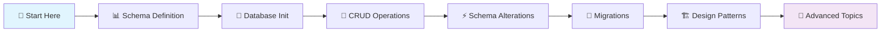

# 💡 Core Concepts

> **Master the fundamentals** - Essential building blocks for effective CQL development

Welcome to the **Core Concepts** section! This is your comprehensive guide to understanding CQL's fundamental architecture and features. Whether you're new to ORMs or transitioning from other frameworks, these concepts will give you the solid foundation needed to build robust Crystal applications with CQL.

## 🎯 What You'll Master

This section covers the essential building blocks that make CQL powerful and developer-friendly:

- 🗄️ **[Schema Definition](#-schema-definition)** - Type-safe database structure design
- 🔗 **[Database Initialization](#-database-initialization)** - Connection setup and management
- ⚡ **[Schema Alterations](#-schema-alterations)** - Evolving your database structure
- 🚀 **[Migrations](#-migrations)** - Systematic schema evolution and versioning
- 🔄 **[CRUD Operations](#-crud-operations)** - Create, Read, Update, Delete mastery
- 🏗️ **[Design Patterns](#️-design-patterns)** - Active Record, Repository, and Data Mapper approaches

---

## 🎯 Learning Path



**Recommended Path:**

1. **Schema Definition** → Learn how to define your database structure
2. **Database Initialization** → Set up connections and build your schema
3. **CRUD Operations** → Master basic database interactions
4. **Schema Alterations** → Understand how to modify existing structures
5. **Migrations** → Implement systematic schema evolution
6. **Design Patterns** → Choose the right architectural approach

---

## 📊 Schema Definition

> **Type-safe database structure design with Crystal's macro system**

CQL's schema definition system leverages Crystal's powerful macro capabilities to provide compile-time safety and intuitive database structure design.

### 🎯 Key Features

- **Type Safety** - Compile-time validation of schema structure
- **Multi-Database Support** - Works with PostgreSQL, MySQL, and SQLite
- **Declarative DSL** - Clean, readable schema definitions
- **Constraint Support** - Foreign keys, unique constraints, and check constraints

### 📝 Quick Example

```crystal
# Define a complete schema with relationships
UserSchema = CQL::Schema.define(
  :user_app,
  adapter: CQL::Adapter::Postgres,
  uri: ENV["DATABASE_URL"]
) do

  table :users do
    primary :id, Int64, auto_increment: true
    column :name, String, size: 100
    column :email, String, size: 255
    column :age, Int32
    column :active, Bool, default: true
    timestamps

    # Constraints
    unique_constraint [:email]
    check_constraint "age >= 0 AND age <= 150"
  end

  table :posts do
    primary :id, Int64, auto_increment: true
    column :title, String, size: 255
    column :content, String
    column :user_id, Int64
    column :published, Bool, default: false
    timestamps

    # Foreign key relationship
    foreign_key :user_id, references: :users, on_delete: :cascade
    index [:user_id, :published]
  end
end
```

### 🔍 What You'll Learn

- **Table Structure** - Defining columns, types, and constraints
- **Relationships** - Foreign keys and referential integrity
- **Indexing Strategy** - Performance optimization through proper indexing
- **Database-Specific Features** - Leveraging unique database capabilities

**👉 [Learn Schema Definition →](schemas.md)**

---

## 🔗 Database Initialization

> **Efficient connection management and schema building**

Learn how to initialize your database connections, configure adapters, and build your schema for optimal performance and reliability.

### 🎯 Key Concepts

- **Connection Pooling** - Efficient database connection management
- **Environment Configuration** - Development, testing, and production setups
- **Schema Building** - Converting definitions to actual database tables
- **Error Handling** - Robust connection error management

### 📝 Quick Example

```crystal
# Environment-specific database setup
case ENV["CRYSTAL_ENV"]?
when "production"
  MyDB = CQL::Schema.define(
    :production_db,
    adapter: CQL::Adapter::Postgres,
    uri: ENV["DATABASE_URL"],
    pool_size: 20,
    checkout_timeout: 10.seconds
  )

when "test"
  MyDB = CQL::Schema.define(
    :test_db,
    adapter: CQL::Adapter::SQLite,
    uri: "sqlite3://:memory:",  # Fast in-memory testing
    pool_size: 1
  )

else # development
  MyDB = CQL::Schema.define(
    :dev_db,
    adapter: CQL::Adapter::SQLite,
    uri: "sqlite3://./db/development.db",
    pool_size: 5
  )
end

# Build the actual database schema
MyDB.build

# Test connection
puts "✅ Database connected: #{MyDB.adapter.class}"
puts "📊 Tables: #{MyDB.tables.size}"
```

### 🔍 What You'll Learn

- **Adapter Configuration** - Setting up PostgreSQL, MySQL, and SQLite
- **Connection Strategies** - Pool sizing and timeout management
- **Environment Management** - Development vs production configurations
- **Health Checks** - Monitoring connection status

**👉 [Learn Database Initialization →](initializing-the-database.md)**

---

## 🔄 CRUD Operations

> **Master Create, Read, Update, Delete operations with type safety**

CRUD operations are the foundation of database interactions. CQL provides both **Active Record** and **Repository** patterns for maximum flexibility.

### 🎯 Core Capabilities

- **Type-Safe Operations** - Compile-time validation of data operations
- **Multiple Patterns** - Active Record and Repository approaches
- **Advanced Querying** - Complex WHERE conditions and joins
- **Batch Operations** - Efficient bulk operations
- **Transaction Support** - ACID compliance with automatic rollback

### 📝 Quick Examples

**Active Record Pattern:**

```crystal
# Create
user = User.create!(
  name: "Alice Johnson",
  email: "alice@example.com",
  age: 28
)

# Read
users = User.where(active: true)
            .where { age >= 18 }
            .order(created_at: :desc)
            .limit(10)
            .all

# Update
user.update!(age: 29, active: false)

# Delete
User.delete_by!(active: false)
```

**Repository Pattern:**

```crystal
# Set up repository
users = CQL::Repository(User, Int64).new(UserDB, :users)

# Create
user_id = users.create(name: "Bob", email: "bob@example.com", age: 35)

# Read
user = users.find!(user_id)
all_users = users.find_all_by(active: true)

# Update
users.update(user_id, age: 36)

# Delete
users.delete(user_id)
```

### 🔍 What You'll Learn

- **Basic Operations** - Creating, finding, updating, and deleting records
- **Advanced Queries** - Complex filtering, sorting, and pagination
- **Performance Optimization** - Efficient batch operations and query strategies
- **Error Handling** - Validation errors and exception management

**👉 [Master CRUD Operations →](crud-operations/README.md)**

---

## ⚡ Schema Alterations

> **Safely modify your database structure as requirements evolve**

As your application grows, your database schema will need to evolve. CQL provides safe, reversible ways to alter your existing database structure.

### 🎯 Alteration Types

- **Column Operations** - Add, remove, and modify columns
- **Table Operations** - Rename tables and change table properties
- **Index Management** - Create and drop indexes for performance
- **Constraint Management** - Add and remove constraints safely

### 📝 Quick Example

```crystal
# Safely alter existing schema
UserSchema.alter_table :users do
  # Add new columns
  add_column :avatar_url, String, null: true
  add_column :last_login, Time, null: true

  # Modify existing columns
  change_column :email, String, size: 320  # Support longer emails

  # Add constraints
  add_index [:last_login]
  add_unique_constraint [:username]

  # Remove old columns (with safety checks)
  drop_column :legacy_field if column_exists?(:legacy_field)
end

# PostgreSQL-specific features
UserSchema.alter_table :users do
  # Add JSON column
  add_column :preferences, JSON::Any, default: "{}"

  # Add array column
  add_column :tags, Array(String), default: [] of String
end
```

### 🔍 What You'll Learn

- **Safe Alterations** - Non-destructive schema changes
- **Database Differences** - Adapter-specific alteration capabilities
- **Performance Impact** - Understanding alteration costs
- **Rollback Strategies** - Reversing changes safely

**👉 [Learn Schema Alterations →](altering-the-schema.md)**

---

## 🚀 Migrations

> **Systematic schema evolution with version control and team collaboration**

Migrations provide a systematic way to evolve your database schema over time, ensuring all team members and environments stay in sync.

### 🎯 Migration Benefits

- **Version Control** - Track schema changes like code changes
- **Team Collaboration** - Consistent database state across developers
- **Environment Sync** - Deploy schema changes systematically
- **Rollback Support** - Safely undo problematic changes
- **Automation** - Integrate with CI/CD pipelines

### 📝 Quick Example

```crystal
# Create a new migration
class AddUserProfiles < CQL::Migration
  def up
    create_table :user_profiles do |t|
      t.references :user, null: false, foreign_key: true
      t.string :bio, limit: 500
      t.string :website_url, limit: 255
      t.string :location, limit: 100
      t.timestamps

      t.index :user_id, unique: true
    end

    # Populate existing users with empty profiles
    execute <<-SQL
      INSERT INTO user_profiles (user_id, created_at, updated_at)
      SELECT id, NOW(), NOW() FROM users
      WHERE id NOT IN (SELECT user_id FROM user_profiles)
    SQL
  end

  def down
    drop_table :user_profiles
  end
end

# Run migrations
CQL::Migration.run_pending

# Check migration status
puts "Pending: #{CQL::Migration.pending.size}"
puts "Applied: #{CQL::Migration.applied.size}"
```

### 🔍 What You'll Learn

- **Migration Structure** - Creating reversible database changes
- **Advanced Operations** - Data transformations and complex schema changes
- **Team Workflows** - Collaborative migration strategies
- **Production Deployment** - Safe production migration practices

**👉 [Master Migrations →](migrations.md)**

---

## 🏗️ Design Patterns

> **Choose the right architectural approach for your application**

CQL supports multiple design patterns, allowing you to choose the best approach for your specific needs and architectural preferences.

### 🎯 Supported Patterns

| Pattern           | Best For          | Complexity | Flexibility |
| ----------------- | ----------------- | ---------- | ----------- |
| **Active Record** | Domain-rich apps  | Low        | Medium      |
| **Repository**    | Data-centric apps | Medium     | High        |
| **Data Mapper**   | Complex domains   | High       | Very High   |

### 📝 Pattern Comparison

**Active Record Pattern:**

```crystal
# Models contain both data and behavior
struct User
  include CQL::ActiveRecord::Model(Int64)

  validates :email, presence: true, uniqueness: true
  has_many :posts, Post

  def full_name
    "#{first_name} #{last_name}"
  end

  def send_welcome_email
    WelcomeMailer.new(self).deliver
  end
end

# Usage
user = User.create!(name: "Alice", email: "alice@example.com")
user.send_welcome_email
```

**Repository Pattern:**

```crystal
# Separate data access from domain logic
struct User
  property id : Int64?
  property name : String
  property email : String

  def full_name
    "#{first_name} #{last_name}"
  end
end

class UserRepository
  def initialize(@db : CQL::Schema)
  end

  def create(user : User) : Int64
    @db.insert.into(:users)
       .values(name: user.name, email: user.email)
       .last_insert_id
  end

  def find_by_email(email : String) : User?
    result = @db.query.from(:users)
                .where(email: email)
                .first?
    result ? User.new(result) : nil
  end
end

# Usage
repo = UserRepository.new(MyDB)
user = User.new("Alice", "alice@example.com")
user_id = repo.create(user)
```

### 🔍 What You'll Learn

- **Pattern Selection** - Choosing the right pattern for your needs
- **Implementation Details** - How to implement each pattern effectively
- **Trade-offs** - Understanding the pros and cons of each approach
- **Migration Strategies** - Moving between patterns as needs change

**👉 [Explore Design Patterns →](patterns/README.md)**

---

## 🎯 Quick Reference

### 📚 Essential Concepts Checklist

- [ ] **Schema Definition** - Can define tables, columns, and relationships
- [ ] **Database Setup** - Can initialize and configure database connections
- [ ] **CRUD Mastery** - Comfortable with Create, Read, Update, Delete operations
- [ ] **Query Building** - Can construct complex queries with conditions and joins
- [ ] **Schema Evolution** - Understand alterations and migrations
- [ ] **Pattern Selection** - Know when to use Active Record vs Repository patterns

### 🔗 Quick Navigation

| Topic                                             | Description                     | Time Investment |
| ------------------------------------------------- | ------------------------------- | --------------- |
| **[Schema Definition](schemas.md)**               | Learn database structure design | 30 minutes      |
| **[Database Init](initializing-the-database.md)** | Master connection setup         | 20 minutes      |
| **[CRUD Operations](crud-operations/README.md)**  | Essential database interactions | 45 minutes      |
| **[Schema Alterations](altering-the-schema.md)**  | Safe schema modifications       | 25 minutes      |
| **[Migrations](migrations.md)**                   | Systematic schema evolution     | 40 minutes      |
| **[Design Patterns](patterns/README.md)**         | Architectural approaches        | 35 minutes      |

### ⚡ Performance Insights

Understanding these core concepts will help you build applications that are:

- **🚀 Fast** - Efficient query generation and execution
- **🔒 Safe** - Compile-time error prevention
- **📈 Scalable** - Proper indexing and query optimization
- **🔧 Maintainable** - Clean separation of concerns
- **🧪 Testable** - Easy to mock and test

---

## 🎓 Next Steps

Once you've mastered these core concepts, you'll be ready for advanced topics:

- **🔗 [Relationships](../guides/active-record-with-cql/relations/README.md)** - Model associations and joins
- **✅ [Validations](../guides/active-record-with-cql/validations.md)** - Data integrity and custom validators
- **🔄 [Callbacks](../guides/active-record-with-cql/callbacks.md)** - Lifecycle hooks and business logic
- **💱 [Transactions](../guides/active-record-with-cql/transactions.md)** - ACID compliance and rollback handling
- **⚡ [Performance](../guides/performance/)** - Query optimization and scaling strategies

---

## 💡 Pro Tips

**🎯 Focus on Fundamentals**

> Master schema definition and CRUD operations first - they're the foundation for everything else in CQL.

**🏗️ Start Simple**

> Begin with the Active Record pattern for most applications. You can always refactor to Repository pattern later as complexity grows.

**📊 Think About Data First**

> Design your schema carefully upfront. Good database design makes everything else easier.

**🔧 Use the Right Tools**

> Leverage CQL's type safety - it will catch errors at compile-time that would be runtime bugs in other ORMs.

**📈 Plan for Growth**

> Design your schema and patterns with future scaling in mind, but don't over-engineer from the start.

---

> 🚀 **Ready to dive deeper?** Start with [Schema Definition](schemas.md) to learn how to design type-safe database structures, then work your way through each concept systematically!

Happy learning! 💎
