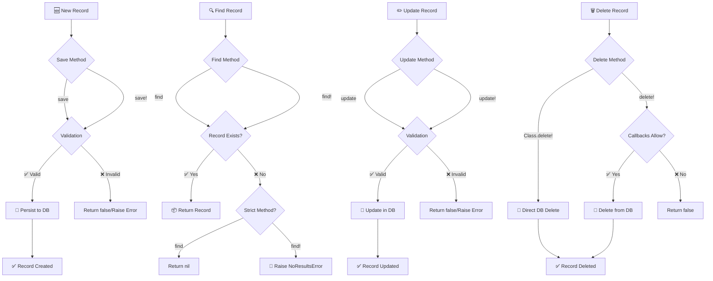

# 🔄 CRUD Operations

> **Create, Read, Update, Delete** – The fundamental building blocks of database interactions in CQL

CQL provides powerful, type-safe CRUD operations that work seamlessly across PostgreSQL, MySQL, and SQLite. Whether you prefer the **Active Record pattern** for domain-rich applications or the **Repository pattern** for data-centric architectures, CQL has you covered.

## 📋 Table of Contents

- [🚀 Quick Start](#-quick-start)
- [🏗️ Create Operations](#️-create-operations)
- [📖 Read Operations](#-read-operations)
- [✏️ Update Operations](#️-update-operations)
- [🗑️ Delete Operations](#️-delete-operations)
- [🔄 CRUD Flow Diagram](#-crud-flow-diagram)
- [🏛️ Repository Pattern](#️-repository-pattern)
- [⚡ Performance Tips](#-performance-tips)
- [🔒 Best Practices](#-best-practices)

---

## 🚀 Quick Start

First, let's set up a basic model to work with:

```crystal
# Example model for demonstrations
struct User
  include CQL::ActiveRecord::Model(Int64)
  db_context UserDB, :users

  property id : Int64?
  property name : String
  property email : String
  property age : Int32
  property active : Bool = true
  property created_at : Time?
  property updated_at : Time?

  # Validations
  validates :name, presence: true, length: {minimum: 2}
  validates :email, presence: true, format: EMAIL_REGEX
  validates :age, numericality: {greater_than: 0, less_than: 150}
end
```

---

## 🏗️ Create Operations

### 📝 Instance Creation with `new` + `save`

The most fundamental approach - create an instance and save it:

```crystal
# Using save (returns true/false)
user = User.new(
  name: "Alice Johnson",
  email: "alice@example.com",
  age: 28
)

if user.save
  puts "✅ User created with ID: #{user.id}"
  puts "📧 Email: #{user.email}"
else
  puts "❌ Failed to save user"
  puts "🚨 Errors: #{user.errors.full_messages.join(", ")}"
end

# Using save! (raises on failure)
begin
  user = User.new(
    name: "Bob Smith",
    email: "bob@example.com",
    age: 35
  )
  user.save!
  puts "✅ User '#{user.name}' saved with ID: #{user.id}"
rescue CQL::RecordInvalid => ex
  puts "❌ Validation failed: #{ex.record.errors.full_messages.join(", ")}"
rescue Exception => ex
  puts "💥 Save failed: #{ex.message}"
end
```

### 🎯 Direct Creation with `create`

Create and save in one step:

```crystal
# Using create! (recommended - raises on failure)
begin
  user = User.create!(
    name: "Carol Davis",
    email: "carol@example.com",
    age: 42,
    active: true
  )
  puts "🎉 Created user: #{user.name} (ID: #{user.id})"

  # You can also use a hash
  attrs = {
    name: "David Wilson",
    email: "david@example.com",
    age: 31
  }
  user2 = User.create!(attrs)
  puts "🎉 Created user: #{user2.name} (ID: #{user2.id})"

rescue CQL::RecordInvalid => ex
  puts "❌ Validation failed: #{ex.record.errors.full_messages.join(", ")}"
rescue Exception => ex
  puts "💥 Creation failed: #{ex.message}"
end

# Using create (returns instance that may be invalid)
user = User.create(name: "Eve Brown", email: "eve@example.com", age: 29)
if user && user.persisted?
  puts "✅ User created successfully"
elsif user
  puts "❌ User creation failed: #{user.errors.full_messages.join(", ")}"
else
  puts "🛑 Creation halted by callback"
end
```

### 🔍 Find or Create

Avoid duplicates with `find_or_create_by`:

```crystal
# Find existing user or create new one
user = User.find_or_create_by(
  email: "unique@example.com",
  name: "Unique User",
  age: 25
)

puts user.persisted? ? "📦 Found existing user" : "🆕 Created new user"
puts "👤 User: #{user.name} (#{user.email})"

# With hash syntax
attrs = {email: "another@example.com", name: "Another User", age: 30}
user2 = User.find_or_create_by(attrs)
```

---

## 📖 Read Operations

### 🎯 Finding by Primary Key

```crystal
# Find by ID (returns User? - nil if not found)
user = User.find(1)
if user
  puts "👤 Found user: #{user.name}"
else
  puts "❌ User not found"
end

# Find by ID or raise exception
begin
  user = User.find!(1)
  puts "👤 Found user: #{user.name}"
rescue DB::NoResultsError
  puts "❌ No user with ID 1"
end

# Using nullable ID
user_id : Int64? = some_method_that_returns_id
if id = user_id
  user = User.find(id)
  puts "👤 User: #{user.try(&.name) || "Not found"}"
end
```

### 🔎 Finding by Attributes

```crystal
# Find first matching user
user = User.find_by(email: "alice@example.com")
puts user ? "📧 Found: #{user.name}" : "❌ No user with that email"

# Find with multiple conditions
admin_user = User.find_by(active: true, age: 25)

# Find or raise exception
begin
  user = User.find_by!(email: "required@example.com")
  puts "✅ Found required user: #{user.name}"
rescue DB::NoResultsError
  puts "❌ Required user not found!"
end

# Find all matching users
active_users = User.find_all_by(active: true)
puts "👥 Active users: #{active_users.size}"

young_users = User.find_all_by(age: 18..25)
puts "🧒 Young users: #{young_users.size}"
```

### 📊 Collection Methods

```crystal
# Get all records
all_users = User.all
puts "👥 Total users: #{all_users.size}"

# Get first and last records
first_user = User.first
last_user = User.last

puts "🥇 First user: #{first_user.try(&.name) || "None"}"
puts "🥉 Last user: #{last_user.try(&.name) || "None"}"

# Count records
total_count = User.count
active_count = User.where(active: true).count

puts "📊 Total: #{total_count}, Active: #{active_count}"

# Check existence
has_users = User.exists?
has_admins = User.exists?(email: "admin@example.com")

puts "👥 Has users: #{has_users}"
puts "👑 Has admin: #{has_admins}"
```

### 🔗 Advanced Querying

```crystal
# Chain conditions with query builder
recent_active_users = User
  .where(active: true)
  .where { created_at > 1.week.ago }
  .order(name: :asc)
  .limit(10)
  .all

puts "🔥 Recent active users: #{recent_active_users.map(&.name).join(", ")}"

# Complex queries
adult_users = User
  .where { age >= 18 }
  .where { name.like("%john%") }
  .order(age: :desc)
  .all

# Pagination
page_users = User
  .where(active: true)
  .order(created_at: :desc)
  .limit(20)
  .offset(40)  # Page 3 (20 per page)
  .all

puts "📄 Page 3 users: #{page_users.size}"
```

---

## ✏️ Update Operations

### 🔄 Instance Updates

The standard approach - load, modify, save:

```crystal
# Find and update with save
user = User.find_by(email: "alice@example.com")
if user
  user.active = false
  user.name = "Alice Smith" # Married name

  if user.save
    puts "✅ User updated successfully"
  else
    puts "❌ Update failed: #{user.errors.full_messages.join(", ")}"
  end
end

# Using save! for updates (raises on failure)
user = User.find_by!(email: "bob@example.com")
user.age = 36
user.updated_at = Time.utc

begin
  user.save!
  puts "✅ User '#{user.name}' updated successfully"
rescue CQL::ActiveRecord::Validations::ValidationError => ex
  puts "❌ Validation failed: #{ex.record.errors.full_messages.join(", ")}"
rescue Exception => ex
  puts "💥 Update failed: #{ex.message}"
end
```

### ⚡ Direct Instance Updates

Update attributes and save in one step:

```crystal
user = User.find_by!(email: "carol@example.com")

# Using update! (raises on failure)
begin
  user.update!(
    name: "Carol Johnson",
    age: 43,
    active: true
  )
  puts "✅ User updated successfully"
rescue CQL::ActiveRecord::Validations::ValidationError => ex
  puts "❌ Update failed: #{ex.record.errors.full_messages.join(", ")}"
end

# Using update (returns true/false)
if user.update(name: "Carol Davis-Johnson")
  puts "✅ Name updated successfully"
else
  puts "❌ Name update failed: #{user.errors.full_messages.join(", ")}"
end
```

### 🎯 Class-Level Updates

Update records by ID without loading them:

```crystal
# Update by ID
begin
  User.update!(1, name: "Updated Name", age: 30)
  puts "✅ User ID 1 updated via class method"
rescue DB::NoResultsError
  puts "❌ User ID 1 not found"
rescue CQL::ActiveRecord::Validations::ValidationError => ex
  puts "❌ Validation failed: #{ex.record.errors.full_messages.join(", ")}"
rescue Exception => ex
  puts "💥 Update failed: #{ex.message}"
end

# Update by ID with hash
attrs = {name: "Hash Updated", active: false}
User.update!(user_id, attrs)
```

### 📦 Batch Updates

Update multiple records efficiently:

```crystal
# Update all records matching conditions (no validations/callbacks)
User.update_by(
  {active: false},           # WHERE conditions
  {active: true, updated_at: Time.utc}  # SET values
)
puts "✅ Reactivated all inactive users"

# Update records by multiple conditions
User.update_by(
  {age: 18..25, active: true},
  {category: "young_adult"}
)

# Update ALL records (use with extreme caution!)
# User.update_all({status: "migrated", updated_at: Time.utc})
# puts "⚠️ Updated all users - use sparingly!"
```

### 📅 Touch Updates

Update timestamp fields without changing other data:

```crystal
user = User.find!(1)

# Touch updated_at
user.touch
puts "✅ Touched user's updated_at timestamp"

# Touch specific fields
user.touch(:last_seen_at, :updated_at)
puts "✅ Updated last_seen_at and updated_at"

# Touch multiple records
user_ids = [1, 2, 3, 4, 5]
User.touch_all(user_ids, :last_active_at)
puts "✅ Touched #{user_ids.size} users' last_active_at"
```

---

## 🗑️ Delete Operations

### 🎯 Instance Deletion

Delete individual records with callbacks:

```crystal
user = User.find_by(email: "tobedeleted@example.com")
if user
  puts "🗑️ Attempting to delete user: #{user.name}"

  if user.delete!
    puts "✅ User deleted successfully"
    puts "🔍 Destroyed? #{user.destroyed?}"
  else
    puts "❌ Deletion failed (perhaps blocked by callback)"
  end
else
  puts "❌ User not found"
end

# Check if record is destroyed
if user && user.destroyed?
  puts "💀 User has been destroyed"
end
```

### ⚡ Class-Level Deletion

Delete records directly without instantiation (skips callbacks):

```crystal
# Delete by ID
begin
  result = User.delete!(1)
  puts "✅ User ID 1 deleted (#{result.rows_affected} rows affected)"
rescue Exception => ex
  puts "💥 Delete failed: #{ex.message}"
end

# Delete by attributes
result = User.delete_by!(email: "spam@example.com")
puts "🧹 Deleted spam users: #{result.rows_affected} rows"

# Delete multiple users by condition
result = User.delete_by!(active: false, age: 0..17)
puts "🧹 Deleted inactive minors: #{result.rows_affected} rows"

# Delete with multiple criteria
result = User.delete_by!(
  name: "Test User",
  email: "test@example.com"
)
puts "🧹 Deleted test users: #{result.rows_affected} rows"
```

### 💥 Bulk Deletion

```crystal
# Delete ALL records (use with extreme caution!)
puts "⚠️ WARNING: This will delete ALL users!"
# Uncomment the next line only if you're absolutely sure:
# result = User.delete_all
# puts "💥 Deleted all users: #{result.rows_affected} rows"

# Safer: Delete with query conditions
User.where(created_at: ..1.year.ago)
    .where(active: false)
    .delete_all
puts "🧹 Deleted old inactive users"
```

---

## 🔄 CRUD Flow Diagram



---

## 🏛️ Repository Pattern

For data-centric applications, use the Repository pattern:

```crystal
# Set up repository
Users = CQL::Repository(User, Int64).new(UserDB, :users)

# Create
user_id = Users.create(name: "Repo User", email: "repo@example.com", age: 30)
puts "📦 Created user with ID: #{user_id}"

# Read
user = Users.find!(user_id)
all_users = Users.all
active_users = Users.find_all_by(active: true)
user_by_email = Users.find_by(email: "repo@example.com")

puts "👤 Found user: #{user.name}"
puts "👥 Total users: #{all_users.size}"

# Update
Users.update(user_id, name: "Updated Repo User", age: 31)
puts "✅ User updated via repository"

# Batch updates
Users.update_by({active: false}, {active: true})
Users.update_all({category: "repository_managed"})

# Delete
Users.delete(user_id)
puts "🗑️ User deleted via repository"

# Batch deletes
Users.delete_by(active: false)
Users.delete_all  # Use with caution!

# Utility methods
count = Users.count
exists = Users.exists?(email: "test@example.com")
puts "📊 Count: #{count}, Test user exists: #{exists}"
```

---

## ⚡ Performance Tips

### 🚀 Batch Operations

```crystal
# ✅ Good: Batch create (if supported)
users_data = [
  {name: "User 1", email: "user1@example.com", age: 25},
  {name: "User 2", email: "user2@example.com", age: 30},
  {name: "User 3", email: "user3@example.com", age: 35}
]

# Create multiple records efficiently
users_data.each { |data| User.create!(data) }

# ✅ Good: Use batch updates for multiple records
User.update_by({active: false}, {active: true})

# ❌ Avoid: Individual updates in loops
# User.all.each { |user| user.update!(active: true) }  # Slow!
```

### 🎯 Selective Loading

```crystal
# ✅ Good: Query only needed fields
users = User.select(:id, :name, :email)
            .where(active: true)
            .limit(100)
            .all

# ✅ Good: Use pagination for large datasets
page_size = 50
offset = (page - 1) * page_size

users = User.where(active: true)
            .order(:created_at)
            .limit(page_size)
            .offset(offset)
            .all

# ✅ Good: Use exists? instead of counting for boolean checks
has_admin = User.exists?(role: "admin")  # Fast
# admin_count = User.where(role: "admin").count > 0  # Slower
```

### 🔍 Efficient Queries

```crystal
# ✅ Good: Use indexes for WHERE conditions
User.where(email: "user@example.com")  # Fast if email is indexed

# ✅ Good: Use find_by! when you expect one result
user = User.find_by!(email: "unique@example.com")

# ❌ Avoid: Loading all records just to get first
# first_user = User.all.first  # Loads everything!
first_user = User.first        # Much better
```

---

## 🔒 Best Practices

### ✅ Validation & Error Handling

```crystal
# Always handle validation errors gracefully
begin
  user = User.create!(invalid_data)
rescue CQL::ActiveRecord::Validations::ValidationError => ex
  puts "User creation failed: #{ex.record.errors.full_messages}"
  # Handle appropriately - show user-friendly message, etc.
rescue Exception => ex
  puts "Unexpected error creating user: #{ex.message}"
  # Handle system errors
end
```

### 🔐 Security Considerations

```crystal
# ✅ Good: Validate and sanitize input
def create_user(params)
  user = User.new(
    name: params[:name]?.try(&.strip),
    email: params[:email]?.try(&.downcase.strip),
    age: params[:age]?.try(&.to_i)
  )

  user.save!
end

# ❌ Avoid: Direct mass assignment without validation
# User.create!(params)  # Dangerous if params not validated
```

### 📊 Monitoring & Logging

```crystal
# ✅ Good: Log important operations
puts "Creating user: #{user.email}"
user = User.create!(user_params)
puts "User created successfully: ID #{user.id}"

# ✅ Good: Track performance-critical operations
start_time = Time.utc
users = User.where(complex_conditions).all
duration = Time.utc - start_time
puts "Query completed in #{duration.total_milliseconds}ms, found #{users.size} users"
```

### 🎯 Transaction Safety

```crystal
# ✅ Good: Use transactions for multi-step operations
UserDB.transaction do
  user = User.create!(user_params)
  UserProfile.create!(user_id: user.id, profile_params)
  UserPreferences.create!(user_id: user.id, default_preferences)

  puts "User onboarding completed for #{user.email}"
end
```

---

## 🎓 What's Next?

Now that you've mastered CRUD operations, explore these advanced topics:

- 🔗 **[Relationships](../relationships/)** - Model associations and joins
- 🔍 **[Advanced Querying](../querying/)** - Complex queries and aggregations
- ✅ **[Validations](../validations/)** - Data integrity and custom validators
- 🔄 **[Callbacks](../callbacks/)** - Lifecycle hooks and business logic
- 🏗️ **[Migrations](../migrations/)** - Schema evolution and versioning
- ⚡ **[Performance](../performance/)** - Optimization and best practices

Happy coding! 🚀

---

> 💡 **Pro Tip**: Use `save!` and `create!` in development to catch validation errors early, but handle exceptions gracefully in production code.
