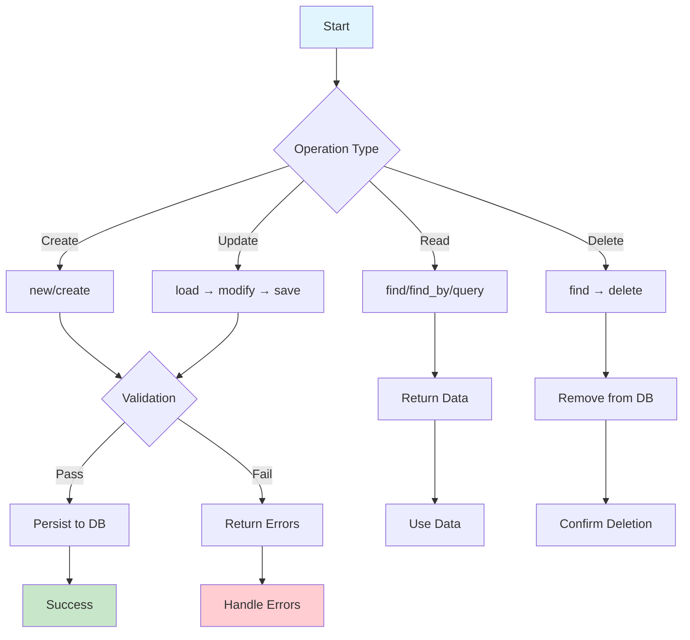

# CRUD Operations

> **Create, Read, Update, Delete** – The fundamental building blocks of database interactions in CQL

CQL provides powerful, type-safe CRUD operations that work seamlessly across PostgreSQL, MySQL, and SQLite. Whether you prefer the **Active Record pattern** for domain-rich applications or the **Repository pattern** for data-centric architectures, CQL has you covered.

## Table of Contents

- [CRUD Operations](#crud-operations)
  - [Table of Contents](#table-of-contents)
  - [Quick Start](#quick-start)
  - [Create Operations](#create-operations)
    - [Instance Creation with `new` + `save`](#instance-creation-with-new--save)
    - [Direct Creation with `create`](#direct-creation-with-create)
    - [Find or Create](#find-or-create)
  - [Read Operations](#read-operations)
    - [Finding by Primary Key](#finding-by-primary-key)
    - [Finding by Attributes](#finding-by-attributes)
    - [Aggregations and Counting](#aggregations-and-counting)
  - [✏️ Update Operations](#️-update-operations)
    - [Load, Modify, and Save](#load-modify-and-save)
    - [Bulk Updates](#bulk-updates)
  - [Delete Operations](#delete-operations)
    - [Individual Deletion](#individual-deletion)
    - [Bulk Deletion](#bulk-deletion)
  - [CRUD Flow Diagram](#crud-flow-diagram)
  - [Repository Pattern](#repository-pattern)
  - [Performance Tips](#performance-tips)
    - [Efficient Queries](#efficient-queries)
    - [Indexing Strategy](#indexing-strategy)
  - [Best Practices](#best-practices)
    - [Do's](#dos)
    - [Don'ts](#donts)
  - [Further Reading](#further-reading)

---

## Quick Start

First, let's set up a basic model to work with:

```crystal
# Example model for demonstrations
struct User
  include CQL::ActiveRecord::Model(Int64)
  db_context UserDB, :users

  property id : Int64?
  property name : String
  property email : String
  property age : Int32
  property active : Bool = true
  property created_at : Time?
  property updated_at : Time?

  # Validations
  validates :name, presence: true, length: {minimum: 2}
  validates :email, presence: true, format: EMAIL_REGEX
  validates :age, numericality: {greater_than: 0, less_than: 150}
end
```

---

## Create Operations

### Instance Creation with `new` + `save`

The most fundamental approach - create an instance and save it:

```crystal
# Using save (returns true/false)
user = User.new(
  name: "Alice Johnson",
  email: "alice@example.com",
  age: 28
)

if user.save
  puts "✅ User created with ID: #{user.id}"
  puts "📧 Email: #{user.email}"
else
  puts "❌ Failed to save user"
  puts "🚨 Errors: #{user.errors.full_messages.join(", ")}"
end

# Using save! (raises on failure)
begin
  user = User.new(
    name: "Bob Smith",
    email: "bob@example.com",
    age: 35
  )
  user.save!
  puts "✅ User '#{user.name}' saved with ID: #{user.id}"
rescue CQL::RecordInvalid => ex
  puts "❌ Validation failed: #{ex.record.errors.full_messages.join(", ")}"
rescue Exception => ex
  puts "💥 Save failed: #{ex.message}"
end
```

### Direct Creation with `create`

Create and save in one step:

```crystal
# Using create! (recommended - raises on failure)
begin
  user = User.create!(
    name: "Carol Davis",
    email: "carol@example.com",
    age: 42,
    active: true
  )
  puts "🎉 Created user: #{user.name} (ID: #{user.id})"

  # You can also use a hash
  attrs = {
    name: "David Wilson",
    email: "david@example.com",
    age: 31
  }
  user2 = User.create!(attrs)
  puts "🎉 Created user: #{user2.name} (ID: #{user2.id})"

rescue CQL::RecordInvalid => ex
  puts "❌ Validation failed: #{ex.record.errors.full_messages.join(", ")}"
rescue Exception => ex
  puts "💥 Creation failed: #{ex.message}"
end
```

### Find or Create

Avoid duplicates with `find_or_create_by`:

```crystal
# Find existing user or create new one
user = User.find_or_create_by(
  email: "unique@example.com",
  name: "Unique User",
  age: 25
)

puts user.persisted? ? "📦 Found existing user" : "🆕 Created new user"
puts "👤 User: #{user.name} (#{user.email})"
```

---

## Read Operations

### Finding by Primary Key

```crystal
# Find by ID (returns User? - nil if not found)
user = User.find(1)
if user
  puts "👤 Found user: #{user.name}"
else
  puts "❌ User not found"
end

# Find by ID or raise exception
begin
  user = User.find!(1)
  puts "👤 Found user: #{user.name}"
rescue DB::NoResultsError
  puts "❌ No user with ID 1"
end
```

### Finding by Attributes

```crystal
# Find first matching user
user = User.find_by(email: "alice@example.com")
puts user ? "📧 Found: #{user.name}" : "❌ No user with that email"

# Find with multiple conditions
admin_user = User.find_by(active: true, age: 25)

# Find or raise exception
begin
  user = User.find_by!(email: "required@example.com")
  puts "✅ Found required user: #{user.name}"
rescue DB::NoResultsError
  puts "❌ Required user not found!"
end
```

### Aggregations and Counting

```crystal
# Count all users
total_users = User.count
puts "👥 Total users: #{total_users}"

# Count with conditions
active_users = User.query.where(active: true).count
puts "✅ Active users: #{active_users}"

# Find all matching records
all_admins = User.find_all_by(role: "admin")
puts "👑 Found #{all_admins.size} admin users"
```

---

## ✏️ Update Operations

### Load, Modify, and Save

```crystal
# Find and update a user
if user = User.find_by(email: "alice@example.com")
  user.name = "Alice Johnson-Smith"
  user.age = 29

  if user.save
    puts "✅ User updated successfully"
  else
    puts "❌ Update failed: #{user.errors.full_messages.join(", ")}"
  end
end

# Using save! for updates
begin
  user = User.find_by!(email: "bob@example.com")
  user.active = false
  user.save!
  puts "✅ User deactivated successfully"
rescue CQL::RecordInvalid => ex
  puts "❌ Update failed: #{ex.record.errors.full_messages.join(", ")}"
end
```

### Bulk Updates

```crystal
# Update multiple records at once
updated_count = User.query
  .where(active: true, age: 18..25)
  .update_all(role: "student")

puts "🎓 Updated #{updated_count} users to student role"

# Update with conditions
User.query
  .where("created_at < ?", 1.month.ago)
  .update_all(needs_verification: true)
```

---

## Delete Operations

### Individual Deletion

```crystal
# Find and delete a user
if user = User.find_by(email: "inactive@example.com")
  if user.delete
    puts "🗑️ User deleted successfully"
  else
    puts "❌ Failed to delete user"
  end
end

# Using delete! (raises on failure)
begin
  user = User.find_by!(email: "spam@example.com")
  user.delete!
  puts "🗑️ Spam user deleted"
rescue Exception => ex
  puts "💥 Delete failed: #{ex.message}"
end
```

### Bulk Deletion

```crystal
# Delete multiple records
deleted_count = User.query
  .where(active: false, "last_login_at < ?", 6.months.ago)
  .delete_all

puts "🗑️ Deleted #{deleted_count} inactive users"

# Delete with complex conditions
User.query
  .where("email LIKE ?", "%@olddomain.com")
  .delete_all
```

---

## CRUD Flow Diagram



---

## Repository Pattern

For data-centric applications, CQL also supports the Repository pattern:

```crystal
# Repository interface
abstract class UserRepository
  abstract def find(id : Int64) : User?
  abstract def find_by_email(email : String) : User?
  abstract def save(user : User) : Bool
  abstract def delete(user : User) : Bool
  abstract def all : Array(User)
end

# Concrete implementation
class SqlUserRepository < UserRepository
  def find(id : Int64) : User?
    User.find(id)
  end

  def find_by_email(email : String) : User?
    User.find_by(email: email)
  end

  def save(user : User) : Bool
    user.save
  end

  def delete(user : User) : Bool
    user.delete
  end

  def all : Array(User)
    User.all
  end
end
```

---

## Performance Tips

### Efficient Queries

```crystal
# Use specific selects to reduce data transfer
users = User.query
  .select(:id, :name, :email)
  .where(active: true)
  .limit(100)

# Use includes for eager loading (prevents N+1)
posts = Post.query
  .includes(:user, :comments)
  .where(published: true)

# Use batch operations for large datasets
User.query.where(active: false).find_in_batches(batch_size: 1000) do |batch|
  batch.each { |user| user.update!(needs_verification: true) }
end
```

### Indexing Strategy

```crystal
# Ensure proper indexing for frequently queried columns
table :users do
  # ... columns ...

  # Index frequently queried columns
  index [:email], unique: true
  index [:active, :created_at]
  index [:role, :active]
end
```

---

## Best Practices

### Do's

- **Use `create!` and `save!`** for critical operations where failure should halt execution
- **Validate data** before saving to ensure data integrity
- **Use transactions** for multi-step operations that must succeed or fail together
- **Handle errors gracefully** with proper exception handling
- **Use batch operations** for large datasets to improve performance
- **Implement proper indexing** for frequently queried columns

### Don'ts

- **Don't ignore validation errors** - always handle them appropriately
- **Don't use `find!` without exception handling** in user-facing code
- **Don't perform bulk operations** without considering performance impact
- **Don't forget to close connections** in long-running applications
- **Don't use raw SQL** unless absolutely necessary - CQL provides type safety

---

## Further Reading

For detailed Active Record CRUD operations with advanced features, see:

- **[Active Record CRUD Operations](../guides/active-record-with-cql/crud-operations.md)** - Comprehensive Active Record implementation
- **[Querying & Scopes](../guides/active-record-with-cql/queryable.md)** - Advanced query building
- **[Complex Queries](../guides/active-record-with-cql/complex-queries.md)** - Joins, aggregations, and subqueries
- **[Transactions](../guides/active-record-with-cql/transactions.md)** - Data consistency and ACID compliance
- **[Validations](../guides/active-record-with-cql/validations.md)** - Data validation and integrity

---

> 💡 **Tip**: CQL's CRUD operations are designed to be intuitive and type-safe. Start with the basic patterns and gradually explore advanced features as your application grows!
