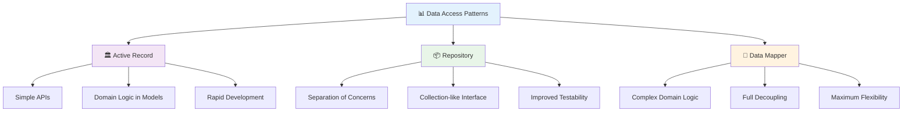
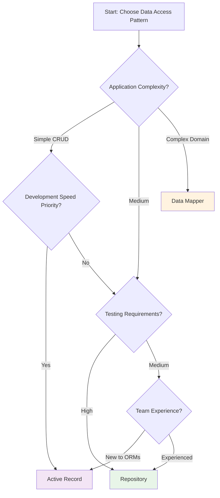

# 🏗️ Design Patterns

> **Choose the right architectural approach** - Master Active Record, Repository, and Data Mapper patterns for scalable Crystal applications

Design patterns are proven solutions to recurring problems in software architecture. In the world of Object-Relational Mapping (ORM) and database interactions, choosing the right pattern can significantly impact your application's maintainability, testability, and scalability.

CQL supports multiple design patterns, giving you the flexibility to choose the approach that best fits your application's needs and complexity. This guide explores the key data access patterns available in CQL and helps you make informed architectural decisions.

## 📋 Table of Contents

- [🎯 Pattern Overview](#-pattern-overview)
- [📊 Pattern Comparison](#-pattern-comparison)
- [🏛️ Active Record Pattern](#️-active-record-pattern)
- [📦 Repository Pattern](#-repository-pattern)
- [🔄 Data Mapper Pattern](#-data-mapper-pattern)
- [🎨 Pattern Selection Guide](#-pattern-selection-guide)
- [🔄 Migration Strategies](#-migration-strategies)
- [💡 Best Practices](#-best-practices)

---

## 🎯 Pattern Overview

CQL supports three main architectural patterns for data access, each with distinct characteristics and use cases:



### 🏛️ **Active Record Pattern**

**"An object that wraps a row in a database table"**

- Models contain both data and behavior
- Database operations are methods on the model
- Ideal for rapid development and simple domains

### 📦 **Repository Pattern**

**"A collection-like interface for accessing domain objects"**

- Separates data access logic from business logic
- Provides a uniform interface for data operations
- Excellent for testing and complex queries

### 🔄 **Data Mapper Pattern**

**"A layer that moves data between objects and database"**

- Complete separation between domain and persistence
- Maximum flexibility for complex domain models
- Ideal for sophisticated business logic

---

## 📊 Pattern Comparison

| Aspect                     | Active Record | Repository   | Data Mapper     |
| -------------------------- | ------------- | ------------ | --------------- |
| **Complexity**             | 🟢 Low        | 🟡 Medium    | 🔴 High         |
| **Learning Curve**         | 🟢 Easy       | 🟡 Moderate  | 🔴 Steep        |
| **Development Speed**      | 🟢 Fast       | 🟡 Medium    | 🔴 Slower       |
| **Testability**            | 🟡 Good       | 🟢 Excellent | 🟢 Excellent    |
| **Flexibility**            | 🟡 Limited    | 🟢 High      | 🟢 Maximum      |
| **Separation of Concerns** | 🔴 Poor       | 🟢 Good      | 🟢 Excellent    |
| **Best for**               | CRUD apps     | Data-centric | Complex domains |

### 🎯 When to Use Each Pattern

**Choose Active Record when:**

- Building CRUD-heavy applications
- Working with simple domain models
- Prioritizing rapid development
- Team is new to ORMs
- Requirements are stable

**Choose Repository when:**

- Need clear separation of concerns
- Building data-centric applications
- Complex querying requirements
- High testability requirements
- Multiple data sources

**Choose Data Mapper when:**

- Complex business domain
- Rich domain models with sophisticated logic
- Need complete persistence ignorance
- Working with legacy databases
- Maximum flexibility required

---

## 🏛️ Active Record Pattern

> **"An object that wraps a row in a database table, encapsulates database access, and adds domain logic on that data"** - Martin Fowler

The Active Record pattern combines data and behavior in a single object, making database records behave like objects with both data and methods that operate on that data.

### 🎯 Key Characteristics

- **Data + Behavior**: Models contain both properties and business logic
- **Direct Database Access**: Objects can save, update, and delete themselves
- **Inheritance-based**: Models inherit persistence capabilities
- **Convention over Configuration**: Sensible defaults reduce boilerplate

### 📝 Implementation in CQL

```crystal
struct User
  include CQL::ActiveRecord::Model(Int64)
  db_context UserDB, :users

  property id : Int64?
  property name : String
  property email : String
  property active : Bool = true
  property created_at : Time?
  property updated_at : Time?

  # Validations
  validates :name, presence: true, length: {minimum: 2}
  validates :email, presence: true, format: EMAIL_REGEX, uniqueness: true

  # Associations
  has_many :posts, Post, foreign_key: :user_id
  has_one :profile, UserProfile, foreign_key: :user_id

  # Business logic methods
  def full_name
    name.split(' ', 2).join(' ')
  end

  def send_welcome_email
    return unless active?
    WelcomeMailer.new(self).deliver
  end

  def deactivate!
    update!(active: false, deactivated_at: Time.utc)
    send_deactivation_email
  end

  # Callbacks
  before_save :normalize_email
  after_create :send_welcome_email

  private def normalize_email
    self.email = email.downcase.strip
  end

  private def send_deactivation_email
    DeactivationMailer.new(self).deliver
  end
end

# Usage examples
user = User.create!(
  name: "Alice Johnson",
  email: "ALICE@EXAMPLE.COM"  # Will be normalized by callback
)

puts user.full_name  # Business logic method
user.send_welcome_email  # Domain-specific behavior

# Built-in CRUD operations
users = User.where(active: true).order(:created_at).all
user.update!(name: "Alice Smith")
user.deactivate!  # Custom business logic
```

### ✅ Advantages

- **Rapid Development**: Quick to implement and understand
- **Intuitive API**: Natural object-oriented interface
- **Rich Query Interface**: Built-in querying capabilities
- **Automatic Persistence**: Objects know how to save themselves
- **Convention-based**: Minimal configuration required

### ❌ Disadvantages

- **Tight Coupling**: Domain logic tied to persistence layer
- **Limited Testability**: Harder to mock database operations
- **Inheritance Constraints**: Models must inherit from base class
- **Database Leakage**: Database concerns can leak into domain logic

### 🎯 Best Use Cases

- **CRUD Applications**: Admin panels, content management systems
- **Rapid Prototyping**: Quick MVPs and proof-of-concepts
- **Simple Domains**: Straightforward business logic
- **Small Teams**: Easy for new developers to understand

**👉 [Learn Active Record in Detail →](active-record.md)**

---

## 📦 Repository Pattern

> **"Encapsulates the logic needed to access data sources, centralizing common data access functionality"** - Microsoft

The Repository pattern provides a uniform interface for accessing data, regardless of the underlying storage mechanism. It acts as a collection of domain objects in memory.

### 🎯 Key Characteristics

- **Collection Interface**: Treat database like an in-memory collection
- **Abstraction Layer**: Hide persistence details from domain logic
- **Centralized Queries**: All data access logic in one place
- **Testability**: Easy to mock for unit testing

### 📝 Implementation in CQL

```crystal
# Domain object (plain Crystal struct)
struct User
  property id : Int64?
  property name : String
  property email : String
  property active : Bool
  property created_at : Time?
  property updated_at : Time?

  def initialize(@name : String, @email : String, @active : Bool = true,
                 @id : Int64? = nil, @created_at : Time? = nil, @updated_at : Time? = nil)
  end

  # Pure domain logic - no database concerns
  def full_name
    name.split(' ', 2).join(' ')
  end

  def can_post?
    active && !banned?
  end

  def banned?
    # Domain logic without database calls
    false  # Simplified for example
  end
end

# Repository implementation
class UserRepository
  def initialize(@schema : CQL::Schema)
  end

  # Basic CRUD operations
  def create(user : User) : Int64
    @schema.insert.into(:users)
           .values(
             name: user.name,
             email: user.email,
             active: user.active,
             created_at: Time.utc,
             updated_at: Time.utc
           )
           .last_insert_id
  end

  def find(id : Int64) : User?
    result = @schema.query.from(:users)
                    .where(id: id)
                    .first?
    result ? map_to_user(result) : nil
  end

  def find!(id : Int64) : User
    find(id) || raise "User with ID #{id} not found"
  end

  def all : Array(User)
    @schema.query.from(:users)
           .all
           .map { |row| map_to_user(row) }
  end

  def update(user : User) : Bool
    return false unless user.id

    result = @schema.update.table(:users)
                    .set(
                      name: user.name,
                      email: user.email,
                      active: user.active,
                      updated_at: Time.utc
                    )
                    .where(id: user.id)
                    .commit
    result.rows_affected > 0
  end

  def delete(id : Int64) : Bool
    result = @schema.delete.from(:users)
                    .where(id: id)
                    .commit
    result.rows_affected > 0
  end

  # Domain-specific queries
  def find_by_email(email : String) : User?
    result = @schema.query.from(:users)
                    .where(email: email)
                    .first?
    result ? map_to_user(result) : nil
  end

  def find_active_users : Array(User)
    @schema.query.from(:users)
           .where(active: true)
           .all
           .map { |row| map_to_user(row) }
  end

  def find_users_created_after(date : Time) : Array(User)
    @schema.query.from(:users)
           .where { created_at > date }
           .order(created_at: :desc)
           .all
           .map { |row| map_to_user(row) }
  end

  def count_active_users : Int64
    @schema.query.from(:users)
           .where(active: true)
           .count
           .get(Int64)
  end

  # Private mapping helper
  private def map_to_user(row) : User
    User.new(
      name: row["name"].as(String),
      email: row["email"].as(String),
      active: row["active"].as(Bool),
      id: row["id"].as(Int64),
      created_at: row["created_at"]?.try(&.as(Time)),
      updated_at: row["updated_at"]?.try(&.as(Time))
    )
  end
end

# Service layer example
class UserService
  def initialize(@user_repo : UserRepository)
  end

  def create_user(name : String, email : String) : User
    # Validation logic
    raise "Name cannot be empty" if name.empty?
    raise "Invalid email format" unless email.includes?('@')

    # Check for existing user
    existing = @user_repo.find_by_email(email)
    raise "User with email #{email} already exists" if existing

    # Create and save
    user = User.new(name, email)
    user.id = @user_repo.create(user)
    user
  end

  def activate_user(id : Int64) : User
    user = @user_repo.find!(id)
    user.active = true
    @user_repo.update(user)
    user
  end
end

# Usage
repo = UserRepository.new(MySchema)
service = UserService.new(repo)

# Clean separation of concerns
user = service.create_user("Alice Johnson", "alice@example.com")
active_users = repo.find_active_users
user_count = repo.count_active_users
```

### ✅ Advantages

- **Separation of Concerns**: Clean boundary between domain and data access
- **Testability**: Easy to mock repositories for unit testing
- **Flexibility**: Can swap data sources without changing domain logic
- **Centralized Queries**: All data access logic in one place
- **Collection Metaphor**: Intuitive interface for domain objects

### ❌ Disadvantages

- **More Code**: Requires additional repository classes
- **Mapping Overhead**: Manual mapping between database and domain objects
- **Learning Curve**: More complex than Active Record
- **Potential Duplication**: May duplicate some CRUD logic

### 🎯 Best Use Cases

- **Complex Querying**: Applications with sophisticated data access patterns
- **High Testability**: When unit testing is critical
- **Multiple Data Sources**: When you need to abstract data access
- **Team Collaboration**: Clear boundaries for different team members

### 🧪 Testing with Repository Pattern

```crystal
# Mock repository for testing
class MockUserRepository
  def initialize(@users = [] of User)
  end

  def create(user : User) : Int64
    id = (@users.map(&.id).compact.max? || 0) + 1
    user.id = id
    @users << user
    id
  end

  def find(id : Int64) : User?
    @users.find { |u| u.id == id }
  end

  def find_by_email(email : String) : User?
    @users.find { |u| u.email == email }
  end

  # ... other methods
end

# Easy unit testing
describe UserService do
  it "creates users with valid data" do
    mock_repo = MockUserRepository.new
    service = UserService.new(mock_repo)

    user = service.create_user("Alice", "alice@example.com")
    user.name.should eq("Alice")
    user.email.should eq("alice@example.com")
  end

  it "prevents duplicate emails" do
    existing_user = User.new("Bob", "bob@example.com")
    mock_repo = MockUserRepository.new([existing_user])
    service = UserService.new(mock_repo)

    expect_raises(Exception, "User with email bob@example.com already exists") do
      service.create_user("Robert", "bob@example.com")
    end
  end
end
```

**👉 [Learn Repository Pattern in Detail →](repository.md)**

---

## 🔄 Data Mapper Pattern

> **"A layer of software that separates the in-memory objects from the database"** - Martin Fowler

The Data Mapper pattern provides complete separation between domain objects and database persistence, allowing domain objects to be completely ignorant of the database.

### 🎯 Key Characteristics

- **Complete Separation**: Domain objects know nothing about persistence
- **Mapper Layer**: Dedicated classes handle object-relational mapping
- **Persistence Ignorance**: Domain objects focus purely on business logic
- **Maximum Flexibility**: Can map any object structure to any database schema

### 📝 Implementation Concept in CQL

```crystal
# Pure domain objects - no database knowledge
struct User
  property id : UUID?
  property name : String
  property email : String
  property status : UserStatus
  property preferences : UserPreferences

  def initialize(@name : String, @email : String,
                 @status = UserStatus::Active,
                 @preferences = UserPreferences.new,
                 @id : UUID? = nil)
  end

  # Rich domain behavior
  def can_access?(resource : Resource) : Bool
    status.active? && preferences.allows?(resource)
  end

  def change_status(new_status : UserStatus, reason : String)
    old_status = @status
    @status = new_status

    # Domain events (no database concerns)
    DomainEvents.publish(UserStatusChanged.new(self, old_status, new_status, reason))
  end

  def update_preferences(new_prefs : UserPreferences)
    @preferences = new_prefs.merge(@preferences)
  end
end

# Complex domain value objects
struct UserPreferences
  property theme : String
  property language : String
  property notifications : NotificationSettings

  def allows?(resource : Resource) : Bool
    # Complex business logic
    case resource.type
    when .admin_panel?
      notifications.admin_enabled?
    when .reports?
      notifications.reports_enabled?
    else
      true
    end
  end

  def merge(other : UserPreferences) : UserPreferences
    # Domain logic for merging preferences
    UserPreferences.new(
      theme: other.theme.empty? ? @theme : other.theme,
      language: other.language.empty? ? @language : other.language,
      notifications: @notifications.merge(other.notifications)
    )
  end
end

# Data mapper handles all persistence concerns
class UserMapper
  def initialize(@schema : CQL::Schema)
  end

  # Complex mapping logic
  def find(id : UUID) : User?
    # Query multiple tables if needed
    user_row = @schema.query.from(:users).where(id: id).first?
    return nil unless user_row

    prefs_row = @schema.query.from(:user_preferences).where(user_id: id).first?

    map_to_domain(user_row, prefs_row)
  end

  def save(user : User)
    if user.id.nil?
      create_user(user)
    else
      update_user(user)
    end
  end

  def delete(user : User)
    return unless user.id

    # Handle complex deletion across multiple tables
    @schema.transaction do
      @schema.delete.from(:user_preferences).where(user_id: user.id).commit
      @schema.delete.from(:user_sessions).where(user_id: user.id).commit
      @schema.delete.from(:users).where(id: user.id).commit
    end
  end

  # Complex queries
  def find_by_status_and_preferences(status : UserStatus, theme : String) : Array(User)
    rows = @schema.query
                  .from(:users)
                  .join(:user_preferences, :users, :id, :user_preferences, :user_id)
                  .where(status: status.value)
                  .where("user_preferences.theme": theme)
                  .all

    rows.map { |row| map_to_domain(row) }
  end

  private def create_user(user : User)
    user.id = UUID.random

    @schema.transaction do
      # Insert into multiple tables maintaining consistency
      @schema.insert.into(:users)
             .values(
               id: user.id,
               name: user.name,
               email: user.email,
               status: user.status.value,
               created_at: Time.utc
             ).commit

      save_preferences(user)
    end
  end

  private def update_user(user : User)
    @schema.transaction do
      @schema.update.table(:users)
             .set(
               name: user.name,
               email: user.email,
               status: user.status.value,
               updated_at: Time.utc
             )
             .where(id: user.id)
             .commit

      save_preferences(user)
    end
  end

  private def save_preferences(user : User)
    # Complex preference persistence logic
    @schema.delete.from(:user_preferences).where(user_id: user.id).commit

    @schema.insert.into(:user_preferences)
           .values(
             user_id: user.id,
             theme: user.preferences.theme,
             language: user.preferences.language,
             notifications_json: user.preferences.notifications.to_json
           ).commit
  end

  private def map_to_domain(user_row, prefs_row = nil) : User
    # Complex mapping from database to domain objects
    preferences = if prefs_row
      UserPreferences.new(
        theme: prefs_row["theme"].as(String),
        language: prefs_row["language"].as(String),
        notifications: NotificationSettings.from_json(prefs_row["notifications_json"].as(String))
      )
    else
      UserPreferences.new  # Default
    end

    User.new(
      name: user_row["name"].as(String),
      email: user_row["email"].as(String),
      status: UserStatus.parse(user_row["status"].as(String)),
      preferences: preferences,
      id: UUID.new(user_row["id"].as(String))
    )
  end
end

# Application service coordinates domain and persistence
class UserApplicationService
  def initialize(@user_mapper : UserMapper, @event_store : EventStore)
  end

  def register_user(name : String, email : String, initial_preferences : UserPreferences) : User
    # Pure domain logic
    user = User.new(name, email, preferences: initial_preferences)

    # Persistence
    @user_mapper.save(user)

    # Domain events
    @event_store.append(UserRegistered.new(user))

    user
  end

  def change_user_status(user_id : UUID, new_status : UserStatus, reason : String)
    user = @user_mapper.find(user_id) || raise "User not found"

    # Domain operation
    user.change_status(new_status, reason)

    # Persistence
    @user_mapper.save(user)

    # Events are published automatically by domain object
  end
end
```

### ✅ Advantages

- **Complete Separation**: Domain objects are completely ignorant of persistence
- **Rich Domain Models**: Full focus on business logic and behavior
- **Flexibility**: Can map any object structure to any database schema
- **Testability**: Domain objects are pure and easy to test
- **Legacy Integration**: Can work with existing database schemas

### ❌ Disadvantages

- **Complexity**: Requires significant additional code and abstractions
- **Learning Curve**: Most complex pattern to understand and implement
- **Performance**: Additional mapping layer can impact performance
- **Development Time**: Slower initial development compared to other patterns

### 🎯 Best Use Cases

- **Complex Domain Logic**: Rich business rules and sophisticated models
- **Legacy Database Integration**: Working with existing, non-optimal schemas
- **Domain-Driven Design**: When following DDD principles strictly
- **Large Teams**: Clear separation enables parallel development
- **Long-term Projects**: Investment in flexibility pays off over time

**👉 [Learn Data Mapper Concepts →](entity-framework.md)**

---

## 🎨 Pattern Selection Guide

### 🤔 Decision Matrix



### 📋 Selection Checklist

#### Choose **Active Record** if:

- [ ] Building CRUD-heavy applications
- [ ] Simple domain models with basic business logic
- [ ] Rapid development is priority
- [ ] Team is new to ORMs or has limited experience
- [ ] Small to medium application size
- [ ] Requirements are well-defined and stable

#### Choose **Repository** if:

- [ ] Need clear separation between domain and data access
- [ ] Complex querying requirements
- [ ] High unit testing requirements
- [ ] Multiple data sources or potential for data source changes
- [ ] Medium to large application size
- [ ] Team has moderate to high ORM experience

#### Choose **Data Mapper** if:

- [ ] Complex business domain with rich models
- [ ] Following Domain-Driven Design principles
- [ ] Need complete persistence ignorance
- [ ] Working with legacy or non-optimal database schemas
- [ ] Large, long-term projects
- [ ] Team has high experience with advanced patterns

### 🎯 Hybrid Approaches

You don't have to choose just one pattern! CQL allows mixing patterns within the same application:

```crystal
# Use Active Record for simple CRUD entities
struct Tag
  include CQL::ActiveRecord::Model(Int32)
  # Simple tag management
end

# Use Repository for complex queries
class ReportRepository
  # Complex analytics and reporting queries
end

# Use Data Mapper concepts for rich domain objects
class OrderMapper
  # Complex order processing with business rules
end
```

---

## 🔄 Migration Strategies

### 🏛️ From Active Record to Repository

```crystal
# Phase 1: Extract repository interface
abstract class UserRepositoryInterface
  abstract def find(id : Int64) : User?
  abstract def create(user : User) : Int64
  # ... other methods
end

# Phase 2: Implement repository using Active Record internally
class ActiveRecordUserRepository < UserRepositoryInterface
  def find(id : Int64) : User?
    User.find(id)  # Still using Active Record
  end

  def create(user : User) : Int64
    ar_user = User.new(user.attributes)
    ar_user.save!
    ar_user.id!
  end
end

# Phase 3: Gradually migrate to pure repository
class PureUserRepository < UserRepositoryInterface
  def find(id : Int64) : User?
    # Direct CQL queries
    result = @schema.query.from(:users).where(id: id).first?
    result ? map_to_user(result) : nil
  end
end
```

### 📦 From Repository to Data Mapper

```crystal
# Phase 1: Introduce mapper layer while keeping repository interface
class UserRepository
  def initialize(@mapper : UserMapper)
  end

  def find(id : Int64) : User?
    @mapper.find(id)
  end

  def save(user : User)
    @mapper.save(user)
  end
end

# Phase 2: Rich domain objects
struct User
  # Remove database-related methods
  # Add rich domain behavior
  def promote_to_premium(plan : PremiumPlan)
    # Business logic
  end
end

# Phase 3: Full data mapper with complex mapping
class UserMapper
  # Handle all persistence complexity
end
```

---

## 💡 Best Practices

### 🎯 General Guidelines

**Start Simple, Evolve as Needed**

```crystal
# Begin with Active Record for rapid development
struct User
  include CQL::ActiveRecord::Model(Int64)
  # Simple implementation
end

# Refactor to Repository when complexity grows
class UserRepository
  # More sophisticated data access
end
```

**Use Consistent Patterns Within Bounded Contexts**

```crystal
# User management context - Active Record
module UserManagement
  struct User
    include CQL::ActiveRecord::Model(Int64)
  end
end

# Order processing context - Repository
module OrderProcessing
  class OrderRepository
    # Complex order queries
  end
end
```

**Optimize for Your Team's Skills**

```crystal
# For teams new to Crystal/ORMs
struct SimpleModel
  include CQL::ActiveRecord::Model(Int64)
  # Familiar, straightforward approach
end

# For experienced teams
class SophisticatedRepository
  # Advanced patterns and abstractions
end
```

### 🧪 Testing Strategies

**Active Record Testing**

```crystal
describe User do
  it "validates email format" do
    user = User.new(name: "Test", email: "invalid")
    user.valid?.should be_false
    user.errors[:email].should contain("invalid format")
  end
end
```

**Repository Testing**

```crystal
describe UserRepository do
  it "finds users by email" do
    repo = UserRepository.new(test_schema)
    user = User.new("Alice", "alice@example.com")
    user_id = repo.create(user)

    found = repo.find_by_email("alice@example.com")
    found.should_not be_nil
    found.not_nil!.name.should eq("Alice")
  end
end

# Mock for unit testing
class MockUserRepository
  def find_by_email(email : String) : User?
    # Mock implementation
  end
end
```

**Data Mapper Testing**

```crystal
describe UserMapper do
  it "maps complex objects correctly" do
    mapper = UserMapper.new(test_schema)
    user = User.new("Alice", "alice@example.com")
    user.preferences.theme = "dark"

    mapper.save(user)
    found = mapper.find(user.id.not_nil!)

    found.preferences.theme.should eq("dark")
  end
end

# Pure domain testing
describe User do
  it "calculates permissions correctly" do
    user = User.new("Alice", "alice@example.com")
    resource = Resource.new(type: ResourceType::AdminPanel)

    user.can_access?(resource).should be_true
  end
end
```

### 🔧 Performance Considerations

**Active Record Optimization**

```crystal
# Use select to limit columns
users = User.select(:id, :name, :email).where(active: true).all

# Use includes for eager loading
users = User.includes(:posts).where(active: true).all
```

**Repository Optimization**

```crystal
class UserRepository
  # Batch operations
  def create_batch(users : Array(User)) : Array(Int64)
    ids = [] of Int64
    @schema.transaction do
      users.each { |user| ids << create(user) }
    end
    ids
  end

  # Optimized queries
  def find_active_users_with_posts : Array(User)
    # Single query with join
    @schema.query
           .from(:users)
           .join(:posts, :users, :id, :posts, :user_id)
           .where(active: true)
           .group(:id)
           .all
           .map { |row| map_to_user(row) }
  end
end
```

---

## 🎓 Summary

Choosing the right data access pattern is crucial for building maintainable Crystal applications. Each pattern offers different trade-offs:

- **🏛️ Active Record**: Perfect for rapid development and simple domains
- **📦 Repository**: Ideal for testability and separation of concerns
- **🔄 Data Mapper**: Best for complex domains and maximum flexibility

Remember that you can mix patterns within the same application, and you can always evolve from simpler to more sophisticated patterns as your application grows.

The key is to **start simple** and **refactor when complexity demands it**. CQL's flexible architecture supports all these patterns, giving you the freedom to choose what works best for your specific needs.

---

> 🚀 **Ready to implement?** Choose your pattern and dive into the detailed guides for implementation examples and best practices!

**Next Steps:**

- **[Active Record Implementation →](active-record.md)**
- **[Repository Implementation →](repository.md)**
- **[Entity Framework Concepts →](entity-framework.md)**
