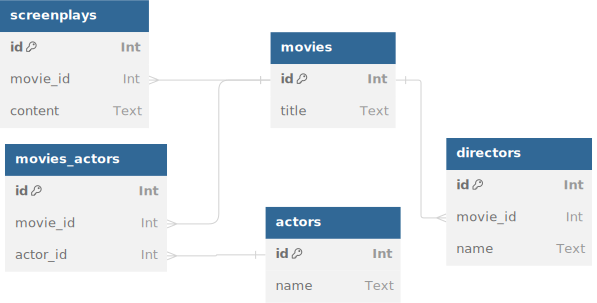

# DB Schema

## Accelerating Database Iteration

Defining the schema first is a fundamental approach in CQL, helping developers quickly structure their database while keeping their application’s data model in sync with real-world entities. By defining your schema upfront, you can rapidly iterate over your database tables, making it easy to adjust data structures as your application evolves. This method ensures that your schema is the single source of truth, giving you a clear view of how your data is organized and how relationships between different tables are modeled.

<div data-full-width="true">

<figure><figcaption></figcaption></figure>

</div>

## Benefits of Defining the Schema First

1. **Faster Prototyping**: With schemas defined at the outset, you can rapidly experiment with different table structures and relationships, making it easier to adjust your application’s data model without writing complex migrations from scratch.
2. **Clear Data Structure**: When your schema is predefined, the application’s data structure becomes clearer, allowing developers to conceptualize how data is organized and interact with tables more easily.
3. **Consistency**: Ensuring the schema matches the database at all times removes ambiguity when writing queries, handling relationships, or performing migrations.
4. **Automatic Data Validation**: CQL schemas enforce data types and constraints, such as `primary`, `auto_increment`, and `text`, ensuring data integrity.
5. **Simplified Query Building**: Since the schema is explicit, writing queries becomes easier as you can reference schema objects directly in queries, avoiding mistakes or typos in table or column names.

## **Difference from Other ORM Libraries**

Unlike traditional ORM libraries (e.g., Active Record in Rails or Ecto in Elixir), which often allow defining database models alongside the code and handling schema evolution through migrations, CQL encourages defining the database schema as the first step.

This "schema-first" approach differs from the "code-first" or "migration-based" methodologies in that it avoids relying on automatic migrations or conventions to infer the structure of the database. CQL enforces an explicit and structured approach to schema creation, ensuring the database schema reflects the actual architecture of your application.

## **Example Schema Definition**

Here’s a basic example of how to define a schema in CQL for a movie-related database:

```crystal
AcmeDB2 = Cql::Schema.build(
  :acme_db,
  adapter: Cql::Adapter::Postgres,
  uri: ENV["DATABASE_URL"]) do

  table :movies do
    primary :id, Int64, auto_increment: true
    text :title
  end

  table :screenplays do
    primary :id, Int64, auto_increment: true
    bigint :movie_id
    text :content
  end

  table :actors do
    primary :id, Int64, auto_increment: true
    text :name
  end

  table :directors do
    primary :id, Int64, auto_increment: true
    bigint :movie_id
    text :name
  end

  table :movies_actors do
    primary :id, Int64, auto_increment: true
    bigint :movie_id
    bigint :actor_id
  end
end
```

## Explanation of Schema Definition

* **Database name**: `:acme_db` defines the schema name.
* **Adapter**: `Cql::Adapter::Postgres` specifies the database adapter (in this case, PostgreSQL).
* **Connection URL**: The `uri: ENV["DATABASE_URL"]` specifies the database connection using environment variables.

Each table is explicitly defined with its columns, such as:

* `:movies` table has `id` as the primary key and `title` as a `text` column.
* `:screenplays`, `:actors`, and `:directors` define relationships between movies and associated records.

This example shows how easy it is to define tables and manage relationships within the schema, leading to a more organized and coherent database structure that aligns with the application’s needs.

#### **Multiple Schemas: Flexibility and Easy Switching**

One significant advantage of CQL is the ability to define and manage multiple schemas within the same application. This is particularly useful in scenarios like multi-tenant applications, where each tenant or environment has a separate database schema. CQL makes switching between schemas seamless, enabling developers to organize different parts of the application independently while maintaining the same connection configuration.

This approach offers the following benefits:

* **Clear Separation of Data**: Each schema can encapsulate its own set of tables and relationships, allowing better isolation and separation of concerns within the application. For example, you might have a `main` schema for core business data and a separate `analytics` schema for reporting.
* **Simple Switching**: Switching between schemas is as simple as referring to the schema name, thanks to CQL’s structured definition of schemas. This allows dynamic switching at runtime, improving scalability in multi-tenant applications.

#### **Example: Managing Multiple Schemas**

```crystal
MainDB = Cql::Schema.build(:main, adapter: Cql::Adapter::Postgres, uri: ENV["MAIN_DB_URL"]) do
  # Define main schema tables
end

AnalyticsDB = Cql::Schema.build(:analytics, adapter: Cql::Adapter::Postgres, uri: ENV["ANALYTICS_DB_URL"]) do
  # Define analytics schema tables
end
```

In this example, you define multiple schemas, and the application can easily switch between `MainDB` and `AnalyticsDB` depending on which database needs to be queried.

#### **Benefits of Multiple Schemas**

* **Improved Organization**: Separate business logic data from other concerns like reporting, testing, or archiving.
* **Scalability**: Ideal for multi-tenant applications, allowing each tenant to have its schema without interference.

By using CQL’s schema system, you gain not only speed and clarity in your database structure but also flexibility in scaling and organizing your application.
