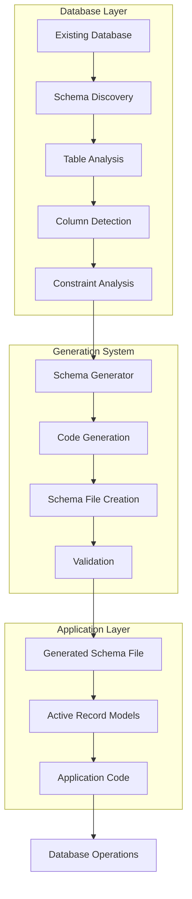

# Generated Schema Example

A comprehensive demonstration of CQL's automatic schema generation system, showing how to create, manage, and use auto-generated schema files that stay synchronized with your database structure.

## 🎯 What You'll Learn

This example teaches you how to:

* **Generate schema files automatically** from existing databases
* **Keep schema files synchronized** with database changes
* **Use generated schemas** in Active Record models
* **Manage schema versioning** and updates
* **Integrate schema generation** into your development workflow
* **Handle schema conflicts** and resolution
* **Customize schema generation** options
* **Deploy applications** with generated schemas

## 🚀 Quick Start

```bash
# Run the generated schema example
crystal examples/generated_schema.cr
```

## 📁 Code Structure

```
examples/
├── generated_schema.cr                  # Main generated schema example
├── existing_database.db                 # Existing SQLite database
├── generated_schema_file.cr             # Auto-generated schema file
└── schema_models.cr                     # Models using generated schema
```

## 🔧 Key Features

### 1. Schema Generation Setup

```crystal
# Setup Schema Generation
puts "Setting up CQL Schema Generation..."

# Create a schema for an existing database
ExistingDB = CQL::Schema.define(
  :existing_database,
  adapter: CQL::Adapter::SQLite,
  uri: "sqlite3://./examples/existing_database.db"
)

# Generate schema file from existing database
puts "Generating schema file from existing database..."
generated_schema = CQL.generate_schema_file(
  ExistingDB,
  file_path: "examples/generated_schema_file.cr",
  schema_name: :GeneratedSchema,
  schema_symbol: :generated_schema
)

puts "Schema file generated successfully!"
```

### 2. Existing Database Structure

```crystal
# This example assumes an existing database with the following structure:
#
# Table: users
# - id (INTEGER PRIMARY KEY)
# - name (TEXT)
# - email (TEXT UNIQUE)
# - created_at (DATETIME)
#
# Table: posts
# - id (INTEGER PRIMARY KEY)
# - user_id (INTEGER)
# - title (TEXT)
# - content (TEXT)
# - published (BOOLEAN DEFAULT 0)
# - created_at (DATETIME)
# - updated_at (DATETIME)
# - FOREIGN KEY (user_id) REFERENCES users(id)
#
# Table: comments
# - id (INTEGER PRIMARY KEY)
# - post_id (INTEGER)
# - user_id (INTEGER)
# - content (TEXT)
# - created_at (DATETIME)
# - FOREIGN KEY (post_id) REFERENCES posts(id)
# - FOREIGN KEY (user_id) REFERENCES users(id)
```

### 3. Generated Schema File

```crystal
# The generated schema file (examples/generated_schema_file.cr) will contain:
GeneratedSchema = CQL::Schema.define(
  :generated_schema,
  adapter: CQL::Adapter::SQLite,
  uri: "sqlite3://./examples/existing_database.db") do
  table :users do
    primary :id, Int32
    text :name
    text :email
    datetime :created_at
  end

  table :posts do
    primary :id, Int32
    text :title
    text :content
    bigint :user_id
    boolean :published, default: "0"
    datetime :created_at
    datetime :updated_at
    foreign_key [:user_id], references: :users, references_columns: [:id]
  end

  table :comments do
    primary :id, Int32
    text :content
    bigint :post_id
    bigint :user_id
    datetime :created_at
    foreign_key [:post_id], references: :posts, references_columns: [:id]
    foreign_key [:user_id], references: :users, references_columns: [:id]
  end
end
```

## 🏗️ Schema Generation Architecture



## 📊 Schema Generation Examples

### Basic Schema Generation

```crystal
# Generate schema from existing database
puts "Generating schema from existing database..."

# Create schema definition for existing database
ExistingDB = CQL::Schema.define(
  :existing_database,
  adapter: CQL::Adapter::SQLite,
  uri: "sqlite3://./examples/existing_database.db"
)

# Generate schema file
generated_schema = CQL.generate_schema_file(
  ExistingDB,
  file_path: "examples/generated_schema_file.cr",
  schema_name: :GeneratedSchema,
  schema_symbol: :generated_schema
)

puts "Schema file generated: #{generated_schema}"
puts "File path: examples/generated_schema_file.cr"
```

### Schema Generation with Options

```crystal
# Generate schema with custom options
puts "\nGenerating schema with custom options..."

custom_schema = CQL.generate_schema_file(
  ExistingDB,
  file_path: "examples/custom_schema.cr",
  schema_name: :CustomGeneratedSchema,
  schema_symbol: :custom_generated_schema,
  include_indexes: true,
  include_foreign_keys: true,
  include_check_constraints: true,
  format_output: true
)

puts "Custom schema file generated: #{custom_schema}"
```

### Schema Validation

```crystal
# Validate generated schema against database
puts "\nValidating generated schema..."

# Load the generated schema
require "./examples/generated_schema_file"

# Validate schema consistency
is_consistent = CQL.verify_schema(GeneratedSchema)
puts "Schema consistency: #{is_consistent}"

if is_consistent
  puts "✅ Generated schema is consistent with database"
else
  puts "❌ Schema inconsistency detected"
  puts "You may need to regenerate the schema file"
end
```

## 🔧 Using Generated Schemas

### Active Record Models with Generated Schema

```crystal
# Load the generated schema
require "./examples/generated_schema_file"

# Define models using the generated schema
class User
  include CQL::ActiveRecord::Model(Int32)
  db_context GeneratedSchema, :users

  property id : Int32?
  property name : String
  property email : String
  property created_at : Time?

  # Relationships
  has_many :posts, Post, foreign_key: :user_id
  has_many :comments, Comment, foreign_key: :user_id

  def initialize(@name : String, @email : String, @created_at : Time? = nil)
  end
end

class Post
  include CQL::ActiveRecord::Model(Int32)
  db_context GeneratedSchema, :posts

  property id : Int32?
  property title : String
  property content : String
  property user_id : Int32
  property published : Bool
  property created_at : Time?
  property updated_at : Time?

  # Relationships
  belongs_to :user, User, foreign_key: :user_id
  has_many :comments, Comment, foreign_key: :post_id

  def initialize(@title : String, @content : String, @user_id : Int32, @published : Bool = false, @created_at : Time? = nil, @updated_at : Time? = nil)
  end
end

class Comment
  include CQL::ActiveRecord::Model(Int32)
  db_context GeneratedSchema, :comments

  property id : Int32?
  property content : String
  property post_id : Int32
  property user_id : Int32
  property created_at : Time?

  # Relationships
  belongs_to :post, Post, foreign_key: :post_id
  belongs_to :user, User, foreign_key: :user_id

  def initialize(@content : String, @post_id : Int32, @user_id : Int32, @created_at : Time? = nil)
  end
end
```

### CRUD Operations with Generated Schema

```crystal
# Test CRUD operations with generated schema
puts "\nTesting CRUD operations with generated schema..."

# Create a user
user = User.new("John Doe", "john@example.com")
user.save!
puts "Created user: #{user.name} (ID: #{user.id})"

# Create a post
post = Post.new("My First Post", "This is the content of my first post.", user.id.not_nil!, true)
post.save!
puts "Created post: #{post.title} (ID: #{post.id})"

# Create a comment
comment = Comment.new("Great post!", post.id.not_nil!, user.id.not_nil!)
comment.save!
puts "Created comment: #{comment.content} (ID: #{comment.id})"

# Query with relationships
posts = Post.preload(:user).all
posts.each do |post|
  puts "Post: #{post.title} by #{post.user.try(&.name) || 'Unknown'}"
end

comments = Comment.preload(:user, :post).all
comments.each do |comment|
  puts "Comment: #{comment.content} by #{comment.user.try(&.name) || 'Unknown'} on #{comment.post.try(&.title) || 'Unknown Post'}"
end
```

## 📊 Schema Generation Options

### Generation Configuration

```crystal
# Configure schema generation options
generation_config = CQL::SchemaGenerationConfig.new
generation_config.include_indexes = true
generation_config.include_foreign_keys = true
generation_config.include_check_constraints = true
generation_config.include_defaults = true
generation_config.format_output = true
generation_config.add_comments = true
generation_config.include_timestamps = true

# Generate schema with configuration
configured_schema = CQL.generate_schema_file(
  ExistingDB,
  file_path: "examples/configured_schema.cr",
  schema_name: :ConfiguredSchema,
  schema_symbol: :configured_schema,
  config: generation_config
)

puts "Configured schema generated: #{configured_schema}"
```

### Schema Generation Modes

```crystal
# Different generation modes
modes = ["full", "minimal", "readonly", "migration_ready"]

modes.each do |mode|
  puts "\nGenerating schema in #{mode} mode..."

  mode_schema = CQL.generate_schema_file(
    ExistingDB,
    file_path: "examples/#{mode}_schema.cr",
    schema_name: "#{mode.capitalize}Schema".to_sym,
    schema_symbol: "#{mode}_schema".to_sym,
    mode: mode
  )

  puts "#{mode.capitalize} schema generated: #{mode_schema}"
end
```

## 🎯 Schema Generation Patterns

### Development Workflow Integration

```crystal
# Integrate schema generation into development workflow
def development_schema_sync
  puts "🔄 Syncing schema for development..."

  # Check if database has changed
  if CQL.schema_changed?(ExistingDB)
    puts "Database schema has changed, regenerating..."

    # Generate updated schema
    updated_schema = CQL.generate_schema_file(
      ExistingDB,
      file_path: "examples/generated_schema_file.cr",
      schema_name: :GeneratedSchema,
      schema_symbol: :generated_schema
    )

    puts "Schema updated: #{updated_schema}"

    # Validate the updated schema
    require "./examples/generated_schema_file"
    is_consistent = CQL.verify_schema(GeneratedSchema)
    puts "Schema consistency after update: #{is_consistent}"
  else
    puts "Database schema is up to date"
  end
end

development_schema_sync
```

### Production Deployment

```crystal
# Schema generation for production deployment
def production_schema_preparation
  puts "🏭 Preparing schema for production..."

  # Generate production schema
  prod_schema = CQL.generate_schema_file(
    ExistingDB,
    file_path: "examples/production_schema.cr",
    schema_name: :ProductionSchema,
    schema_symbol: :production_schema,
    mode: "production",
    include_indexes: true,
    include_foreign_keys: true,
    format_output: false # Disable formatting for production
  )

  puts "Production schema generated: #{prod_schema}"

  # Validate production schema
  require "./examples/production_schema"
  is_consistent = CQL.verify_schema(ProductionSchema)

  if is_consistent
    puts "✅ Production schema is ready for deployment"
  else
    puts "❌ Production schema validation failed"
    raise "Schema validation failed for production"
  end
end

production_schema_preparation
```

### Schema Versioning

```crystal
# Schema versioning and management
def schema_versioning_example
  puts "📚 Demonstrating schema versioning..."

  # Generate schema with version information
  versioned_schema = CQL.generate_schema_file(
    ExistingDB,
    file_path: "examples/versioned_schema.cr",
    schema_name: :VersionedSchema,
    schema_symbol: :versioned_schema,
    version: "1.0.0",
    include_version_info: true
  )

  puts "Versioned schema generated: #{versioned_schema}"

  # Check schema version
  schema_version = CQL.get_schema_version(ExistingDB)
  puts "Current database schema version: #{schema_version}"

  # Compare schema versions
  if CQL.schema_version_changed?(ExistingDB, "1.0.0")
    puts "Schema version has changed since 1.0.0"
  else
    puts "Schema version is still 1.0.0"
  end
end

schema_versioning_example
```

## 📊 Generated Schema Examples

### Full Schema Generation

```crystal
# Generate complete schema with all features
full_schema = CQL.generate_schema_file(
  ExistingDB,
  file_path: "examples/full_schema.cr",
  schema_name: :FullSchema,
  schema_symbol: :full_schema,
  include_indexes: true,
  include_foreign_keys: true,
  include_check_constraints: true,
  include_defaults: true,
  include_timestamps: true,
  add_comments: true,
  format_output: true
)

puts "Full schema generated with all features"
```

### Minimal Schema Generation

```crystal
# Generate minimal schema for basic operations
minimal_schema = CQL.generate_schema_file(
  ExistingDB,
  file_path: "examples/minimal_schema.cr",
  schema_name: :MinimalSchema,
  schema_symbol: :minimal_schema,
  include_indexes: false,
  include_foreign_keys: false,
  include_check_constraints: false,
  include_defaults: false,
  add_comments: false,
  format_output: false
)

puts "Minimal schema generated for basic operations"
```

### Read-Only Schema Generation

```crystal
# Generate read-only schema for reporting
readonly_schema = CQL.generate_schema_file(
  ExistingDB,
  file_path: "examples/readonly_schema.cr",
  schema_name: :ReadOnlySchema,
  schema_symbol: :readonly_schema,
  mode: "readonly",
  include_indexes: true,
  include_foreign_keys: true
)

puts "Read-only schema generated for reporting"
```

## 🎯 Best Practices

### 1. Development Workflow

```crystal
# Best practices for development workflow
def development_best_practices
  puts "🎯 Development Best Practices..."

  # Always validate schema after generation
  generated_schema = CQL.generate_schema_file(ExistingDB, file_path: "examples/dev_schema.cr")
  require "./examples/dev_schema"
  is_consistent = CQL.verify_schema(DevSchema)

  if is_consistent
    puts "✅ Schema generation successful and validated"
  else
    puts "❌ Schema validation failed - check database structure"
  end

  # Keep schema files in version control
  puts "💡 Remember to commit generated schema files to version control"

  # Use descriptive schema names
  puts "💡 Use descriptive schema names for different environments"
end
```

### 2. Production Deployment

```crystal
# Best practices for production deployment
def production_best_practices
  puts "🏭 Production Best Practices..."

  # Generate production schema with strict validation
  prod_schema = CQL.generate_schema_file(
    ExistingDB,
    file_path: "examples/production_schema.cr",
    schema_name: :ProductionSchema,
    mode: "production"
  )

  # Validate schema before deployment
  require "./examples/production_schema"
  is_consistent = CQL.verify_schema(ProductionSchema)

  if is_consistent
    puts "✅ Production schema validated successfully"
    puts "🚀 Ready for deployment"
  else
    puts "❌ Production schema validation failed"
    raise "Cannot deploy with invalid schema"
  end
end
```

### 3. Schema Management

```crystal
# Best practices for schema management
def schema_management_best_practices
  puts "📚 Schema Management Best Practices..."

  # Version your schemas
  version = "1.0.0"
  versioned_schema = CQL.generate_schema_file(
    ExistingDB,
    file_path: "examples/versioned_schema.cr",
    schema_name: :VersionedSchema,
    version: version
  )

  puts "📝 Schema versioned as #{version}"

  # Document schema changes
  puts "📝 Document any schema changes in your migration files"

  # Test schema with your models
  puts "🧪 Always test generated schemas with your Active Record models"
end
```

## 📚 Next Steps

### Related Examples

* [**Schema Migration Workflow**](schema-migration-workflow.md) - Migration-based schema management
* [**PostgreSQL Migration Workflow**](postgresql-migration-workflow.md) - PostgreSQL-specific schema generation
* [**Blog Engine**](blog-engine.md) - See schema generation in a complete application

### Advanced Topics

* [**Schema Management**](../../core-concepts/schemas.md) - Complete schema documentation
* [**Migration Guide**](../../guides/active-record-with-cql/migrations.md) - Migration-based schema evolution
* [**Configuration Guide**](../../guides/configuration.md) - Schema generation configuration

### Production Considerations

* **Schema Validation** - Always validate generated schemas before deployment
* **Version Control** - Keep generated schema files in version control
* **Testing** - Test generated schemas with your application models
* **Documentation** - Document schema changes and generation processes
* **Automation** - Automate schema generation in your CI/CD pipeline

## 🔧 Troubleshooting

### Common Schema Generation Issues

1. **Database connection issues** - Check database URL and connectivity
2. **Permission problems** - Ensure database user has proper permissions
3. **Schema inconsistency** - Regenerate schema after database changes
4. **File path issues** - Ensure target directory exists and is writable

### Debug Schema Generation

```crystal
# Debug schema generation issues
puts "🔧 Debugging schema generation..."

# Check database connection
begin
  ExistingDB.exec("SELECT 1")
  puts "✅ Database connection successful"
rescue ex
  puts "❌ Database connection failed: #{ex.message}"
end

# Check schema discovery
tables = CQL.discover_tables(ExistingDB)
puts "📋 Discovered tables: #{tables.join(", ")}"

# Check schema generation
begin
  test_schema = CQL.generate_schema_file(
    ExistingDB,
    file_path: "examples/test_schema.cr",
    schema_name: :TestSchema
  )
  puts "✅ Schema generation successful: #{test_schema}"
rescue ex
  puts "❌ Schema generation failed: #{ex.message}"
end
```

***

## 🏁 Summary

This generated schema example demonstrates:

* ✅ **Automatic schema generation** from existing databases
* ✅ **Schema synchronization** with database changes
* ✅ **Multiple generation modes** for different use cases
* ✅ **Schema validation** and consistency checking
* ✅ **Active Record integration** with generated schemas
* ✅ **Production-ready deployment** with proper validation
* ✅ **Development workflow integration** for seamless development

Ready to implement schema generation in your CQL application? Start with basic generation and gradually add advanced features as needed! 🚀
