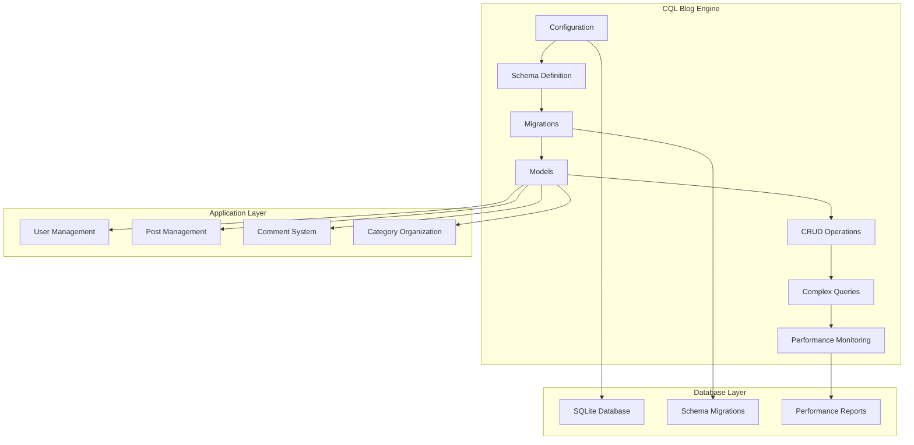
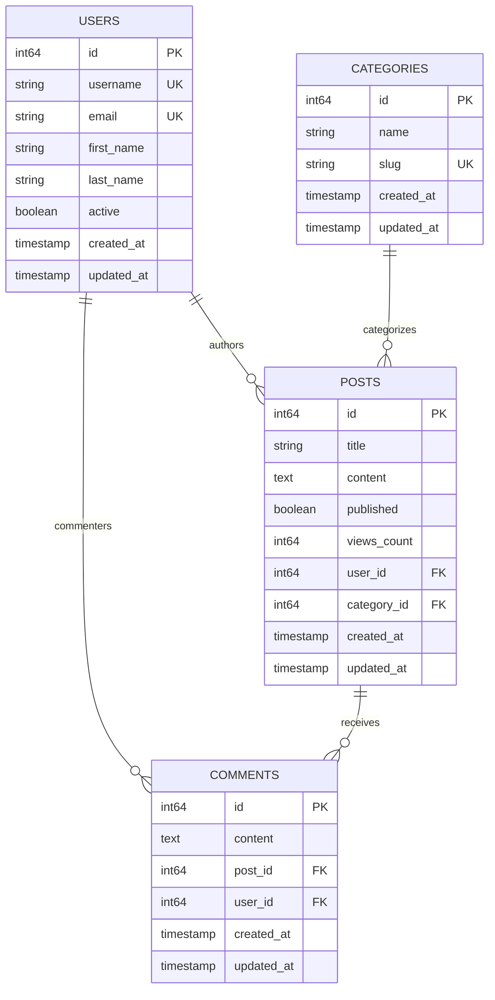
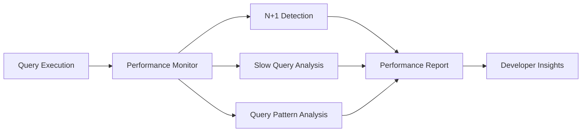

# Blog Engine Example

A comprehensive blog application built with CQL that demonstrates real-world usage patterns, performance monitoring, and best practices for building scalable Crystal applications.

## 🎯 What You'll Learn

This example teaches you how to:

- **Configure CQL** for different environments
- **Design database schemas** with relationships
- **Implement migrations** for schema evolution
- **Build Active Record models** with associations
- **Perform CRUD operations** efficiently
- **Write complex queries** with joins and aggregations
- **Monitor performance** and detect N+1 queries
- **Optimize database operations** for production

## 🏗️ Architecture Overview



## 📊 Database Schema

The blog engine implements a complete content management system with the following entities:



## 🚀 Getting Started

### Prerequisites

- Crystal 1.0+ installed
- Basic understanding of Crystal syntax
- Familiarity with database concepts

### Quick Start

1. **Clone and navigate to the example:**

   ```bash
   cd examples/blog
   ```

2. **Run the complete demo:**

   ```bash
   crystal blog_demo.cr
   ```

3. **Explore the output** to see CQL in action!

## 📁 Project Structure

```
examples/blog/
├── blog_demo.cr              # Main demo runner
├── README.md                 # This documentation
├── models/                   # Active Record models
│   ├── user.cr              # User model with relationships
│   ├── category.cr          # Category model
│   ├── post.cr              # Post model with content
│   └── comment.cr           # Comment model
├── migrations/              # Database migrations
│   ├── 001_create_users.cr
│   ├── 002_create_categories.cr
│   ├── 003_create_posts.cr
│   └── 004_create_comments.cr
├── demos/                   # Feature demonstrations
│   ├── crud_operations.cr   # Basic CRUD operations
│   ├── complex_queries.cr   # Advanced queries
│   ├── relationships.cr     # Model associations
│   ├── performance_features.cr # Optimization features
│   └── statistics.cr        # Reporting and analytics
└── seeders.cr              # Sample data creation
```

## ⚙️ Configuration

The blog engine demonstrates comprehensive CQL configuration:

```crystal
CQL.configure do |config|
  # Database connection
  config.database_url = "sqlite3://examples/blog/blog.db"
  config.logger = Log.for("cql.*")
  config.environment = "development"

  # SQLite-specific optimizations
  config.sqlite.journal_mode = "wal"
  config.sqlite.foreign_keys = true

  # Schema management
  config.migration_table_name = :cql_schema_migrations
  config.schema_path = "./examples/blog/schemas"
  config.schema_file_name = "app_schema.cr"
  config.schema_constant_name = :BlogDB
  config.schema_symbol = :app_schema

  # Development features
  config.auto_load_models = true
  config.enable_auto_schema_sync = true
  config.bootstrap_on_startup = true
  config.verify_schema_on_startup = true

  # Performance monitoring
  config.enable_performance_monitoring = true
end
```

## 🗄️ Database Schema Definition

### Users Table

```crystal
class CreateUsers < CQL::Migration(1)
  def up
    schema.table :users do
      primary :id, Int64, auto_increment: true
      column :username, String, null: false
      column :email, String, null: false
      column :first_name, String, null: true
      column :last_name, String, null: true
      column :active, Bool, default: true
      timestamps

      index [:email], unique: true
      index [:username], unique: true
    end
    schema.users.create!
  end
end
```

### Categories Table

```crystal
class CreateCategories < CQL::Migration(2)
  def up
    schema.table :categories do
      primary :id, Int64, auto_increment: true
      column :name, String, null: false
      column :slug, String, null: false
      timestamps

      index [:slug], unique: true
    end
    schema.categories.create!
  end
end
```

### Posts Table

```crystal
class CreatePosts < CQL::Migration(3)
  def up
    schema.table :posts do
      primary :id, Int64, auto_increment: true
      column :title, String, null: false
      column :content, String, null: false
      column :published, Bool, default: false
      column :views_count, Int64, default: 0
      column :user_id, Int64, null: false
      column :category_id, Int64, null: true
      timestamps

      foreign_key [:user_id], references: :users, references_columns: [:id]
      foreign_key [:category_id], references: :categories, references_columns: [:id]

      index [:published]
      index [:user_id]
      index [:category_id]
    end
    schema.posts.create!
  end
end
```

### Comments Table

```crystal
class CreateComments < CQL::Migration(4)
  def up
    schema.table :comments do
      primary :id, Int64, auto_increment: true
      column :content, String, null: false
      column :post_id, Int64, null: false
      column :user_id, Int64, null: true
      timestamps

      foreign_key [:post_id], references: :posts, references_columns: [:id]
      foreign_key [:user_id], references: :users, references_columns: [:id]

      index [:post_id]
      index [:user_id]
    end
    schema.comments.create!
  end
end
```

## 🏗️ Active Record Models

### User Model

```crystal
struct User
  include CQL::ActiveRecord::Model(Int64)
  db_context BlogDB, :users

  getter id : Int64?
  getter username : String
  getter email : String
  getter first_name : String?
  getter last_name : String?
  getter? active : Bool = true
  getter created_at : Time?
  getter updated_at : Time?

  # Relationships
  has_many :posts, Post, foreign_key: :user_id
  has_many :comments, Comment, foreign_key: :user_id

  def initialize(@username : String, @email : String,
                 @first_name : String? = nil, @last_name : String? = nil,
                 @active : Bool = true, @created_at : Time? = nil,
                 @updated_at : Time? = nil)
  end

  # Custom methods
  def full_name
    if first_name && last_name
      "#{first_name} #{last_name}"
    elsif first_name
      first_name.not_nil!
    else
      username
    end
  end
end
```

### Post Model

```crystal
struct Post
  include CQL::ActiveRecord::Model(Int64)
  db_context BlogDB, :posts

  getter id : Int64?
  getter title : String
  getter content : String
  getter? published : Bool = false
  property views_count : Int64
  getter user_id : Int64
  getter category_id : Int64?
  getter created_at : Time?
  getter updated_at : Time?

  # Relationships
  belongs_to :user, User, foreign_key: :user_id
  belongs_to :category, Category, foreign_key: :category_id, optional: true
  has_many :comments, Comment, foreign_key: :post_id

  def initialize(@title : String, @content : String, @user_id : Int64,
                 @published : Bool = false, @views_count : Int64 = 0,
                 @category_id : Int64? = nil, @created_at : Time? = nil,
                 @updated_at : Time? = nil)
  end

  # Custom methods
  def published?
    published
  end

  def word_count
    content.split.size
  end
end
```

## 🔧 CRUD Operations

### Creating Records

```crystal
# Create a new user
john = User.create!(
  username: "john_doe",
  email: "john@example.com",
  first_name: "John",
  last_name: "Doe"
)

# Create a post with relationships
crystal_post = Post.create!(
  title: "Getting Started with Crystal",
  content: "Crystal is a powerful programming language...",
  user_id: john.id.not_nil!,
  category_id: tech_cat.id,
  published: true,
  views_count: 150_i64
)
```

### Reading Records

```crystal
# Find by ID
user = User.find(1)

# Find by attributes
admin_user = User.find_by(username: "john_doe")

# Query with conditions
published_posts = Post.where(published: true).all(Post)

# Complex queries
most_viewed_posts = Post
  .where(published: true)
  .order(views_count: :desc)
  .limit(5)
  .all(Post)
```

### Updating Records

```crystal
# Update attributes
post = Post.find(1)
post.views_count += 1
post.save!

# Update with conditions
Post.where(published: false)
    .update_all(published: true)
```

### Deleting Records

```crystal
# Delete a single record
post = Post.find(1)
post.destroy!

# Delete with conditions
Post.where(published: false).delete_all
```

## 🔗 Relationship Navigation

### One-to-Many Relationships

```crystal
# User -> Posts
user = User.find(1)
user_posts = user.posts.where(published: true).all(Post)

# Post -> Comments
post = Post.find(1)
post_comments = post.comments.all(Comment)
```

### Many-to-One Relationships

```crystal
# Post -> User (author)
post = Post.find(1)
author = post.user

# Comment -> User (commenter)
comment = Comment.find(1)
commenter = comment.user
```

### Many-to-Many Through Relationships

```crystal
# Users who commented on a post
post = Post.find(1)
commenters = post.comments.map(&.user).compact

# Posts by category
category = Category.find(1)
category_posts = category.posts.where(published: true).all(Post)
```

## 🔍 Complex Queries

### Joins and Aggregations

```crystal
# Posts with author information
published_posts = Post
  .where(published: true)
  .order(views_count: :desc)
  .all(Post)

published_posts.each do |post|
  author = post.user
  puts "#{post.title} by #{author.full_name}"
end

# Aggregation queries
total_views = Post.where(published: true).sum(:views_count)
avg_views = Post.where(published: true).avg(:views_count)

# Posts by category
Category.all.each do |category|
  post_count = category.posts.where(published: true).count
  puts "#{category.name}: #{post_count} posts"
end
```

### Raw SQL Queries

```crystal
# Complex join query
schema.exec(<<-SQL)
  SELECT u.username, p.title, c.content
  FROM users u
  LEFT JOIN posts p ON u.id = p.user_id
  LEFT JOIN comments c ON p.id = c.post_id
  WHERE p.published = 1
  ORDER BY p.views_count DESC, c.created_at DESC
SQL
```

## ⚡ Performance Features

### Batch Processing

```crystal
# Process posts in batches
post_count = 0
Post.find_each(batch_size: 10) do |post|
  post_count += 1
  # Process each post
end
```

### Efficient Data Extraction

```crystal
# Pluck specific columns
post_titles = Post.where(published: true).pluck(:title, as: String)
user_emails = User.pluck(:email)

# Count operations
total_posts = Post.count
published_count = Post.where(published: true).count
```

### Performance Monitoring

The blog engine includes comprehensive performance monitoring:



```shell

════════════════════════════════════════════════════════════════════════════════
🚀 CQL PERFORMANCE MONITORING REPORT
════════════════════════════════════════════════════════════════════════════════

📊 OVERVIEW
────────────────────
  ⏰ Generated: 2025-06-26 19:32:31 UTC
  ⚡ Uptime: 00:00:01.008859000
  🔍 Monitoring: true

✅ EXCELLENT PERFORMANCE!
──────────────────────────────
  🎉 No performance issues detected
  🚀 Your application is running smoothly
  💪 Keep up the great work!

════════════════════════════════════════════════════════════════════════════════
🔧 CQL Performance Monitoring • 19:32:31
════════════════════════════════════════════════════════════════════════════════
```

## 📊 Statistics and Reporting

### Blog Analytics

```crystal
# Basic statistics
puts "Total Users: #{User.count}"
puts "Total Posts: #{Post.count}"
puts "Published Posts: #{Post.where(published: true).count}"
puts "Total Comments: #{Comment.count}"

# Content analysis
avg_word_count = Post.all.sum(&.word_count) / Post.count
most_active_author = User.all.max_by(&.posts.count)
```

### Performance Reports

The demo generates comprehensive performance reports including:

- **Query Performance Metrics** - Execution times and frequency
- **N+1 Query Detection** - Identified inefficient query patterns
- **Slow Query Analysis** - Queries exceeding performance thresholds
- **Query Pattern Analysis** - Understanding application query behavior
- **Performance Recommendations** - Automated optimization suggestions

## 🎯 Learning Path

### Beginner Level

1. **Start with Configuration** - Understand how to set up CQL
2. **Explore Models** - Learn Active Record model definitions
3. **Practice CRUD** - Master basic database operations
4. **Understand Relationships** - Learn model associations

### Intermediate Level

1. **Study Migrations** - Learn schema evolution patterns
2. **Master Complex Queries** - Advanced query techniques
3. **Optimize Performance** - Batch processing and efficient queries
4. **Monitor Performance** - Use performance monitoring tools

### Advanced Level

1. **Custom Validations** - Add business logic to models
2. **Advanced Relationships** - Complex association patterns
3. **Raw SQL Integration** - When to use direct SQL
4. **Production Optimization** - Performance tuning for scale

## 🔧 Customization Ideas

### Add New Features

- **User Authentication** - Add password fields and authentication
- **Post Tags** - Implement tagging system
- **User Roles** - Add role-based access control
- **Post Drafts** - Enhanced draft management
- **Comment Moderation** - Comment approval workflow

### Performance Enhancements

- **Caching Layer** - Add Redis caching for popular posts
- **Search Functionality** - Full-text search implementation
- **Pagination** - Efficient pagination for large datasets
- **Background Jobs** - Async processing for heavy operations

### Monitoring Extensions

- **Custom Metrics** - Business-specific performance metrics
- **Alerting** - Performance threshold alerts
- **Dashboard** - Real-time performance dashboard
- **Logging** - Enhanced query logging and analysis

## 🚀 Production Considerations

### Database Optimization

- **Index Strategy** - Optimize indexes for query patterns
- **Connection Pooling** - Configure appropriate pool sizes
- **Query Optimization** - Monitor and optimize slow queries
- **Schema Design** - Plan for future growth

### Security

- **Input Validation** - Validate all user inputs
- **SQL Injection Prevention** - Use parameterized queries
- **Access Control** - Implement proper authorization
- **Data Encryption** - Encrypt sensitive data

### Monitoring

- **Performance Monitoring** - Track query performance
- **Error Tracking** - Monitor and alert on errors
- **Health Checks** - Database connectivity monitoring
- **Metrics Collection** - Business and technical metrics

## 📚 Additional Resources

- **[CQL Configuration Guide](../guides/configuration.md)** - Detailed configuration options
- **[Active Record Guide](../guides/active-record-with-cql/README.md)** - Complete Active Record documentation
- **[Performance Guide](../guides/performance-optimization.md)** - Performance optimization techniques
- **[Migration Guide](../guides/active-record-with-cql/migrations.md)** - Database migration best practices

---

## 🏁 Next Steps

Ready to build your own application? Start by:

1. **Fork this example** and customize it for your needs
2. **Explore the CQL documentation** for advanced features
3. **Join the community** to get help and share your projects
4. **Contribute back** by improving this example or CQL itself

Happy coding with CQL! 🚀
