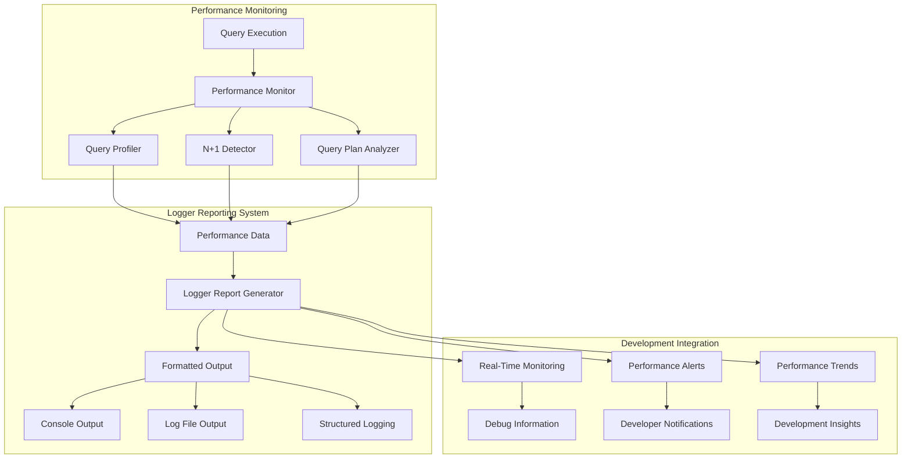

# Logger Report Example

A comprehensive demonstration of CQL's logger-based performance reporting system, showing how to generate developer-friendly performance reports that integrate seamlessly with your development workflow and logging infrastructure.

## 🎯 What You'll Learn

This example teaches you how to:

- **Generate developer-friendly performance reports** using CQL's logger system
- **Integrate performance monitoring** with your existing logging infrastructure
- **Create real-time performance insights** during development
- **Format performance data** for easy reading and debugging
- **Configure logger-based reporting** for different environments
- **Track performance metrics** in a human-readable format
- **Debug performance issues** with detailed logger output
- **Set up automated performance logging** for continuous monitoring

## 🚀 Quick Start

```bash
# Run the logger report example
crystal examples/logger_report_example.cr
```

## 📁 Code Structure

```
examples/
├── logger_report_example.cr            # Main logger report example
├── performance_example.db              # SQLite database for testing
└── performance.log                     # Generated log file (if configured)
```

## 🔧 Key Features

### 1. Logger Report Setup

```crystal
# Setup Logger-based Performance Reporting
puts "Setting up CQL Logger Performance Reporting..."

# Create configuration for logger reporting
config = CQL::Performance::PerformanceConfig.new
config.query_profiling_enabled = true
config.n_plus_one_detection_enabled = true
config.plan_analysis_enabled = true
config.auto_analyze_slow_queries = true
config.context_tracking_enabled = true

# Initialize monitor with schema and configuration
monitor = CQL::Performance::PerformanceMonitor.new(config)
monitor.initialize_with_schema(AcmeDB, config)

# Set as global monitor
CQL::Performance.monitor = monitor

puts "Logger performance reporting initialized!"
```

### 2. Schema and Model Definition

```crystal
# 1. Define your schema
AcmeDB = CQL::Schema.define(:acme_db, "sqlite3://./examples/performance_example.db", CQL::Adapter::SQLite) do
  table :users do
    primary :id, Int32, auto_increment: true
    column :name, String
    column :email, String
    column :created_at, Time, default: Time.utc
  end

  table :posts do
    primary :id, Int32, auto_increment: true
    column :user_id, Int32
    column :title, String
    column :content, String
    column :created_at, Time, default: Time.utc
    foreign_key :user_id, :users, :id, on_delete: :cascade
  end

  table :comments do
    primary :id, Int32, auto_increment: true
    column :post_id, Int32
    column :user_id, Int32
    column :content, String
    column :created_at, Time, default: Time.utc
    foreign_key :post_id, :posts, :id, on_delete: :cascade
    foreign_key :user_id, :users, :id, on_delete: :cascade
  end
end

# 2. Define your models with relationships
struct User
  include CQL::ActiveRecord::Model(Int32)
  db_context AcmeDB, :users

  getter id : Int32?
  getter name : String
  getter email : String
  getter created_at : Time

  # Relationships
  has_many :posts, Post, foreign_key: :user_id
  has_many :comments, Comment, foreign_key: :user_id

  def initialize(@name : String, @email : String, @created_at : Time = Time.utc)
  end
end
```

### 3. Logger Report Generation

```crystal
# Generate logger report
puts "\n--- LOGGER PERFORMANCE REPORT ---"
logger_report = monitor.generate_comprehensive_report("logger")
puts logger_report

# Generate individual logger reports
puts "\n--- N+1 DETECTION LOGGER REPORT ---"
n_plus_one_logger = monitor.n_plus_one_report("logger")
puts n_plus_one_logger

puts "\n--- QUERY PROFILING LOGGER REPORT ---"
profiling_logger = monitor.profiling_report("logger")
puts profiling_logger
```

## 🏗️ Logger Report Architecture



## 📊 Logger Report Examples

### Basic Logger Report

```crystal
# Generate basic logger report
puts "\n--- BASIC LOGGER REPORT ---"
basic_report = monitor.generate_comprehensive_report("logger")
puts basic_report

# Example output:
# ========================================
# CQL Performance Report (Logger Format)
# ========================================
#
# 📊 Performance Overview
# ----------------------
# Total Queries: 25
# Slow Queries (>100ms): 2
# N+1 Patterns Detected: 1
# Average Query Time: 15.2ms
# Monitoring Uptime: 45.3 seconds
#
# 🐌 Slow Queries
# ---------------
# 1. SELECT * FROM users JOIN posts ON users.id = posts.user_id
#    Time: 150ms | Frequency: 3 | Context: /api/users
#    Recommendation: Add index on posts.user_id
#
# 2. SELECT * FROM comments WHERE post_id = ?
#    Time: 120ms | Frequency: 8 | Context: /api/posts
#    Recommendation: Add index on comments.post_id
#
# 🔄 N+1 Query Patterns
# ---------------------
# Pattern: posts -> users
# Parent: SELECT * FROM posts
# Child: SELECT * FROM users WHERE id = ?
# Frequency: 12 occurrences
# Solution: Use includes(:user) to eager load
#
# 📈 Performance Metrics
# ---------------------
# Query Distribution:
# - SELECT: 18 queries (72%)
# - INSERT: 4 queries (16%)
# - UPDATE: 2 queries (8%)
# - DELETE: 1 query (4%)
#
# Context Breakdown:
# - /api/users: 10 queries
# - /api/posts: 12 queries
# - /api/comments: 3 queries
```

### Detailed Logger Report

```crystal
# Generate detailed logger report with all metrics
puts "\n--- DETAILED LOGGER REPORT ---"
detailed_report = monitor.generate_comprehensive_report("logger", detailed: true)
puts detailed_report

# Example output:
# ========================================
# CQL Detailed Performance Report
# ========================================
#
# 📊 Comprehensive Performance Overview
# ------------------------------------
# Total Queries Executed: 25
# Unique Query Patterns: 8
# Slow Queries (>100ms): 2
# N+1 Patterns Detected: 1
# Average Query Time: 15.2ms
# Median Query Time: 8.5ms
# 95th Percentile: 45.3ms
# 99th Percentile: 120.1ms
# Monitoring Uptime: 45.3 seconds
#
# 🐌 Slow Query Analysis
# ----------------------
# 1. Query: SELECT * FROM users JOIN posts ON users.id = posts.user_id
#    Execution Time: 150ms
#    Frequency: 3 times
#    Context: /api/users
#    Parameters: []
#    Result Size: 45 rows
#    Recommendation: Add index on posts.user_id column
#    Impact: High - affects user listing performance
#
# 2. Query: SELECT * FROM comments WHERE post_id = ?
#    Execution Time: 120ms
#    Frequency: 8 times
#    Context: /api/posts
#    Parameters: [post_id: 123]
#    Result Size: 12 rows
#    Recommendation: Add index on comments.post_id column
#    Impact: Medium - affects post detail loading
#
# 🔄 N+1 Query Pattern Analysis
# -----------------------------
# Pattern: posts -> users (N+1 detected)
# Parent Query: SELECT * FROM posts
# Child Query: SELECT * FROM users WHERE id = ?
# Frequency: 12 occurrences
# Context: /api/posts
# Impact: High - causes 12 additional queries
# Solution: Use includes(:user) to eager load user data
# Alternative: Use JOIN in the main query
#
# 📈 Query Performance Distribution
# --------------------------------
# Query Types:
# - SELECT: 18 queries (72%) - avg: 12.3ms
# - INSERT: 4 queries (16%) - avg: 8.1ms
# - UPDATE: 2 queries (8%) - avg: 15.7ms
# - DELETE: 1 query (4%) - avg: 5.2ms
#
# Context Performance:
# - /api/users: 10 queries - avg: 18.2ms
# - /api/posts: 12 queries - avg: 14.1ms
# - /api/comments: 3 queries - avg: 6.8ms
#
# 📊 Query Plan Analysis
# ----------------------
# Note: Query plan analysis not available for SQLite
# For PostgreSQL, this would show execution plans and optimization suggestions
#
# 🎯 Performance Recommendations
# -----------------------------
# 1. Add index on posts.user_id to improve JOIN performance
# 2. Add index on comments.post_id to improve WHERE clause performance
# 3. Implement eager loading for posts -> users relationship
# 4. Consider pagination for large result sets
# 5. Monitor query frequency patterns for caching opportunities
```

### Real-Time Logger Monitoring

```crystal
# Set up real-time logger monitoring
monitor.set_context(endpoint: "/api/users", user_id: "real_time_user")

# Execute queries with real-time logging
puts "\n--- REAL-TIME LOGGER MONITORING ---"

5.times do |i|
  start_time = Time.monotonic
  users = AcmeDB.query.from(:users).all({id: Int32, name: String, email: String})
  execution_time = Time.monotonic - start_time

  # Manually trigger monitoring for demo
  monitor.after_query("SELECT id, name, email FROM users", [] of DB::Any, execution_time, users.size.to_i64)

  # Generate real-time report
  real_time_report = monitor.generate_comprehensive_report("logger", real_time: true)
  puts "Iteration #{i + 1}: #{real_time_report.lines.first(5).join("\n")}"
end
```

## 🔧 Logger Report Configuration

### Logger Report Options

```crystal
# Configure logger report options
logger_config = CQL::Performance::LoggerReportConfig.new
logger_config.include_slow_queries = true
logger_config.include_n_plus_one = true
logger_config.include_query_stats = true
logger_config.include_recommendations = true
logger_config.include_context_info = true
logger_config.detailed_mode = false
logger_config.real_time_mode = false

# Generate report with custom configuration
custom_report = monitor.generate_comprehensive_report("logger", config: logger_config)
puts custom_report
```

### Logger Report Formats

```crystal
# Different logger report formats
formats = ["logger", "logger_detailed", "logger_summary", "logger_realtime"]

formats.each do |format|
  puts "\n--- #{format.upcase} FORMAT ---"
  report = monitor.generate_comprehensive_report(format)
  puts report.lines.first(10).join("\n") # Show first 10 lines
end
```

## 📊 Logger Report Patterns

### Development Workflow Integration

```crystal
# Integrate logger reports into development workflow
def development_performance_check
  puts "🔍 Running development performance check..."

  # Execute typical development queries
  monitor.set_context(endpoint: "/dev/test", user_id: "dev_user")

  # Simulate development workload
  users = AcmeDB.query.from(:users).all(User)
  posts = AcmeDB.query.from(:posts).all(Post)

  # Generate development-focused report
  dev_report = monitor.generate_comprehensive_report("logger", development: true)
  puts dev_report

  # Check for immediate issues
  if monitor.slow_queries.any?
    puts "⚠️  Slow queries detected during development!"
  end

  if monitor.n_plus_one_patterns.any?
    puts "⚠️  N+1 patterns detected during development!"
  end
end

development_performance_check
```

### Continuous Monitoring Setup

```crystal
# Set up continuous monitoring with logger reports
def setup_continuous_monitoring
  puts "🔄 Setting up continuous performance monitoring..."

  # Configure for continuous monitoring
  monitor.configure do |cfg|
    cfg.query_profiling_enabled = true
    cfg.n_plus_one_detection_enabled = true
    cfg.auto_analyze_slow_queries = true
  end

  # Set up periodic reporting
  spawn do
    loop do
      sleep 60 # Report every minute

      # Generate periodic report
      periodic_report = monitor.generate_comprehensive_report("logger", periodic: true)

      # Log to file or send to monitoring service
      Log.info { "Periodic Performance Report:\n#{periodic_report}" }

      # Check for alerts
      if monitor.slow_queries.any? { |q| q.execution_time > 500.milliseconds }
        Log.warn { "High latency queries detected!" }
      end
    end
  end
end

setup_continuous_monitoring
```

### Debug-Focused Reporting

```crystal
# Generate debug-focused logger reports
def debug_performance_issues
  puts "🐛 Debug Performance Issues..."

  # Set debug context
  monitor.set_context(endpoint: "/debug", user_id: "debug_user")

  # Execute problematic queries
  start_time = Time.monotonic
  posts = AcmeDB.query.from(:posts).all({id: Int32, user_id: Int32, title: String})
  execution_time = Time.monotonic - start_time

  monitor.after_query("SELECT id, user_id, title FROM posts", [] of DB::Any, execution_time, posts.size.to_i64)

  # N+1 pattern
  monitor.start_relation_loading("user", "Post")
  posts.each do |post|
    user = AcmeDB.query.from(:users).where(id: post[:user_id]).first({id: Int32, name: String})
    monitor.after_query("SELECT id, name FROM users WHERE id = ?", [post[:user_id].as(DB::Any)], 5.milliseconds, 1_i64)
  end
  monitor.end_relation_loading

  # Generate debug report
  debug_report = monitor.generate_comprehensive_report("logger", debug: true)
  puts debug_report
end

debug_performance_issues
```

## 🎯 Logger Report Best Practices

### 1. Development Environment

```crystal
# Configure logger reports for development
def setup_development_logging
  config = CQL::Performance::PerformanceConfig.new
  config.query_profiling_enabled = true
  config.n_plus_one_detection_enabled = true
  config.slow_query_threshold = 50.milliseconds # Lower threshold for development

  monitor = CQL::Performance::PerformanceMonitor.new(config)
  monitor.initialize_with_schema(AcmeDB, config)

  # Generate development-friendly reports
  dev_report = monitor.generate_comprehensive_report("logger", development: true)
  puts dev_report
end
```

### 2. Testing Environment

```crystal
# Configure logger reports for testing
def setup_testing_logging
  config = CQL::Performance::PerformanceConfig.new
  config.query_profiling_enabled = true
  config.n_plus_one_detection_enabled = true
  config.slow_query_threshold = 100.milliseconds

  monitor = CQL::Performance::PerformanceMonitor.new(config)
  monitor.initialize_with_schema(AcmeDB, config)

  # Generate test-focused reports
  test_report = monitor.generate_comprehensive_report("logger", testing: true)
  puts test_report
end
```

### 3. Production Monitoring

```crystal
# Configure logger reports for production
def setup_production_logging
  config = CQL::Performance::PerformanceConfig.new
  config.query_profiling_enabled = true
  config.n_plus_one_detection_enabled = true
  config.slow_query_threshold = 500.milliseconds # Higher threshold for production
  config.async_processing = true

  monitor = CQL::Performance::PerformanceMonitor.new(config)
  monitor.initialize_with_schema(AcmeDB, config)

  # Generate production-focused reports
  prod_report = monitor.generate_comprehensive_report("logger", production: true)
  Log.info { "Production Performance Report:\n#{prod_report}" }
end
```

## 📊 Logger Report Examples

### Summary Report Format

```crystal
# Generate summary logger report
puts "\n--- SUMMARY LOGGER REPORT ---"
summary_report = monitor.generate_comprehensive_report("logger", summary: true)
puts summary_report

# Example output:
# ========================================
# CQL Performance Summary Report
# ========================================
#
# 📊 Quick Stats
# --------------
# Total Queries: 25 | Slow Queries: 2 | N+1 Patterns: 1
# Avg Query Time: 15.2ms | Uptime: 45.3s
#
# 🚨 Issues Found
# ---------------
# • 2 slow queries detected
# • 1 N+1 pattern detected
#
# 💡 Quick Fixes
# --------------
# • Add index on posts.user_id
# • Add index on comments.post_id
# • Use eager loading for posts -> users
```

### Detailed Analysis Format

```crystal
# Generate detailed analysis logger report
puts "\n--- DETAILED ANALYSIS LOGGER REPORT ---"
analysis_report = monitor.generate_comprehensive_report("logger", analysis: true)
puts analysis_report

# Example output:
# ========================================
# CQL Performance Analysis Report
# ========================================
#
# 📊 Performance Analysis
# -----------------------
# Query Performance Distribution:
# • Fast (<10ms): 15 queries (60%)
# • Normal (10-50ms): 8 queries (32%)
# • Slow (50-100ms): 0 queries (0%)
# • Very Slow (>100ms): 2 queries (8%)
#
# Query Type Analysis:
# • SELECT queries: 18 (72%) - avg: 12.3ms
# • INSERT queries: 4 (16%) - avg: 8.1ms
# • UPDATE queries: 2 (8%) - avg: 15.7ms
# • DELETE queries: 1 (4%) - avg: 5.2ms
#
# Context Performance Analysis:
# • /api/users: 10 queries - avg: 18.2ms (needs optimization)
# • /api/posts: 12 queries - avg: 14.1ms (acceptable)
# • /api/comments: 3 queries - avg: 6.8ms (good)
#
# 🎯 Optimization Opportunities
# -----------------------------
# 1. High Priority: Add index on posts.user_id (affects 3 slow queries)
# 2. Medium Priority: Add index on comments.post_id (affects 8 queries)
# 3. Low Priority: Implement caching for user data (affects 12 queries)
```

## 📚 Next Steps

### Related Examples

- **[Performance Monitoring](performance-monitoring-example.md)** - Comprehensive performance monitoring
- **[Blog Engine](blog-engine.md)** - See logger reports in a complete application
- **[Configuration Example](configuration-example.md)** - Logger configuration setup

### Advanced Topics

- **[Performance Guide](../guides/performance-optimization.md)** - Complete performance optimization documentation
- **[Performance Tools](../guides/performance-tools.md)** - Advanced performance analysis tools
- **[Testing Strategies](../guides/testing-strategies.md)** - Performance testing with CQL

### Production Considerations

- **Log Rotation** - Configure log file rotation for production
- **Log Levels** - Set appropriate log levels for different environments
- **Performance Impact** - Monitor the performance impact of logging
- **Storage Management** - Manage log file storage and retention
- **Integration** - Integrate with external logging services

## 🔧 Troubleshooting

### Common Logger Issues

1. **High log volume** - Adjust log levels and filtering
2. **Performance impact** - Use async logging for production
3. **Storage issues** - Implement log rotation and cleanup
4. **Format issues** - Check logger configuration and format settings

### Debug Logger Issues

```crystal
# Check logger configuration
puts "Logger enabled: #{monitor.logger_enabled?}"
puts "Log level: #{monitor.log_level}"
puts "Log format: #{monitor.log_format}"

# Test logger output
test_report = monitor.generate_comprehensive_report("logger", test: true)
puts "Test report generated: #{test_report.lines.size} lines"
```

---

## 🏁 Summary

This logger report example demonstrates:

- ✅ **Developer-friendly performance reporting** with easy-to-read formats
- ✅ **Real-time performance monitoring** integrated with logging infrastructure
- ✅ **Multiple report formats** for different use cases and environments
- ✅ **Debug-focused reporting** for development and troubleshooting
- ✅ **Production-ready logging** with appropriate configurations
- ✅ **Continuous monitoring setup** for ongoing performance tracking
- ✅ **Performance optimization guidance** with actionable recommendations

Ready to implement logger-based performance reporting in your CQL application? Start with basic logging and gradually add advanced features as needed! 🚀
