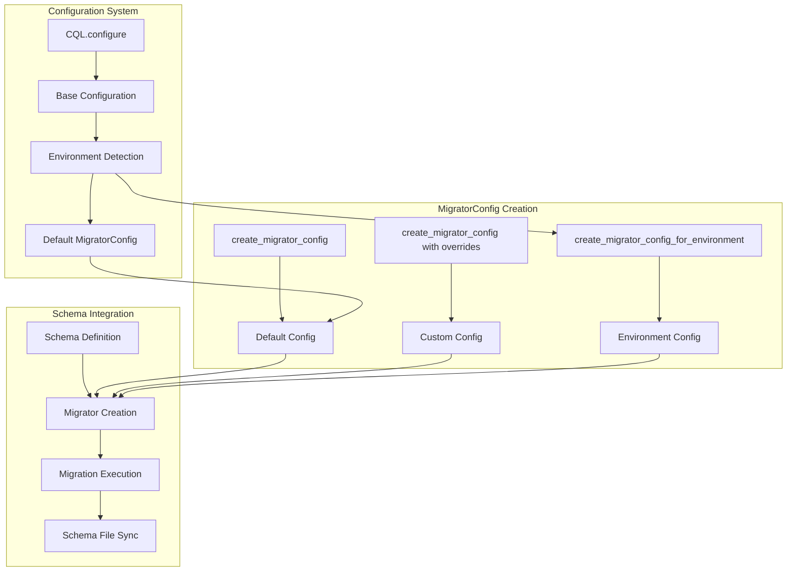

# Migrator Configuration Example

A detailed demonstration of CQL's advanced migrator configuration system, showing how to customize migration behavior, create environment-specific configurations, and integrate with complex migration workflows.

## 🎯 What You'll Learn

This example teaches you how to:

- **Create custom migrator configurations** with specific settings
- **Override default configuration** for specialized use cases
- **Generate environment-specific** migrator configurations
- **Integrate migrator configs** with schema definitions
- **Use configuration helpers** for migrator setup
- **Manage multiple migration workflows** in complex applications
- **Customize schema file generation** and synchronization
- **Implement advanced migration patterns** for production use

## 🚀 Quick Start

```bash
# Run the migrator configuration example
crystal examples/migrator_config_example.cr
```

## 📁 Code Structure

```
examples/
├── migrator_config_example.cr        # Main migrator configuration example
├── migrator_demo.db                  # Generated SQLite database
├── workflow_demo.db                  # Workflow-specific database
├── demo_schema.cr                    # Generated schema file
├── custom_schema.cr                  # Custom schema file
└── workflow_schema.cr                # Workflow schema file
```

## 🔧 Key Features

### 1. Basic MigratorConfig Creation

```crystal
CQL.configure do |config|
  config.database_url = "sqlite3://examples/migrator_demo.db"
  config.schema_path = "examples"
  config.schema_file_name = "demo_schema.cr"
  config.schema_constant_name = :DemoSchema
  config.enable_auto_schema_sync = true
end

# Create MigratorConfig using configuration
migrator_config = CQL.create_migrator_config
puts "Default MigratorConfig:"
puts "  Schema file: #{migrator_config.schema_file_path}"
puts "  Schema name: #{migrator_config.schema_name}"
puts "  Schema symbol: #{migrator_config.schema_symbol}"
puts "  Auto sync: #{migrator_config.auto_sync?}"
```

### 2. Custom MigratorConfig Overrides

```crystal
custom_config = CQL.create_migrator_config(
  schema_file_path: "examples/custom_schema.cr",
  schema_name: :CustomSchema,
  auto_sync: false
)

puts "Custom MigratorConfig:"
puts "  Schema file: #{custom_config.schema_file_path}"
puts "  Schema name: #{custom_config.schema_name}"
puts "  Schema symbol: #{custom_config.schema_symbol}"
puts "  Auto sync: #{custom_config.auto_sync?}"
```

### 3. Environment-Specific MigratorConfig

```crystal
# Development config
dev_config = CQL.create_migrator_config_for_environment("development")
puts "Development MigratorConfig:"
puts "  Schema file: #{dev_config.schema_file_path}"
puts "  Schema name: #{dev_config.schema_name}"
puts "  Auto sync: #{dev_config.auto_sync?}"

# Test config
test_config = CQL.create_migrator_config_for_environment("test")
puts "\nTest MigratorConfig:"
puts "  Schema file: #{test_config.schema_file_path}"
puts "  Schema name: #{test_config.schema_name}"
puts "  Auto sync: #{test_config.auto_sync?}"

# Production config
prod_config = CQL.create_migrator_config_for_environment("production")
puts "\nProduction MigratorConfig:"
puts "  Schema file: #{prod_config.schema_file_path}"
puts "  Schema name: #{prod_config.schema_name}"
puts "  Auto sync: #{prod_config.auto_sync?}"
```

## 🏗️ Migrator Configuration Architecture



## 📊 MigratorConfig Examples

### Using MigratorConfig with Schema

```crystal
# Create schema
DemoSchema = CQL.create_schema(:demo_schema) do
  # Empty schema - will be managed by migrations
end

# Create migrator using default config
migrator1 = CQL.create_migrator(DemoSchema)
puts "Default migrator config: #{migrator1.config.schema_file_path}"

# Create migrator using custom config
migrator2 = CQL.create_migrator(DemoSchema, custom_config)
puts "Custom migrator config: #{migrator2.config.schema_file_path}"
```

### ConfigHelpers for MigratorConfig

```crystal
# Using helpers
helper_config = CQL::ConfigHelpers.create_migrator_config
puts "Helper MigratorConfig:"
puts "  Schema file: #{helper_config.schema_file_path}"
puts "  Auto sync: #{helper_config.auto_sync?}"

# Using helpers with overrides
helper_custom = CQL::ConfigHelpers.create_migrator_config(
  schema_name: :HelperSchema,
  auto_sync: false
)
puts "\nHelper Custom MigratorConfig:"
puts "  Schema name: #{helper_custom.schema_name}"
puts "  Auto sync: #{helper_custom.auto_sync?}"

# Using environment-specific helper
helper_prod = CQL::ConfigHelpers.create_migrator_config_for_environment("production")
puts "\nHelper Production MigratorConfig:"
puts "  Schema file: #{helper_prod.schema_file_path}"
puts "  Schema name: #{helper_prod.schema_name}"
```

### Complete Workflow with MigratorConfig

```crystal
# Configure for a specific workflow
CQL.configure do |config|
  config.environment = "development"
  config.database_url = "sqlite3://examples/workflow_demo.db"
  config.schema_path = "examples"
  config.enable_auto_schema_sync = true
end

# Create workflow-specific config
workflow_config = CQL.create_migrator_config(
  schema_file_path: "examples/workflow_schema.cr",
  schema_name: :WorkflowSchema
)

# Create schema and migrator
WorkflowSchema = CQL.create_schema(:workflow_schema) do
  # Migrations will define tables
end

workflow_migrator = CQL.create_migrator(WorkflowSchema, workflow_config)

puts "Workflow complete:"
puts "  Schema: #{WorkflowSchema.name}"
puts "  Migrator config: #{workflow_migrator.config.schema_name}"
puts "  Auto sync enabled: #{workflow_migrator.config.auto_sync?}"
```

## 🔧 MigratorConfig Options

### Core Configuration Options

| Option                 | Type   | Default                  | Description                    |
| ---------------------- | ------ | ------------------------ | ------------------------------ |
| `schema_file_path`     | String | Auto-generated           | Path to schema file            |
| `schema_name`          | Symbol | Auto-generated           | Schema constant name           |
| `schema_symbol`        | Symbol | Auto-generated           | Schema symbol for internal use |
| `auto_sync`            | Bool   | `true`                   | Auto schema synchronization    |
| `migration_table_name` | Symbol | `:cql_schema_migrations` | Migration tracking table       |

### Environment-Specific Defaults

| Environment | Schema File            | Schema Name        | Auto Sync | Migration Table          |
| ----------- | ---------------------- | ------------------ | --------- | ------------------------ |
| Development | `app_schema.cr`        | `AppSchema`        | `true`    | `cql_schema_migrations`  |
| Test        | `test_schema.cr`       | `TestSchema`       | `true`    | `test_schema_migrations` |
| Production  | `production_schema.cr` | `ProductionSchema` | `false`   | `cql_schema_migrations`  |

## 🎯 Advanced Configuration Patterns

### Multi-Environment Configuration

```crystal
# Development environment
dev_config = CQL.create_migrator_config_for_environment("development")
puts "Development:"
puts "  Schema: #{dev_config.schema_name}"
puts "  Auto sync: #{dev_config.auto_sync?}"
puts "  File: #{dev_config.schema_file_path}"

# Test environment
test_config = CQL.create_migrator_config_for_environment("test")
puts "\nTest:"
puts "  Schema: #{test_config.schema_name}"
puts "  Auto sync: #{test_config.auto_sync?}"
puts "  File: #{test_config.schema_file_path}"

# Production environment
prod_config = CQL.create_migrator_config_for_environment("production")
puts "\nProduction:"
puts "  Schema: #{prod_config.schema_name}"
puts "  Auto sync: #{prod_config.auto_sync?}"
puts "  File: #{prod_config.schema_file_path}"
```

### Custom Schema Naming

```crystal
# Custom schema naming for specific use cases
api_config = CQL.create_migrator_config(
  schema_name: :ApiSchema,
  schema_symbol: :api_schema,
  schema_file_path: "src/schemas/api_schema.cr"
)

admin_config = CQL.create_migrator_config(
  schema_name: :AdminSchema,
  schema_symbol: :admin_schema,
  schema_file_path: "src/schemas/admin_schema.cr"
)

puts "API Schema: #{api_config.schema_name} (#{api_config.schema_file_path})"
puts "Admin Schema: #{admin_config.schema_name} (#{admin_config.schema_file_path})"
```

### Workflow-Specific Configurations

```crystal
# Feature branch workflow
feature_config = CQL.create_migrator_config(
  schema_name: :FeatureSchema,
  schema_file_path: "src/schemas/feature_schema.cr",
  auto_sync: true
)

# Staging workflow
staging_config = CQL.create_migrator_config(
  schema_name: :StagingSchema,
  schema_file_path: "src/schemas/staging_schema.cr",
  auto_sync: false
)

# Production workflow
production_config = CQL.create_migrator_config(
  schema_name: :ProductionSchema,
  schema_file_path: "src/schemas/production_schema.cr",
  auto_sync: false
)
```

## 🔧 Configuration Helpers

### Available Helper Methods

```crystal
# Basic migrator config creation
config1 = CQL::ConfigHelpers.create_migrator_config

# Custom migrator config with overrides
config2 = CQL::ConfigHelpers.create_migrator_config(
  schema_name: :CustomSchema,
  auto_sync: false
)

# Environment-specific migrator config
config3 = CQL::ConfigHelpers.create_migrator_config_for_environment("production")

# Access configuration properties
puts "Schema file path: #{CQL::ConfigHelpers.schema_file_path}"
puts "Schema path: #{CQL::ConfigHelpers.schema_path}"
puts "Auto sync enabled: #{CQL::ConfigHelpers.auto_schema_sync?}"
puts "Environment: #{CQL::ConfigHelpers.environment}"
```

### Helper Integration Examples

```crystal
# Create migrator using helper config
helper_config = CQL::ConfigHelpers.create_migrator_config
schema = CQL.create_schema(:helper_schema)
migrator = CQL.create_migrator(schema, helper_config)

# Create environment-specific migrator
env_config = CQL::ConfigHelpers.create_migrator_config_for_environment("test")
test_schema = CQL.create_schema(:test_schema)
test_migrator = CQL.create_migrator(test_schema, env_config)
```

## 🎯 Use Cases

### Microservices Architecture

```crystal
# User service migrator config
user_config = CQL.create_migrator_config(
  schema_name: :UserServiceSchema,
  schema_file_path: "services/user/schema.cr",
  auto_sync: true
)

# Order service migrator config
order_config = CQL.create_migrator_config(
  schema_name: :OrderServiceSchema,
  schema_file_path: "services/order/schema.cr",
  auto_sync: true
)

# Payment service migrator config
payment_config = CQL.create_migrator_config(
  schema_name: :PaymentServiceSchema,
  schema_file_path: "services/payment/schema.cr",
  auto_sync: false  # Manual control for payment service
)
```

### Multi-Tenant Applications

```crystal
# Tenant-specific configurations
tenant_configs = {} of String => CQL::MigratorConfig

["tenant_a", "tenant_b", "tenant_c"].each do |tenant|
  tenant_configs[tenant] = CQL.create_migrator_config(
    schema_name: "#{tenant.capitalize}Schema".to_sym,
    schema_file_path: "schemas/#{tenant}_schema.cr",
    auto_sync: true
  )
end

# Use tenant-specific configs
tenant_configs.each do |tenant, config|
  puts "#{tenant}: #{config.schema_name} (#{config.schema_file_path})"
end
```

### Feature Branch Development

```crystal
# Feature branch configuration
feature_name = ENV["FEATURE_BRANCH"]? || "main"
feature_config = CQL.create_migrator_config(
  schema_name: "#{feature_name.capitalize}Schema".to_sym,
  schema_file_path: "schemas/#{feature_name}_schema.cr",
  auto_sync: true
)

puts "Feature branch: #{feature_name}"
puts "Schema: #{feature_config.schema_name}"
puts "File: #{feature_config.schema_file_path}"
```

## 📊 Configuration Comparison

### Default vs Custom Configurations

```crystal
# Default configuration
default_config = CQL.create_migrator_config
puts "Default:"
puts "  Schema: #{default_config.schema_name}"
puts "  File: #{default_config.schema_file_path}"
puts "  Auto sync: #{default_config.auto_sync?}"

# Custom configuration
custom_config = CQL.create_migrator_config(
  schema_name: :CustomSchema,
  schema_file_path: "custom/path/schema.cr",
  auto_sync: false
)
puts "\nCustom:"
puts "  Schema: #{custom_config.schema_name}"
puts "  File: #{custom_config.schema_file_path}"
puts "  Auto sync: #{custom_config.auto_sync?}"
```

### Environment Comparison

```crystal
environments = ["development", "test", "production"]

environments.each do |env|
  config = CQL.create_migrator_config_for_environment(env)
  puts "#{env.capitalize}:"
  puts "  Schema: #{config.schema_name}"
  puts "  File: #{config.schema_file_path}"
  puts "  Auto sync: #{config.auto_sync?}"
  puts
end
```

## 🎯 Best Practices

### 1. Environment-Specific Configuration

```crystal
# Use environment-specific configs for different deployment stages
case ENV["CRYSTAL_ENV"]? || "development"
when "production"
  config = CQL.create_migrator_config_for_environment("production")
  # Production: manual control, separate schema file
when "test"
  config = CQL.create_migrator_config_for_environment("test")
  # Test: auto sync, separate schema file
else
  config = CQL.create_migrator_config_for_environment("development")
  # Development: auto sync, main schema file
end
```

### 2. Schema File Organization

```crystal
# Organize schema files by environment or service
configs = {
  development: CQL.create_migrator_config(
    schema_file_path: "src/schemas/development_schema.cr"
  ),
  test: CQL.create_migrator_config(
    schema_file_path: "src/schemas/test_schema.cr"
  ),
  production: CQL.create_migrator_config(
    schema_file_path: "src/schemas/production_schema.cr"
  )
}
```

### 3. Configuration Validation

```crystal
# Validate migrator configuration
def validate_migrator_config(config : CQL::MigratorConfig)
  raise "Schema file path cannot be empty" if config.schema_file_path.empty?
  raise "Schema name cannot be empty" if config.schema_name.to_s.empty?

  # Ensure schema file directory exists
  dir = File.dirname(config.schema_file_path)
  Dir.mkdir_p(dir) unless Dir.exists?(dir)
end

# Use validation
config = CQL.create_migrator_config
validate_migrator_config(config)
```

## 📚 Next Steps

### Related Examples

- **[Migration Configuration](migration-configuration-example.md)** - Basic migration workflow integration
- **[Schema Migration Workflow](schema-migration-workflow.md)** - Detailed migration workflow
- **[PostgreSQL Migration Workflow](postgresql-migration-workflow.md)** - PostgreSQL-specific patterns

### Advanced Topics

- **[Migration Guide](../guides/active-record-with-cql/migrations.md)** - Complete migration documentation
- **[Integrated Migration Workflow](../guides/active-record-with-cql/integrated-migration-workflow.md)** - Advanced workflow patterns
- **[Configuration Guide](../guides/configuration.md)** - Detailed configuration options

### Production Considerations

- **Environment Isolation** - Separate configurations for different environments
- **Schema File Management** - Organize schema files by environment or service
- **Configuration Validation** - Validate migrator configurations before use
- **Team Coordination** - Coordinate configuration changes across team
- **CI/CD Integration** - Use appropriate configurations in automated workflows

## 🔧 Troubleshooting

### Common Issues

1. **Schema file path issues** - Ensure directory exists and is writable
2. **Environment detection problems** - Check `CRYSTAL_ENV` environment variable
3. **Configuration conflicts** - Avoid conflicting schema names across environments
4. **Auto sync issues** - Verify `auto_sync` setting matches environment needs

### Debug Configuration

```crystal
# Print migrator configuration details
config = CQL.create_migrator_config
puts "Migrator Configuration:"
puts "  Schema file: #{config.schema_file_path}"
puts "  Schema name: #{config.schema_name}"
puts "  Schema symbol: #{config.schema_symbol}"
puts "  Auto sync: #{config.auto_sync?}"
puts "  Migration table: #{config.migration_table_name}"

# Check if schema file directory exists
dir = File.dirname(config.schema_file_path)
puts "Schema directory exists: #{Dir.exists?(dir)}"
puts "Schema directory writable: #{File.writable?(dir)}"
```

---

## 🏁 Summary

This migrator configuration example demonstrates:

- ✅ **Advanced migrator configuration** with custom settings and overrides
- ✅ **Environment-specific configurations** for different deployment stages
- ✅ **Configuration helpers** for common migrator setup patterns
- ✅ **Multi-environment support** with automatic defaults
- ✅ **Custom schema naming** for complex applications
- ✅ **Workflow-specific configurations** for specialized use cases
- ✅ **Production-ready patterns** for enterprise applications

Ready to implement advanced migrator configurations in your CQL application? Start with basic configurations and gradually add customizations as needed! 🚀
