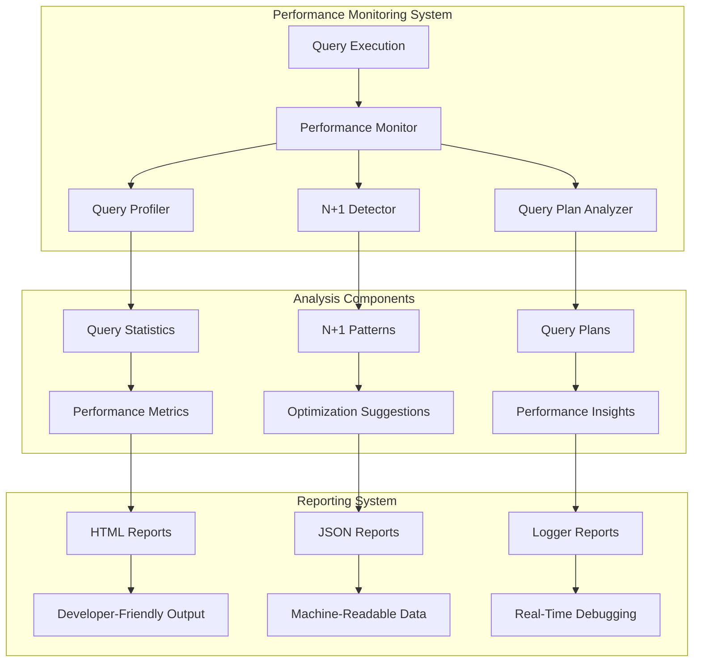

# Performance Monitoring Example

A comprehensive demonstration of CQL's advanced performance monitoring system, showing how to track query performance, detect N+1 queries, analyze query plans, and generate detailed performance reports for optimization.

## 🎯 What You'll Learn

This example teaches you how to:

- **Set up comprehensive performance monitoring** with CQL
- **Track query execution times** and identify slow queries
- **Detect N+1 query patterns** automatically
- **Analyze query plans** for optimization opportunities
- **Generate detailed performance reports** in multiple formats
- **Monitor performance in real-time** during development
- **Configure performance thresholds** and alerts
- **Integrate performance monitoring** into your application workflow

## 🚀 Quick Start

```bash
# Run the performance monitoring example
crystal examples/performance_monitoring_example.cr
```

## 📁 Code Structure

```
examples/
├── performance_monitoring_example.cr   # Main performance monitoring example
├── performance_report.html             # Generated HTML report
├── performance_report.json             # Generated JSON report
└── performance_example.db              # SQLite database for testing
```

## 🔧 Key Features

### 1. Performance Monitor Setup

```crystal
# Setup Performance Monitoring
puts "Setting up CQL Performance Monitoring..."

# Create configuration
config = CQL::Performance::PerformanceConfig.new
config.query_profiling_enabled = true
config.n_plus_one_detection_enabled = true
config.plan_analysis_enabled = true
config.auto_analyze_slow_queries = true
config.context_tracking_enabled = true

# Initialize monitor with schema and configuration
monitor = CQL::Performance::PerformanceMonitor.new(config)
monitor.initialize_with_schema(AcmeDB, config)

# Set as global monitor
CQL::Performance.monitor = monitor

puts "Performance monitoring initialized!"
```

### 2. Schema and Model Definition

```crystal
# 1. Define your schema
AcmeDB = CQL::Schema.define(:acme_db, "sqlite3://./examples/performance_example.db", CQL::Adapter::SQLite) do
  table :users do
    primary :id, Int32, auto_increment: true
    column :name, String
    column :email, String
    column :created_at, Time, default: Time.utc
  end

  table :posts do
    primary :id, Int32, auto_increment: true
    column :user_id, Int32
    column :title, String
    column :content, String
    column :created_at, Time, default: Time.utc
    foreign_key :user_id, :users, :id, on_delete: :cascade
  end

  table :comments do
    primary :id, Int32, auto_increment: true
    column :post_id, Int32
    column :user_id, Int32
    column :content, String
    column :created_at, Time, default: Time.utc
    foreign_key :post_id, :posts, :id, on_delete: :cascade
    foreign_key :user_id, :users, :id, on_delete: :cascade
  end
end

# 2. Define your models with relationships
struct User
  include CQL::ActiveRecord::Model(Int32)
  db_context AcmeDB, :users

  getter id : Int32?
  getter name : String
  getter email : String
  getter created_at : Time

  # Relationships
  has_many :posts, Post, foreign_key: :user_id
  has_many :comments, Comment, foreign_key: :user_id

  def initialize(@name : String, @email : String, @created_at : Time = Time.utc)
  end
end
```

### 3. Performance Monitoring Features

```crystal
# Set context for tracking
monitor.set_context(endpoint: "/api/users", user_id: "demo_user")

# Analyze a query plan
simple_query = "SELECT * FROM users WHERE name = 'Alice Smith'"

if plan = monitor.analyze_query_plan(simple_query)
  puts "Query Plan for: #{simple_query}"
  puts plan.summary if plan.responds_to?(:summary)
else
  puts "Query plan analysis not available for SQLite"
end
```

## 🏗️ Performance Monitoring Architecture



## 📊 Performance Monitoring Examples

### Query Profiling

```crystal
# Execute various queries and monitor them
5.times do |i|
  start_time = Time.monotonic
  users = AcmeDB.query.from(:users).all({id: Int32, name: String, email: String})
  execution_time = Time.monotonic - start_time

  # Manually trigger monitoring for demo
  monitor.after_query("SELECT id, name, email FROM users", [] of DB::Any, execution_time, users.size.to_i64)

  puts "Fetched #{users.size} users (iteration #{i + 1})"
end

# Execute more complex queries
3.times do |i|
  start_time = Time.monotonic
  posts = AcmeDB.query
    .from(:posts)
    .join(:users) { |j| j.posts.user_id.eq(j.users.id) }
    .select(posts: [:id, :title], users: [:name])
    .all({id: Int32, title: String, name: String})
  execution_time = Time.monotonic - start_time

  # Manually trigger monitoring for demo
  monitor.after_query("SELECT posts.id, posts.title, users.name FROM posts JOIN users ON posts.user_id = users.id", [] of DB::Any, execution_time, posts.size.to_i64)

  puts "Fetched #{posts.size} posts with user names (iteration #{i + 1})"
end
```

### N+1 Query Detection

```crystal
# This will trigger N+1 queries - one query to get posts, then one query per post to get user
monitor.set_context(endpoint: "/api/posts_with_users", user_id: "user_789")

start_time = Time.monotonic
posts = AcmeDB.query.from(:posts).all({id: Int32, user_id: Int32, title: String})
execution_time = Time.monotonic - start_time

# Trigger the parent query monitoring
monitor.after_query("SELECT id, user_id, title FROM posts", [] of DB::Any, execution_time, posts.size.to_i64)

puts "Fetched #{posts.size} posts"

# Start relation loading to track N+1 pattern
monitor.start_relation_loading("user", "Post")

# This loop will trigger N+1 pattern detection
posts.each do |post|
  # This will execute a separate query for each post
  start_time = Time.monotonic
  user = AcmeDB.query.from(:users).where(id: post[:user_id]).first({id: Int32, name: String})
  execution_time = Time.monotonic - start_time

  # Trigger monitoring for the repeated query
  monitor.after_query("SELECT id, name FROM users WHERE id = ?", [post[:user_id].as(DB::Any)], execution_time, 1_i64)

  puts "Post '#{post[:title]}' by #{user.try(&.[:name]) || "Unknown"}"
end

# End relation loading
monitor.end_relation_loading
```

### Performance Reports

```crystal
# Comprehensive report
puts "\n--- COMPREHENSIVE PERFORMANCE REPORT ---"
puts monitor.generate_comprehensive_report

# Individual reports
puts "\n--- N+1 DETECTION REPORT ---"
puts monitor.n_plus_one_report

puts "\n--- QUERY PROFILING REPORT ---"
puts monitor.profiling_report

# Performance Metrics Summary
puts "\n--- PERFORMANCE METRICS SUMMARY ---"
metrics = monitor.metrics_summary
puts "Total Queries: #{metrics.total_queries}"
puts "Slow Queries: #{metrics.slow_queries}"
puts "N+1 Patterns: #{metrics.n_plus_one_patterns}"
puts "Average Query Time: #{metrics.avg_query_time.round(2)}ms"
puts "Monitoring Enabled: #{metrics.monitoring_enabled}"
puts "Uptime: #{metrics.uptime.total_seconds.round(2)} seconds"
```

## 🔧 Advanced Performance Features

### HTML Report Generation

```crystal
# Generate HTML report
puts "\nGenerating HTML performance report..."
html_report = monitor.generate_comprehensive_report("html")
File.write("performance_report.html", html_report)
puts "HTML report saved to 'performance_report.html'"
```

### JSON Report Generation

```crystal
# Generate JSON report
puts "\nGenerating JSON performance report..."
json_report = monitor.generate_comprehensive_report("json")
File.write("performance_report.json", json_report)
puts "JSON report saved to 'performance_report.json'"
```

### Configuration Management

```crystal
# Configuration management
puts "\nDemonstrating configuration management..."
monitor.configure do |cfg|
  cfg.query_profiling_enabled = false # Temporarily disable profiling
  puts "Query profiling disabled"
end

# Test a query with profiling disabled
start_time = Time.monotonic
users = AcmeDB.query.from(:users).all({id: Int32, name: String})
execution_time = Time.monotonic - start_time
monitor.after_query("SELECT id, name FROM users", [] of DB::Any, execution_time, users.size.to_i64)

monitor.configure do |cfg|
  cfg.query_profiling_enabled = true # Re-enable profiling
  puts "Query profiling re-enabled"
end
```

## 📊 Performance Configuration Options

### Performance Config Settings

| Option                         | Type | Default | Description                |
| ------------------------------ | ---- | ------- | -------------------------- |
| `query_profiling_enabled`      | Bool | `true`  | Enable query profiling     |
| `n_plus_one_detection_enabled` | Bool | `true`  | Enable N+1 detection       |
| `plan_analysis_enabled`        | Bool | `true`  | Enable query plan analysis |
| `auto_analyze_slow_queries`    | Bool | `true`  | Auto-analyze slow queries  |
| `context_tracking_enabled`     | Bool | `true`  | Enable context tracking    |
| `endpoint_tracking_enabled`    | Bool | `false` | Enable endpoint tracking   |
| `async_processing`             | Bool | `false` | Enable async processing    |

### Performance Thresholds

```crystal
# Configure performance thresholds
config.slow_query_threshold = 100.milliseconds
config.n_plus_one_threshold = 5 # Number of similar queries to trigger detection
config.max_queries_per_context = 1000 # Maximum queries to track per context
```

## 🎯 Performance Monitoring Patterns

### Real-Time Monitoring

```crystal
# Set up real-time monitoring for development
monitor.set_context(endpoint: "/api/users", user_id: "dev_user")

# Monitor queries in real-time
AcmeDB.query.from(:users).all(User).each do |user|
  # Each query is automatically monitored
  puts "User: #{user.name}"
end

# Generate real-time report
puts monitor.generate_comprehensive_report("logger")
```

### Batch Processing Monitoring

```crystal
# Monitor batch operations
monitor.set_context(endpoint: "/api/batch_import", user_id: "batch_user")

# Monitor large batch operation
1000.times do |i|
  user = User.new("User #{i}", "user#{i}@example.com")
  user.save!
  # Each save operation is monitored
end

# Check batch performance
metrics = monitor.metrics_summary
puts "Batch operation completed: #{metrics.total_queries} queries in #{metrics.uptime.total_seconds.round(2)}s"
```

### Context-Aware Monitoring

```crystal
# Monitor different contexts separately
monitor.set_context(endpoint: "/api/admin", user_id: "admin_user")
# Admin queries...

monitor.set_context(endpoint: "/api/public", user_id: "public_user")
# Public queries...

# Generate context-specific reports
admin_metrics = monitor.metrics_for_context("/api/admin")
public_metrics = monitor.metrics_for_context("/api/public")

puts "Admin queries: #{admin_metrics.total_queries}"
puts "Public queries: #{public_metrics.total_queries}"
```

## 📊 Performance Report Examples

### HTML Report Structure

```html
<!-- Generated HTML report includes: -->
<!-- - Performance overview with metrics -->
<!-- - Slow query analysis with recommendations -->
<!-- - N+1 query detection with solutions -->
<!-- - Query pattern analysis -->
<!-- - Performance optimization suggestions -->
<!-- - Interactive charts and graphs -->
```

### JSON Report Structure

```json
{
  "overview": {
    "total_queries": 150,
    "slow_queries": 3,
    "n_plus_one_patterns": 2,
    "avg_query_time": 15.5,
    "uptime": 3600.0
  },
  "slow_queries": [
    {
      "query": "SELECT * FROM users JOIN posts...",
      "execution_time": 250.0,
      "frequency": 5,
      "recommendation": "Add index on user_id column"
    }
  ],
  "n_plus_one_patterns": [
    {
      "parent_query": "SELECT * FROM posts",
      "child_query": "SELECT * FROM users WHERE id = ?",
      "frequency": 25,
      "solution": "Use includes(:user) to eager load"
    }
  ]
}
```

## 🎯 Best Practices

### 1. Development Monitoring

```crystal
# Enable comprehensive monitoring in development
config = CQL::Performance::PerformanceConfig.new
config.query_profiling_enabled = true
config.n_plus_one_detection_enabled = true
config.plan_analysis_enabled = true
config.context_tracking_enabled = true

# Generate reports during development
monitor.generate_comprehensive_report("logger")
```

### 2. Production Monitoring

```crystal
# Configure production monitoring with appropriate thresholds
config = CQL::Performance::PerformanceConfig.new
config.query_profiling_enabled = true
config.n_plus_one_detection_enabled = true
config.slow_query_threshold = 500.milliseconds
config.async_processing = true

# Generate reports periodically
if monitor.should_generate_report?
  report = monitor.generate_comprehensive_report("json")
  # Send to monitoring service
end
```

### 3. Performance Optimization

```crystal
# Use monitoring data to optimize queries
slow_queries = monitor.slow_queries
slow_queries.each do |query|
  puts "Optimizing: #{query.sql}"
  puts "Recommendation: #{query.recommendation}"
end

# Check for N+1 patterns
n_plus_one_patterns = monitor.n_plus_one_patterns
n_plus_one_patterns.each do |pattern|
  puts "N+1 detected: #{pattern.parent_query}"
  puts "Solution: #{pattern.solution}"
end
```

## 📚 Next Steps

### Related Examples

- **[Logger Report](logger-report-example.md)** - Development-friendly performance reports
- **[Blog Engine](blog-engine.md)** - See performance monitoring in a complete application
- **[Configuration Example](configuration-example.md)** - Performance configuration setup

### Advanced Topics

- **[Performance Guide](../guides/performance-optimization.md)** - Complete performance optimization documentation
- **[Performance Tools](../guides/performance-tools.md)** - Advanced performance analysis tools
- **[Testing Strategies](../guides/testing-strategies.md)** - Performance testing with CQL

### Production Considerations

- **Performance Thresholds** - Set appropriate thresholds for your application
- **Report Generation** - Configure automated report generation
- **Monitoring Integration** - Integrate with external monitoring services
- **Performance Alerts** - Set up alerts for performance issues
- **Data Retention** - Configure performance data retention policies

## 🔧 Troubleshooting

### Common Performance Issues

1. **High query count** - Check for N+1 queries and optimize relationships
2. **Slow queries** - Analyze query plans and add appropriate indexes
3. **Memory usage** - Monitor query result sizes and implement pagination
4. **Connection pool exhaustion** - Check connection pool configuration

### Debug Performance Issues

```crystal
# Check performance monitoring status
puts "Monitoring enabled: #{monitor.monitoring_enabled?}"
puts "Total queries tracked: #{monitor.total_queries}"
puts "Slow queries detected: #{monitor.slow_queries.size}"
puts "N+1 patterns detected: #{monitor.n_plus_one_patterns.size}"

# Generate detailed report for debugging
report = monitor.generate_comprehensive_report("json")
puts "Detailed report: #{report[0..200]}..."
```

---

## 🏁 Summary

This performance monitoring example demonstrates:

- ✅ **Comprehensive performance tracking** with query profiling and N+1 detection
- ✅ **Advanced analysis features** including query plan analysis
- ✅ **Multiple report formats** (HTML, JSON, Logger) for different use cases
- ✅ **Real-time monitoring** for development and debugging
- ✅ **Production-ready configuration** with appropriate thresholds
- ✅ **Context-aware tracking** for different application endpoints
- ✅ **Performance optimization guidance** with actionable recommendations

Ready to implement performance monitoring in your CQL application? Start with basic monitoring and gradually add advanced features as needed! 🚀
