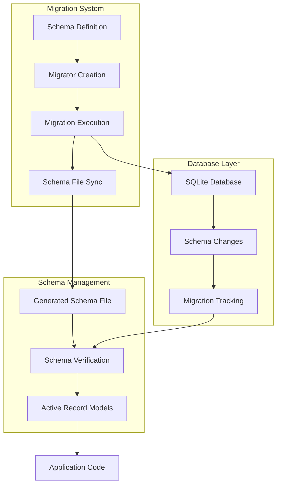

# Schema Migration Workflow Example

A comprehensive demonstration of CQL's integrated schema migration workflow using SQLite, showing how to manage database schema evolution with automatic schema file synchronization and version control.

## 🎯 What You'll Learn

This example teaches you how to:

- **Set up a complete migration workflow** with automatic schema synchronization
- **Define and execute migrations** with proper version control
- **Handle migration rollbacks** with schema consistency
- **Generate and maintain schema files** automatically
- **Verify schema consistency** between database and schema files
- **Implement team collaboration** patterns for schema management
- **Use generated schema files** in Active Record models
- **Manage complex migration scenarios** with foreign keys and indexes

## 🚀 Quick Start

```bash
# Run the SQLite migration workflow example
crystal examples/schema_migration_workflow.cr
```

## 📁 Code Structure

```
examples/
├── schema_migration_workflow.cr       # Main migration workflow example
├── app_example.db                     # Generated SQLite database
└── generated_app_schema.cr            # Auto-generated schema file
```

## 🔧 Key Features

### 1. Base Schema Definition

```crystal
# Step 1: Define Base Schema Connection
AppDB = CQL::Schema.define(
  :app_database,
  adapter: CQL::Adapter::SQLite,
  uri: "sqlite3://examples/app_example.db"
) do
  # Minimal initial structure - will be populated by migrations
  # The migrator will ensure this stays in sync with the database
end
```

### 2. Migration System Configuration

```crystal
# Step 2: Configure Migration System
config = CQL::MigratorConfig.new(
  schema_file_path: "examples/generated_app_schema.cr",
  schema_name: :GeneratedAppSchema,
  schema_symbol: :generated_app_schema,
  auto_sync: true # Automatically update schema file after migrations
)

migrator = AppDB.migrator(config)
```

### 3. Migration Definition

```crystal
# Migration 1: Create users table
class CreateUsersTable < CQL::Migration(1)
  def up
    puts "📄 Migration 1: Creating users table..."

    schema.table :users do
      primary :id, Int32
      column :name, String
      column :email, String
      timestamps
    end

    schema.users.create!
  end

  def down
    puts "📄 Migration 1 (rollback): Dropping users table..."
    schema.users.drop!
  end
end

# Migration 2: Add email index
class AddEmailIndex < CQL::Migration(2)
  def up
    puts "📄 Migration 2: Adding email index..."
    schema.alter :users do
      create_index :email_idx, [:email], unique: true
    end
  end

  def down
    puts "📄 Migration 2 (rollback): Dropping email index..."
    schema.alter :users do
      drop_index :email_idx
    end
  end
end
```

## 🏗️ Migration Workflow Architecture



## 📊 Migration Examples

### Complete Migration Workflow

```crystal
def demonstrate_workflow(migrator : CQL::Migrator)
  puts "🚀 CQL Schema Migration Workflow Demonstration"
  puts "=" * 50

  # Initialize fresh database
  File.delete("examples/app_example.db") if File.exists?("examples/app_example.db")
  File.delete("examples/generated_app_schema.cr") if File.exists?("examples/generated_app_schema.cr")

  puts "\n📊 Initial Migration Status:"
  puts "Pending migrations:"
  migrator.pending_migrations.each do |migration|
    puts "  ⏱ #{migration.name} (version #{migration.version})"
  end

  puts "\n⬆️  Applying all migrations..."
  puts "This will automatically update the schema file after each migration."
  migrator.up

  puts "\n📊 Migration Status After Up:"
  puts "Applied migrations:"
  migrator.applied_migrations.each do |migration|
    puts "  ✔ #{migration.name} (version #{migration.version})"
  end

  puts "\n📁 Generated Schema File:"
  if File.exists?("examples/generated_app_schema.cr")
    schema_content = File.read("examples/generated_app_schema.cr")
    puts "File: examples/generated_app_schema.cr"
    puts "-" * 40
    puts schema_content
    puts "-" * 40
  else
    puts "❌ Schema file not found!"
  end

  puts "\n✅ Verifying Schema Consistency:"
  consistent = migrator.verify_schema_consistency
  puts "Schema is consistent with database: #{consistent}"
end
```

### Migration Rollback and Redo

```crystal
puts "\n⬇️  Rolling back last migration..."
migrator.rollback

puts "\n📊 Migration Status After Rollback:"
puts "Applied migrations:"
migrator.applied_migrations.each do |migration|
  puts "  ✔ #{migration.name} (version #{migration.version})"
end

puts "\n📁 Schema File After Rollback:"
if File.exists?("examples/generated_app_schema.cr")
  schema_content = File.read("examples/generated_app_schema.cr")
  puts "Notice how the 'published' column has been removed:"
  puts "-" * 40
  puts schema_content
  puts "-" * 40
end

puts "\n↩️  Redoing last migration..."
migrator.redo

puts "\n📊 Final Migration Status:"
puts "Applied migrations:"
migrator.applied_migrations.each do |migration|
  puts "  ✔ #{migration.name} (version #{migration.version})"
end

puts "\n✅ Final Schema Consistency Check:"
consistent = migrator.verify_schema_consistency
puts "Schema is consistent with database: #{consistent}"
```

## 🔧 Migration Patterns

### Complex Migration with Foreign Keys

```crystal
# Migration 3: Create posts table with foreign key
class CreatePostsTable < CQL::Migration(3)
  def up
    puts "📄 Migration 3: Creating posts table..."

    schema.table :posts do
      primary :id, Int32
      column :title, String
      column :content, String
      column :user_id, Int32
      timestamps

      # Include foreign key constraint during table creation (SQLite compatible)
      foreign_key [:user_id], references: :users, references_columns: [:id]
    end

    schema.posts.create!
  end

  def down
    puts "📄 Migration 3 (rollback): Dropping posts table..."
    schema.posts.drop!
  end
end
```

### Adding Columns to Existing Tables

```crystal
# Migration 4: Add published column to posts
class AddPublishedToPosts < CQL::Migration(4)
  def up
    puts "📄 Migration 4: Adding published column to posts..."
    schema.alter :posts do
      add_column :published, Bool, default: false
    end
  end

  def down
    puts "📄 Migration 4 (rollback): Removing published column from posts..."
    schema.alter :posts do
      drop_column :published
    end
  end
end
```

### Index Management

```crystal
# Migration 2: Add email index
class AddEmailIndex < CQL::Migration(2)
  def up
    puts "📄 Migration 2: Adding email index..."
    schema.alter :users do
      create_index :email_idx, [:email], unique: true
    end
  end

  def down
    puts "📄 Migration 2 (rollback): Dropping email index..."
    schema.alter :users do
      drop_index :email_idx
    end
  end
end
```

## 📊 Generated Schema Files

### Schema File Structure

```crystal
# Generated schema file (examples/generated_app_schema.cr)
GeneratedAppSchema = CQL::Schema.define(
  :generated_app_schema,
  adapter: CQL::Adapter::SQLite,
  uri: "sqlite3://examples/app_example.db") do
  table :schema_migrations do
    primary :id, Int32
    text :name
    integer :version
    timestamps
  end

  table :users do
    primary :id, Int32
    text :name
    text :email
    timestamps
  end

  table :posts do
    primary :id, Int32
    text :title
    text :content
    bigint :user_id
    boolean :published, default: "0"
    timestamps
    foreign_key [:user_id], references: :users, references_columns: [:id]
  end
end
```

### Using Generated Schema in Models

```crystal
# Load the generated schema
require "./examples/generated_app_schema"

# Use in Active Record models
class User
  include CQL::ActiveRecord::Model(Int32)
  db_context GeneratedAppSchema, :users

  property id : Int32?
  property name : String
  property email : String
  property created_at : Time?
  property updated_at : Time?
end

class Post
  include CQL::ActiveRecord::Model(Int32)
  db_context GeneratedAppSchema, :posts

  property id : Int32?
  property title : String
  property content : String
  property user_id : Int32
  property published : Bool
  property created_at : Time?
  property updated_at : Time?

  belongs_to :user, User, foreign_key: :user_id
end
```

## 🎯 Team Workflow Scenarios

### New Team Member Setup

```bash
# 1. Clone repository
git clone <repository>

# 2. Set up local database
# (SQLite database will be created automatically)

# 3. Run migrations
crystal run migration_runner.cr

# 4. Schema file automatically created and ready to use
```

### Resolving Schema Conflicts

```bash
# 1. Pull latest changes
git pull origin main

# 2. Apply any new migrations
crystal run migration_runner.cr

# 3. Regenerate schema file
crystal run -e "CQL.create_migrator(AppDB).update_schema_file"

# 4. Commit updated schema
git add examples/generated_app_schema.cr
git commit -m "Update schema file after migrations"
```

### Production Deployment

```bash
# 1. Set production configuration
export CRYSTAL_ENV=production
export DATABASE_URL=sqlite3:///path/to/production.db

# 2. Apply migrations
crystal run migration_runner.cr

# 3. Verify schema consistency
crystal run -e "puts CQL.verify_schema(AppDB)"

# 4. Deploy application with updated schema file
```

## 🔧 Configuration Examples

### Development Configuration

```crystal
# Development configuration
puts "\n🔧 Development Configuration:"
CQL.configure do |config|
  config.environment = "development"
  config.enable_auto_schema_sync = true
  config.verify_schema_on_startup = true
  config.bootstrap_on_startup = false
end

dev_migrator_config = CQL.config.create_migrator_config
puts "  Auto sync: #{dev_migrator_config.auto_sync?}"
puts "  Schema file: #{dev_migrator_config.schema_file_path}"
```

### Test Configuration

```crystal
# Test configuration
puts "\n🧪 Test Configuration:"
CQL.configure do |config|
  config.environment = "test"
  # Environment defaults automatically applied
end

test_migrator_config = CQL.config.create_migrator_config
puts "  Schema file: #{test_migrator_config.schema_file_path}"
puts "  Schema name: #{test_migrator_config.schema_name}"
```

### Production Configuration

```crystal
# Production configuration
puts "\n🏭 Production Configuration:"
CQL.configure do |config|
  config.environment = "production"
  # Environment defaults automatically applied
end

prod_migrator_config = CQL.config.create_migrator_config
puts "  Auto sync: #{prod_migrator_config.auto_sync?}"
puts "  Verify on startup: #{CQL.config.verify_schema_on_startup?}"
```

## 🎯 Best Practices

### 1. Migration Naming Conventions

```crystal
# Use descriptive migration names
class CreateUsersTable < CQL::Migration(1)
class AddEmailIndexToUsers < CQL::Migration(2)
class CreatePostsTable < CQL::Migration(3)
class AddPublishedColumnToPosts < CQL::Migration(4)
class AddUserProfileTable < CQL::Migration(5)
```

### 2. Migration Safety

```crystal
# Always implement both up and down methods
class SafeMigration < CQL::Migration(6)
  def up
    # Add new feature
    schema.alter :users do
      add_column :profile_picture, String
    end
  end

  def down
    # Remove feature safely
    schema.alter :users do
      drop_column :profile_picture
    end
  end
end
```

### 3. Schema File Management

```crystal
# Always commit schema files with migrations
git add examples/generated_app_schema.cr
git commit -m "Update schema after migration: Add user profiles"

# Verify schema consistency in CI/CD
crystal run -e "exit 1 unless CQL.verify_schema(AppDB)"
```

## 📚 Next Steps

### Related Examples

- **[PostgreSQL Migration Workflow](postgresql-migration-workflow.md)** - PostgreSQL-specific patterns
- **[Migration Configuration](migration-configuration-example.md)** - Configuration integration
- **[Blog Engine](blog-engine.md)** - See migrations in a complete application

### Advanced Topics

- **[Migration Guide](../guides/active-record-with-cql/migrations.md)** - Complete migration documentation
- **[Integrated Migration Workflow](../guides/active-record-with-cql/integrated-migration-workflow.md)** - Advanced workflow patterns
- **[Schema Management](../core-concepts/schemas.md)** - Schema definition and management

### Production Considerations

- **Migration Safety** - Always test migrations in staging
- **Schema Consistency** - Verify schema files match database
- **Rollback Strategy** - Ensure migrations can be safely rolled back
- **Team Coordination** - Coordinate schema changes across team
- **CI/CD Integration** - Automate migration and schema verification

## 🔧 Troubleshooting

### Common Issues

1. **Schema file not generated** - Check `auto_sync` setting in migrator config
2. **Migration conflicts** - Ensure migration versions are sequential
3. **Schema inconsistency** - Run `migrator.verify_schema_consistency` to check
4. **Rollback issues** - Ensure all migrations have proper `down` methods

### Debug Migration Issues

```crystal
# Check migration status
puts "Pending migrations: #{migrator.pending_migrations.size}"
puts "Applied migrations: #{migrator.applied_migrations.size}"

# Verify schema consistency
consistent = migrator.verify_schema_consistency
puts "Schema consistent: #{consistent}"

# Check schema file
schema_file = "examples/generated_app_schema.cr"
puts "Schema file exists: #{File.exists?(schema_file)}"
if File.exists?(schema_file)
  puts "Schema file size: #{File.size(schema_file)} bytes"
end
```

---

## 🏁 Summary

This SQLite migration workflow example demonstrates:

- ✅ **Complete migration workflow** with automatic schema synchronization
- ✅ **Version-controlled schema evolution** with proper rollback support
- ✅ **Automatic schema file generation** from database migrations
- ✅ **Schema consistency verification** between database and files
- ✅ **Team collaboration patterns** for schema management
- ✅ **Production-ready deployment** with proper migration handling
- ✅ **SQLite-specific optimizations** and compatibility

Ready to implement migration workflows in your CQL application? Start with basic migrations and gradually add advanced features like schema synchronization! 🚀
