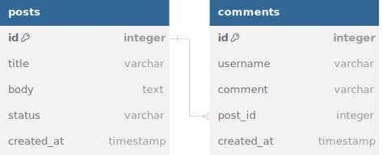

# BelongsTo

In this guide, we'll cover the `BelongsTo` relationship using CQL's Active Record syntax. We'll start with an Entity-Relationship Diagram (ERD) to illustrate how this relationship works and continuously build upon this diagram as we introduce new relationships in subsequent guides.

## **What is a `BelongsTo` Relationship?**

The `BelongsTo` association in a database indicates that one entity (a record) refers to another entity by holding a foreign key to that record. For example, a `Comment` belongs to a `Post`, and each comment references the `Post` it is associated with by storing the `post_id` as a foreign key.

### Example Scenario: Posts and Comments

Let's say you have a blog system where:

- A **Post** can have many **Comments**.
- A **Comment** belongs to one **Post**.

<figure><figcaption></figcaption></figure>

We'll start by implementing the `BelongsTo` relationship from the `Comment` to the `Post`.

---

## Defining the Schema

We'll first define the `posts` and `comments` tables using CQL’s schema DSL.

```crystal
codeAcmeDB = Cql::Schema.define(
  :acme_db,
  adapter: Cql::Adapter::Postgres,
  uri: ENV["DATABASE_URL"]
) do

  table :posts do
    primary
    text :title
    text :body
    timestamp :published_at
  end

  table :comments do
    primary
    bigint :post_id
    text :body
  end
end
```

- **posts** table: Contains the blog post data (title, body, and published date).
- **comments** table: Contains the comment data and a foreign key `post_id` which references the `posts` table.

---

## Defining the Models

Next, we'll define the `Post` and `Comment` structs in CQL.

### **Post Model**

```crystal
struct Post < Cql::Record(Int64)
  db_context AcmeDB, :posts

  getter id : Int64?
  getter title : String
  getter body : String
  getter published_at : Time

  # Initializing a new post with title, body, and optional published_at
  def initialize(@title : String, @body : String, @published_at : Time = Time.utc)
  end
end
```

### **Comment Model**

```crystal
struct Comment < Cql::Record(Int64)
  db_context AcmeDB, :comments

  getter id : Int64?
  getter post_id : Int64
  getter body : String

  # Initializing a comment with a post_id (foreign key) and body
  def initialize(@post_id : Int64, @body : String)
  end

  # Association: Each Comment belongs to one Post
  belongs_to :post, Post
end
```

In the `Comment` model, we specify the `belongs_to :post` association, which links each comment to its parent post by using the `post_id` foreign key.

---

## Creating and Querying Records

Now that we have db_contextd the `Post` and `Comment` models with a `belongs_to` relationship, let's see how to create and query records in CQL.

### **Creating a Post and Comment**

```crystal
# Create a new Post
comment = Comment.new(post.id.not_nil!, "Great post!")
comment.create_post("My First Blog Post", "This is the body of the post.")
comment.savex

```

- We instantiate a `Comment` and associate it with the post by creating a `post`.
- The post record is created and saved in the database.
- &#x20;And the returned id is then associtated to the comment.

### **Querying the Associated Post from a Comment**

Once we have a comment, we can retrieve the associated post using the `belongs_to` association.

```crystal
crystalCopy code# Fetch the comment
comment = Comment.find(1)

# Fetch the associated post
post = comment.post

puts post.title  # Outputs: "My First Blog Post"
```

In this example, `comment.post` will fetch the `Post` associated with that `Comment`.

---

## Summary

In this guide, we’ve covered the basics of the `belongs_to` relationship in CQL. We:

- Defined the `Post` and `Comment` tables in the schema.
- Created the corresponding models, specifying the `belongs_to` relationship in the `Comment` model.
- Showed how to create and query records using the `belongs_to` association.

### Next Steps

In the next guides, we'll build on this ERD and introduce other types of relationships like `has_one`, `has_many`, and `many_to_many`. Stay tuned for the next part where we'll cover the `has_many` relationship!

Feel free to play around with this setup and extend the models or experiment with more queries to familiarize yourself with CQL's Active Record capabilities.
