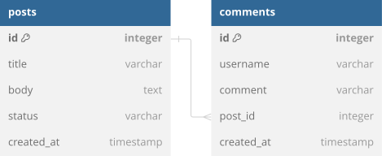

# BelongsTo

In this guide, we'll cover the `BelongsTo` relationship using CQL's Active Record syntax. We'll start with an Entity-Relationship Diagram (ERD) to illustrate how this relationship works and continuously build upon this diagram as we introduce new relationships in subsequent guides.

## **What is a `BelongsTo` Relationship?**

The `BelongsTo` association in a database indicates that one entity (a record) refers to another entity by holding a foreign key to that record. For example, a `Comment` belongs to a `Post`, and each comment references the `Post` it is associated with by storing the `post_id` as a foreign key.

### Example Scenario: Posts and Comments

Let's say you have a blog system where:

- A **Post** can have many **Comments**.
- A **Comment** belongs to one **Post**.

<figure><figcaption></figcaption></figure>

We'll start by implementing the `BelongsTo` relationship from the `Comment` to the `Post`.

---

## Defining the Schema

We'll first define the `posts` and `comments` tables using CQL's schema DSL.

```crystal
codeAcmeDB = CQL::Schema.define(
  :acme_db,
  adapter: CQL::Adapter::Postgres,
  uri: ENV["DATABASE_URL"]
) do

  table :posts do
    primary
    text :title
    text :body
    timestamp :published_at
  end

  table :comments do
    primary
    bigint :post_id
    text :body
  end
end
```

- **posts** table: Contains the blog post data (title, body, and published date).
- **comments** table: Contains the comment data and a foreign key `post_id` which references the `posts` table.

---

## Defining the Models

Next, we'll define the `Post` and `Comment` structs in CQL.

### **Post Model**

```crystal
struct Post
  include CQL::ActiveRecord::Model(Int64)
  db_context AcmeDB, :posts

  property id : Int64?
  property title : String
  property body : String
  property published_at : Time?

  # Initializing a new post with title, body, and optional published_at
  def initialize(@title : String, @body : String, @published_at : Time? = Time.utc)
  end
end
```

### **Comment Model**

```crystal
struct Comment
  include CQL::ActiveRecord::Model(Int64)
  db_context AcmeDB, :comments

  property id : Int64?
  property body : String
  property post_id : Int64?

  # Initializing a comment with a body. Post can be associated later.
  def initialize(@body : String, @post_id : Int64? = nil)
  end

  # Association: Each Comment belongs to one Post
  belongs_to :post, Post, foreign_key: :post_id
end
```

In the `Comment` model, we specify the `belongs_to :post, Post, foreign_key: :post_id` association. This links each comment to its parent post. The `Comment` model must have a `post_id` attribute (matching the `foreign_key` option) that stores the `id` of the associated `Post`.

---

## Creating and Querying Records

Now that we have defined the `Post` and `Comment` models with a `belongs_to` relationship, let's see how to create and query records in CQL.

### **Creating Records**

**Option 1: Create Parent, then Child**

```crystal
# 1. Create and save the parent Post first
post = Post.new(title: "My First Blog Post", body: "This is the body of the post.")
post.save!

# 2. Create the Comment and associate it
#    a) By setting the foreign key directly:
comment1 = Comment.new(body: "Great post via direct FK!")
comment1.post_id = post.id # Assign the foreign key
comment1.save!
puts "Comment 1 associated with Post ID: #{comment1.post_id}, Post title: #{comment1.post.try(&.title)}"

#    b) By using the association setter:
comment2 = Comment.new(body: "Awesome article via association setter!")
comment2.post = post # Assign the Post instance to the association
comment2.save!
puts "Comment 2 associated with Post ID: #{comment2.post_id}, Post title: #{comment2.post.try(&.title)}"
```

**Option 2: Create Child and Associated Parent Simultaneously (if needed)**
If you have a `Comment` instance and want to create its `Post` at the same time (less common for `belongs_to` primary creation flow but possible via association methods):

```crystal
new_comment = Comment.new(body: "A comment for a brand new post.")
# This creates a new Post, saves it, and associates it with new_comment
created_post = new_comment.create_post(title: "Post Created Via Comment", body: "Content for post created via comment.")
new_comment.save! # Save the comment itself which now has the post_id populated

puts "New comment ID: #{new_comment.id}, associated Post ID: #{new_comment.post_id}"
puts "Title of post created via comment: #{created_post.title}"
puts "Comment's post title: #{new_comment.post.try(&.title)}"
```

Note: `create_association` (like `create_post`) will create and save the associated object (`Post`) and set the foreign key on the current object (`new_comment`). The current object itself (`new_comment`) still needs to be saved if it's new.

**Option 3: Build Associated Parent (without saving parent yet)**

```crystal
yet_another_comment = Comment.new(body: "Comment with a built post.")
# This builds a new Post instance but does not save it to the DB yet.
# The foreign key on `yet_another_comment` is not set by `build_post`.
built_post = yet_another_comment.build_post(title: "Built, Not Saved Post", body: "Body of built post.")

# You would then save `built_post` and then `yet_another_comment` after setting association.
# built_post.save!
# yet_another_comment.post = built_post
# yet_another_comment.save!
puts "Built post title: #{built_post.title} (not yet saved)"
```

### **Querying the Associated Post from a Comment**

Once we have a comment, we can retrieve the associated post using the `belongs_to` association.

```crystal
crystalCopy code# Fetch the comment
comment = Comment.find(1)

# Fetch the associated post
post = comment.post

puts post.title  # Outputs: "My First Blog Post"
```

In this example, `comment.post` will fetch the `Post` associated with that `Comment`.

---

## Summary

In this guide, we've covered the basics of the `belongs_to` relationship in CQL. We:

- Defined the `Post` and `Comment` tables in the schema.
- Created the corresponding models, specifying the `belongs_to` relationship in the `Comment` model.
- Showed how to create and query records using the `belongs_to` association.

### Next Steps

In the next guides, we'll build on this ERD and introduce other types of relationships like `has_one`, `has_many`, and `many_to_many`. Stay tuned for the next part where we'll cover the `has_many` relationship!

Feel free to play around with this setup and extend the models or experiment with more queries to familiarize yourself with CQL's Active Record capabilities.
