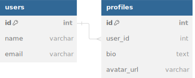

# HasOne

In this guide, we'll cover the `HasOne` relationship using CQL's Active Record syntax. Like in the previous `BelongsTo`guide, we’ll start with an Entity-Relationship Diagram (ERD) to visually represent how the `HasOne` relationship works and build on the structure we already introduced with the `BelongsTo` relationship.

## **What is a `HasOne` Relationship?**

The `HasOne` relationship indicates that one entity (a record) is related to exactly one other entity. For example, a **User** can have one **Profile** associated with it. This relationship is a one-to-one mapping between two entities.

#### Example Scenario: Users and Profiles

Let's say we have a system where:

- A **User** can have one **Profile**.
- A **Profile** belongs to one **User**.

<figure><figcaption></figcaption></figure>

We will represent this one-to-one relationship using CQL’s `HasOne` and `BelongsTo` associations.

---

## Defining the Schema

We'll define the `users` and `profiles` tables in the schema using CQL.

```crystal
AcmeDB = Cql::Schema.define(
  :acme_db,
  adapter: Cql::Adapter::Postgres,
  uri: ENV["DATABASE_URL"]
) do
  table :users do
    primary
    text :name
    text :email
  end

  table :profiles do
    primary
    bigint :user_id, index: true
    text :bio
    text :avatar_url
  end
end
```

- **users** table: Stores user details like `name` and `email`.
- **profiles** table: Stores profile details like `bio` and `avatar_url`. It has a `user_id` foreign key referencing the `users`table.

---

## Defining the Models

Let’s define the `User` and `Profile` models in CQL, establishing the `HasOne` and `BelongsTo` relationships.

### **User Model**

```crystal
struct User< Cql::Record(Int64)
  db_context AcmeDB, :users

  getter id : Int64?
  getter name : String
  getter email : String

  # Initializing a new user with name and email
  def initialize(@name : String, @email : String)
  end

  # Association: A User has one Profile
  has_one :profile, Profile
end
```

- The `has_one :profile` association in the `User` model indicates that each user has one profile.

### **Profile Model**

```crystal
struct Profile < Cql::Record(Int64)
  db_context AcmeDB, :profiles

  getter id : Int64?
  getter user_id : Int64
  getter bio : String
  getter avatar_url : String

  # Initializing a profile with user_id, bio, and avatar_url
  def initialize(@user_id : Int64, @bio : String, @avatar_url : String)
  end

  # Association: A Profile belongs to one User
  belongs_to :user, User
end
```

- The `belongs_to :user` association in the `Profile` model links each profile to a user by its `user_id`.

## Creating and Querying Records

Now that we have define the `User` and `Profile` models with a `has_one` and `belongs_to` relationship, let's see how to create and query records in CQL.

### **Creating a User and Profile**

```crystal
# Create a new User
user = User.new("John Doe", "john@example.com")
user.save

# Create a Profile for the User
profile = Profile.new(user.id.not_nil!, "Developer at Acme", "avatar_url.jpg")
profile.save
```

- First, we create a `User` and save it to the database.
- Then, we create a `Profile` and associate it with the user by passing `user.id` as the `user_id`.

### **Accessing the Profile from the User**

Once a user and their profile have been created, you can retrieve the profile using the `has_one` association.

```crystal
# Fetch the user
user = User.find(1)

# Fetch the associated profile
profile = user.profile

puts profile.bio  # Outputs: "Developer at Acme"
```

Here, `user.profile` fetches the profile associated with the user.

### **Accessing the User from the Profile**

Similarly, you can retrieve the associated user from the profile.

```crystal
# Fetch the profile
profile = Profile.find(1)

# Fetch the associated user
user = profile.user

puts user.name  # Outputs: "John Doe"
```

In this example, `profile.user` fetches the `User` associated with that `Profile`.

## Updating and Deleting the Associations

### **Updating the Profile for a User**

You can update the profile associated with a user in the same way you would update any other record.

```crystal
# Fetch the user
user = User.find(1)

# Update the user's profile
profile = user.profile
profile.bio = "Senior Developer at Acme"
profile.save
```

Here, we retrieve the profile associated with the user, modify its `bio`, and save the changes.

### **Deleting the Profile**

You can also delete the associated profile, but note that this does not automatically delete the user.

```crystal
crystalCopy code# Fetch the user's profile
profile = user.profile

# Delete the profile
profile.delete
```

Similarly, deleting the user will not automatically delete the associated profile unless cascade rules are explicitly set in the database.

---

## Summary

In this guide, we explored the `has_one` relationship in CQL. We:

- Define the `User` and `Profile` tables in the schema.
- Created corresponding models, specifying the `has_one` relationship in the `User` model and the `belongs_to`relationship in the `Profile` model.
- Demonstrated how to create, query, update, and delete records using the `has_one` and `belongs_to` associations.

### Next Steps

In the next guide, we’ll extend the ERD and cover the `has_many` relationship, which is commonly used when one entity is associated with multiple records (e.g., a post having many comments).

Feel free to experiment with the `has_one` relationship by adding more fields to your models, setting up validations, or extending your schema with more complex relationships.
