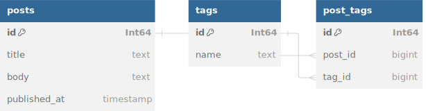

# ManyToMany

## CQL Active Record: `ManyToMany` Relationship Guide

In this guide, we’ll cover the `ManyToMany` relationship using CQL's Active Record syntax. This is a more complex relationship compared to `HasOne` and `HasMany`, and it’s commonly used when two entities have a many-to-many relationship, such as posts and tags where:

* A **Post** can have many **Tags**.
* A **Tag** can belong to many **Posts**.

To model this, we need an intermediate (or join) table that connects these two entities.

***

## What is a `ManyToMany` Relationship?

A `ManyToMany` relationship means that multiple records in one table can relate to multiple records in another table. For example:

* A **Post** can have multiple **Tags** (e.g., "Tech", "News").
* A **Tag** can belong to multiple **Posts** (e.g., both Post 1 and Post 2 can have the "Tech" tag).

### Example Scenario: Posts and Tags

<figure><figcaption></figcaption></figure>

We’ll use a scenario where:

* A **Post** can have many **Tags**.
* A **Tag** can belong to many **Posts**.

We will represent this many-to-many relationship using a join table called **PostTags**.

***

## Defining the Schema

We’ll define the `posts`, `tags`, and `post_tags` tables in the schema using CQL’s DSL.

```crystal
AcmeDB = Cql::Schema.define(
  :acme_db,
  adapter: Cql::Adapter::Postgres,
  uri: ENV["DATABASE_URL"]
) do
  table :posts do
    primary # Defaults to :id, Int64, auto_increment: true
    text :title
    text :body
    timestamp :published_at
  end

  table :tags do
    primary
    text :name
  end

  table :post_tags do
    primary
    bigint :post_id, index: true
    bigint :tag_id, index: true
    index [:post_id, :tag_id], unique: true
  end
end
```

* **posts** table: Stores post details such as `title`, `body`, and `published_at`.
* **tags** table: Stores tag names.
* **post\_tags** table: A join table that connects `posts` and `tags` via their foreign keys `post_id` and `tag_id`.

***

## Defining the Models

Let’s define the `Post`, `Tag`, and `PostTag` models in CQL, establishing the `ManyToMany` relationship.

### **Post Model**

```crystal
struct Post
  include Cql::Record(Post, Int64)

  define AcmeDB, :posts

  getter id : Int64?
  getter title : String
  getter body : String
  getter published_at : Time

  # Initializing a new post with title, body, and published_at
  def initialize(@title : String, @body : String, @published_at : Time = Time.utc)
  end

  # Association: A Post has many Tags through PostTags
  has_many :post_tags, PostTag
  has_many :tags, Tag, through: :post_tags
end
```

In the `Post` model, we define:

* `has_many :post_tags` to establish the association between `Post` and the join table `PostTag`.
* `has_many :tags, through: :post_tags` to associate `Post` with `Tag` through the join table.

### **Tag Model**

```crystal
struct Tag
  include Cql::Record(Tag, Int64)

  define AcmeDB, :tags

  getter id : Int64?
  getter name : String

  # Initializing a new tag with name
  def initialize(@name : String)
  end

  # Association: A Tag has many Posts through PostTags
  has_many :post_tags, PostTag
  has_many :posts, Post, through: :post_tags
end
```

Similarly, in the `Tag` model, we define:

* `has_many :post_tags` to associate `Tag` with `PostTag`.
* `has_many :posts, through: :post_tags` to associate `Tag` with `Post` through the join table.

### **PostTag Model (Join Table)**

```crystal
struct PostTag
  include Cql::Record(PostTag, Int64)

  define AcmeDB, :post_tags

  getter id : Int64?
  getter post_id : Int64
  getter tag_id : Int64

  # Initializing a PostTag with post_id and tag_id
  def initialize(@post_id : Int64, @tag_id : Int64)
  end

  # Associations
  belongs_to :post, Post
  belongs_to :tag, Tag
end
```

The `PostTag` model links each `Post` and `Tag` by storing their respective IDs.

***

## Creating and Querying Records

Now that we’ve defined the `Post`, `Tag`, and `PostTag` models, let’s explore how to create and query records in a `ManyToMany` relationship.

### **Creating a Post with Tags**

```crystal
# Create a new Post
post = Post.new("Crystal Language Guide", "This is a guide about Crystal.")
post.save

# Create some Tags
tag1 = Tag.new("Tech")
tag2 = Tag.new("Programming")
tag1.save
tag2.save

# Associate the Post with the Tags
PostTag.new(post.id.not_nil!, tag1.id.not_nil!).save
PostTag.new(post.id.not_nil!, tag2.id.not_nil!).save
```

In this example:

* We create a `Post` and save it to the database.
* We create two `Tags` ("Tech" and "Programming") and save them.
* We create records in the `PostTag` join table to associate the `Post` with these two `Tags`.

### **Accessing Tags for a Post**

Once a post has tags associated with it, you can retrieve them using the `ManyToMany` association.

```crystal
# Fetch the post
post = Post.find(1)

# Fetch all associated tags
post.tags.each do |tag|
  puts tag.name
end
```

Here, `post.tags` retrieves all the tags associated with the post.

### **Accessing Posts for a Tag**

Similarly, you can retrieve all posts associated with a tag.

```crystal
# Fetch the tag
tag = Tag.find(1)

# Fetch all associated posts
tag.posts.each do |post|
  puts post.title
end
```

Here, `tag.posts` retrieves all the posts associated with the tag.

***

## Updating and Deleting the Associations

### **Adding New Tags to a Post**

You can associate more tags with an existing post by creating new entries in the `PostTag` join table.

```crystal
# Fetch the post
post = Post.find(1)

# Create a new tag and associate it with the post
new_tag = Tag.new("Web Development")
new_tag.save

# Associate the post with the new tag
PostTag.new(post.id.not_nil!, new_tag.id.not_nil!).save
```

### **Removing a Tag from a Post**

To disassociate a tag from a post, you need to delete the corresponding record from the `PostTag` join table.

```crystal
# Fetch the post and tag
post = Post.find(1)
tag = Tag.find(2)

# Find the PostTag entry
post_tag = PostTag.where(post_id: post.id, tag_id: tag.id).first

# Delete the PostTag entry
post_tag.delete
```

***

## Advanced Querying

You can also perform advanced queries using the `ManyToMany` relationship, such as finding posts with a specific tag or fetching tags for multiple posts.

### **Fetching Posts with a Specific Tag**

To find all posts associated with a specific tag, you can filter the posts by the tag name.

```crystal
# Fetch the tag
tag = Tag.where { name.eq("Tech") }.first

# Fetch all posts associated with the "Tech" tag
tag.posts.each do |post|
  puts post.title
end
```

### **Fetching Tags for Multiple Posts**

You can fetch all tags associated with multiple posts as follows:

```crystal
# Fetch posts
posts = Post.where { id.in([1, 2, 3]) }

# Fetch all tags associated with the posts
posts.each do |post|
  post.tags.each do |tag|
    puts "Post #{post.title} has tag #{tag.name}"
  end
end
```

***

## Summary

In this guide, we explored the `ManyToMany` relationship in CQL. We:

* Defined the `Post`, `Tag`, and `PostTag` tables in the schema
* Created corresponding models, specifying the `ManyToMany` relationship between `Post` and `Tag` through the `PostTag` join table.
* Demonstrated how to create, query, update, and delete records in a `ManyToMany` relationship.

### Next Steps

This concludes our series of guides on relationships in CQL Active Record, covering `BelongsTo`, `HasOne`, `HasMany`, and `ManyToMany`. Feel free to experiment by extending your models, adding validations, or implementing more complex queries to suit your needs.
