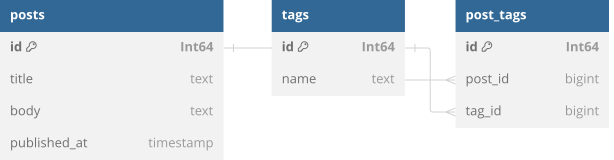

# ManyToMany

## CQL Active Record: `ManyToMany` Relationship Guide

In this guide, we'll cover the `ManyToMany` relationship using CQL's Active Record syntax. This relationship is used when multiple records in one table can relate to multiple records in another table, facilitated by an intermediate join table.

---

## What is a `ManyToMany` Relationship?

A `ManyToMany` relationship means that multiple records in one table can relate to multiple records in another table. For example:

- A **Post** can have multiple **Tags** (e.g., "Tech", "News").
- A **Tag** can belong to multiple **Posts** (e.g., both Post 1 and Post 2 can have the "Tech" tag).

### Example Scenario: Posts and Tags

<figure><figcaption></figcaption></figure>

We'll use a scenario where:

- A **Post** can have many **Tags**.
- A **Tag** can belong to many **Posts**.

We will represent this many-to-many relationship using a join table called **PostTags**.

---

## Defining the Schema

We'll define the `posts`, `tags`, and `post_tags` tables in the schema using CQL's DSL.

```crystal
AcmeDB = CQL::Schema.define(
  :acme_db,
  adapter: CQL::Adapter::Postgres,
  uri: ENV["DATABASE_URL"]
) do
  table :posts do
    primary # Defaults to :id, Int64, auto_increment: true
    text :title
    text :body
    timestamp :published_at
  end

  table :tags do
    primary
    text :name
  end

  table :post_tags do
    primary
    bigint :post_id, index: true
    bigint :tag_id, index: true
    index [:post_id, :tag_id], unique: true
  end
end
```

- **posts** table: Stores post details such as `title`, `body`, and `published_at`.
- **tags** table: Stores tag names.
- **post_tags** table: A join table that connects `posts` and `tags` via their foreign keys `post_id` and `tag_id`.

---

## Defining the Models

Let's define the `Post`, `Tag`, and `PostTag` models in CQL, establishing the `ManyToMany` relationship.

### **Post Model**

```crystal
struct Post < CQL::ActiveRecord::Model(Int64)
  db_context AcmeDB, :posts

  property id : Int64?
  property title : String
  property body : String
  property published_at : Time?

  # Initializing a new post
  def initialize(@title : String, @body : String, @published_at : Time? = Time.utc)
  end

  # Association: A Post has many Tags through the 'post_tags' join table.
  # `join_through` refers to the table name of the join model.
  many_to_many :tags, Tag, join_through: :post_tags
end
```

- The `many_to_many :tags, Tag, join_through: :post_tags` association in the `Post` model connects `Post` to `Tag` via the `post_tags` table.

### **Tag Model**

```crystal
struct Tag < CQL::ActiveRecord::Model(Int64)
  db_context AcmeDB, :tags

  property id : Int64?
  property name : String

  # Initializing a new tag
  def initialize(@name : String)
  end

  # Association: A Tag has many Posts through the 'post_tags' join table.
  many_to_many :posts, Post, join_through: :post_tags
end
```

- Similarly, the `Tag` model uses `many_to_many :posts, Post, join_through: :post_tags`.

### **PostTag Model (Join Model)**

```crystal
struct PostTag < CQL::ActiveRecord::Model(Int64)
  db_context AcmeDB, :post_tags

  property id : Int64?
  property post_id : Int64?
  property tag_id : Int64?

  # Initializing a PostTag. IDs are typically set by the association logic.
  def initialize(@post_id : Int64? = nil, @tag_id : Int64? = nil)
  end

  # Associations to the parent models
  belongs_to :post, Post, foreign_key: :post_id
  belongs_to :tag, Tag, foreign_key: :tag_id
end
```

- The `PostTag` model is crucial. It `belongs_to` both `Post` and `Tag`.
- The `many_to_many` macro uses this join model implicitly via the `join_through: :post_tags` option, which refers to the table name.

---

## Working with `ManyToMany` Associations

When you access a `many_to_many` association (e.g., `post.tags`), you get a `ManyCollection` proxy that offers powerful methods to manage the relationship.

### **Creating and Associating Records**

```crystal
# Create a new Post
post = Post.create!(title: "Crystal Language Guide", body: "This is a guide about Crystal.")

# Option 1: Create new Tags and associate them via the collection's `create` method
# This creates the Tag, saves it, and creates the PostTag join record.
tag_crystal = post.tags.create(name: "Crystal")
tag_programming = post.tags.create(name: "Programming")
puts "Post '#{post.title}' now has tags: #{post.tags.all.map(&.name).join(", ")}"

# Option 2: Add existing (persisted) Tags using `<<`
# First, ensure the tags exist or create them.
tag_tech = Tag.find_or_create_by(name: "Tech")
tag_tech.save! if !tag_tech.persisted?

post.tags << tag_tech
puts "After adding 'Tech', Post tags: #{post.tags.all.map(&.name).join(", ")}"

# Trying to add an unpersisted tag with `<<` will raise an error.
# new_unpersisted_tag = Tag.new(name: "Unsaved")
# begin
#   post.tags << new_unpersisted_tag # This would fail
# rescue e : ArgumentError
#   puts "Error adding unsaved tag: #{e.message}"
# end

# Option 3: Setting associations by an array of IDs (post.tag_ids = [...])
# This is a common pattern for updating all associations at once.
# It typically clears existing associations for this post and creates new ones.

# Ensure some tags exist to get their IDs
tag_guide = Tag.find_or_create_by(name: "Guide") { |t| t.save! }
tag_cql = Tag.find_or_create_by(name: "CQL") { |t| t.save! }

# Assuming ManyCollection supports `ids=` (verify from ManyCollection API)
# post.tag_ids = [tag_crystal.id.not_nil!, tag_guide.id.not_nil!, tag_cql.id.not_nil!]
# This functionality (direct assignment to `tag_ids=`) depends on its specific implementation in `ManyCollection`.
# If not directly available, an alternative is to clear and then add:
post.tags.clear
post.tags << tag_crystal
post.tags << tag_guide
post.tags << tag_cql
puts "After setting by IDs (clear & add), Post tags: #{post.tags.all.map(&.name).join(", ")}"
```

### **Accessing Associated Records**

```crystal
# Fetch the post
loaded_post = Post.find!(post.id.not_nil!)

puts "\nTags for post '#{loaded_post.title}':"
loaded_post.tags.all.each do |tag|
  puts "- #{tag.name}"
end

# Fetch the tag and its posts
loaded_tag_crystal = Tag.find!(tag_crystal.id.not_nil!)
puts "\nPosts for tag '#{loaded_tag_crystal.name}':"
loaded_tag_crystal.posts.all.each do |p|
  puts "- #{p.title}"
end

# Other collection methods like find_by, exists?, size, empty? also work:
tech_tag_on_post = loaded_post.tags.find_by(name: "Tech")
puts "Post has 'Tech' tag? #{!tech_tag_on_post.nil?}"
```

### **Removing Associations / Deleting Records**

**Removing an association (deletes the join table record, not the Tag itself):**

```crystal
# Remove the 'Programming' tag association from the post
programming_tag = loaded_post.tags.find_by(name: "Programming")
if prog_tag = programming_tag
  if loaded_post.tags.delete(prog_tag) # Pass instance or its ID
    puts "Removed 'Programming' tag association from '#{loaded_post.title}'."
  end
end
puts "Post tags after removing 'Programming': #{loaded_post.tags.all.map(&.name).join(", ")}"

# The 'Programming' tag itself still exists in the `tags` table
still_exists_programming_tag = Tag.find_by(name: "Programming")
puts "'Programming' tag still exists globally? #{!still_exists_programming_tag.nil?}"
```

**Clearing all associations for a post (deletes all its PostTag records):**

```crystal
puts "Tags before clear for '#{loaded_post.title}': #{loaded_post.tags.size}"
loaded_post.tags.clear
puts "Tags after clear for '#{loaded_post.title}': #{loaded_post.tags.size}" # Should be 0
```

- `clear` only removes the join records. The `Tag` records themselves are not deleted.
- If `cascade: true` was set on the `many_to_many` association, the behavior of `delete` or `clear` with respect to the target records (`Tag`) might change, potentially deleting them. This needs careful checking of `ManyCollection`'s cascade implementation.

Deleting a `Post` or a `Tag` will _not_ automatically delete its associations from the `post_tags` table or the associated records on the other side, unless cascade deletes are configured at the database level or handled by `before_destroy` callbacks manually cleaning up join table records.

---

## Eager Loading `ManyToMany`

To avoid N+1 queries with many-to-many associations, use `includes`:

```crystal
# Fetches all posts and their associated tags efficiently
posts_with_tags = Post.query.includes(:tags).all(Post)

posts_with_tags.each do |p|
  puts "Post: #{p.title} has tags: #{p.tags.map(&.name).join(", ") || "None"} (already loaded)"
end
```

---

## Summary

In this guide, we explored the `ManyToMany` relationship in CQL:

- Defined `Post`, `Tag`, and `PostTag` (join) models using `CQL::ActiveRecord::Model(Pk)`.
- Used the `many_to_many :association, TargetModel, join_through: :join_table_symbol` macro.
- Showcased managing associations using `ManyCollection` methods like `<<`, `create`, `delete`, and `clear`.
- Discussed accessing associated records and eager loading with `includes`.

This provides a robust way to handle many-to-many relationships in your Crystal applications using CQL.

### Next Steps

This concludes our series of guides on relationships in CQL Active Record, covering `BelongsTo`, `HasOne`, `HasMany`, and `ManyToMany`. Feel free to experiment by extending your models, adding validations, or implementing more complex queries to suit your needs.
