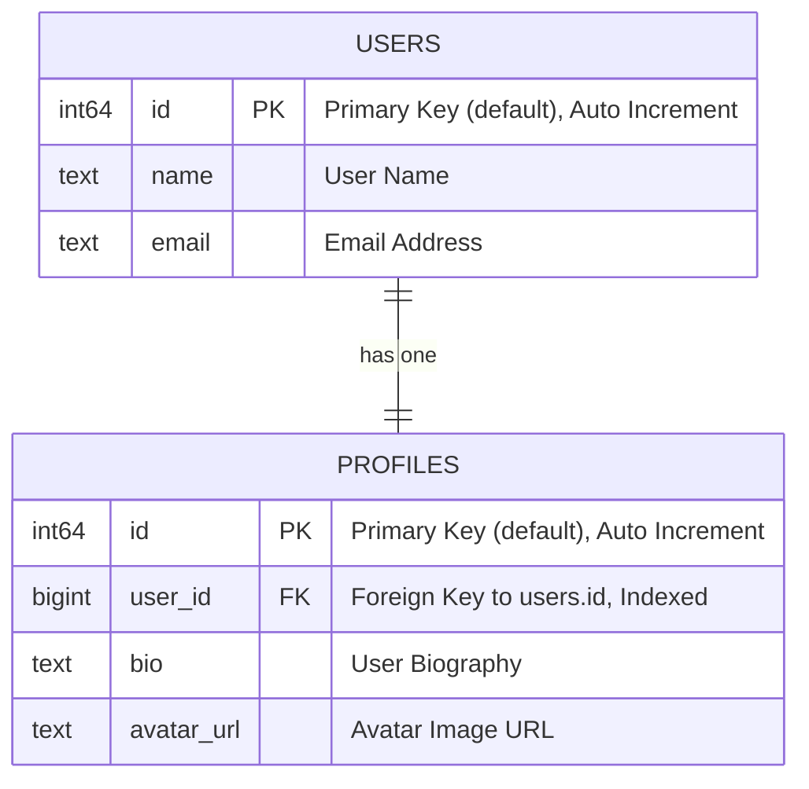

# HasOne

In this guide, we'll cover the `HasOne` relationship using CQL's Active Record syntax. Like in the previous `BelongsTo`guide, we'll start with an Entity-Relationship Diagram (ERD) to visually represent how the `HasOne` relationship works and build on the structure we already introduced with the `BelongsTo` relationship.

## **What is a `HasOne` Relationship?**

The `HasOne` relationship indicates that one entity (a record) is related to exactly one other entity. For example, a **User** can have one **Profile** associated with it. This relationship is a one-to-one mapping between two entities.

#### Example Scenario: Users and Profiles

Let's say we have a system where:

- A **User** can have one **Profile**.
- A **Profile** belongs to one **User**.



We will represent this one-to-one relationship using CQL's `HasOne` and `BelongsTo` associations.

---

## Defining the Schema

We'll define the `users` and `profiles` tables in the schema using CQL.

```crystal
AcmeDB = CQL::Schema.define(
  :acme_db,
  adapter: CQL::Adapter::Postgres,
  uri: ENV["DATABASE_URL"]
) do
  table :users do
    primary
    text :name
    text :email
  end

  table :profiles do
    primary
    bigint :user_id, index: true
    text :bio
    text :avatar_url
  end
end
```

- **users** table: Stores user details like `name` and `email`.
- **profiles** table: Stores profile details like `bio` and `avatar_url`. It has a `user_id` foreign key referencing the `users`table.

---

## Defining the Models

Let's define the `User` and `Profile` models in CQL, establishing the `HasOne` and `BelongsTo` relationships.

### **User Model**

```crystal
struct User
  include CQL::ActiveRecord::Model(Int64)
  db_context AcmeDB, :users

  property id : Int64?
  property name : String
  property email : String

  # Initializing a new user with name and email
  def initialize(@name : String, @email : String)
  end

  # Association: A User has one Profile
  has_one :profile, Profile
end
```

- The `has_one :profile, Profile` association in the `User` model indicates that each user has one profile. The foreign key (e.g., `user_id`) is expected on the `profiles` table.

### **Profile Model**

```crystal
struct Profile
  include CQL::ActiveRecord::Model(Int64)
  db_context AcmeDB, :profiles

  property id : Int64?
  property user_id : Int64?
  property bio : String
  property avatar_url : String

  # Initializing a profile. User can be associated later.
  def initialize(@bio : String, @avatar_url : String, @user_id : Int64? = nil)
  end

  # Association: A Profile belongs to one User
  belongs_to :user, User, foreign_key: :user_id
end
```

- The `belongs_to :user, User, foreign_key: :user_id` association in the `Profile` model links each profile to a user.

## Creating and Querying Records

Now that we have defined the `User` and `Profile` models with `has_one` and `belongs_to` relationships, let's see how to create and query records.

### **Creating a User and Profile**

**Option 1: Create User, then use `create_association` for Profile**

```crystal
# 1. Create and save the User
user = User.new(name: "John Doe", email: "john@example.com")
user.save!

# 2. Create and associate the Profile using the helper method
# This creates a Profile, sets its user_id to user.id, and saves the Profile.
profile = user.create_profile(bio: "Developer at Acme", avatar_url: "avatar_url.jpg")

puts "User #{user.name} created with ID: #{user.id.not_nil!}"
puts "Profile for user created with ID: #{profile.id.not_nil!}, Bio: #{profile.bio}, UserID: #{profile.user_id}"
```

**Option 2: Create User, then build and save Profile manually**

```crystal
user2 = User.new(name: "Jane Roe", email: "jane@example.com")
user2.save!

# Build the profile (in memory, foreign key is set)
new_profile = user2.build_profile(bio: "Designer at Innovations", avatar_url: "jane_avatar.png")
# new_profile.user_id is now user2.id

# You must save the profile separately if you use build_profile
new_profile.save!

puts "User #{user2.name} created with ID: #{user2.id.not_nil!}"
puts "Built and saved Profile ID: #{new_profile.id.not_nil!}, UserID: #{new_profile.user_id}"
```

**Option 3: Manual creation (less common with helpers available)**

```crystal
user3 = User.new(name: "Manual Mike", email: "mike@example.com")
user3.save!

profile_manual = Profile.new(bio: "Manual bio", avatar_url: "manual.jpg")
profile_manual.user_id = user3.id # Manually set foreign key
# or profile_manual.user = user3   # Use belongs_to setter if preferred before save
profile_manual.save!

puts "User #{user3.name} (ID: #{user3.id.not_nil!}) and Profile (ID: #{profile_manual.id.not_nil!}) created manually."
```

### **Accessing the Profile from the User**

Once a user and their profile have been created, you can retrieve the profile using the `has_one` association.

```crystal
# Fetch the user
user = User.find(1)

# Fetch the associated profile
profile = user.profile

puts profile.bio  # Outputs: "Developer at Acme"
```

Here, `user.profile` fetches the profile associated with the user.

### **Accessing the User from the Profile**

Similarly, you can retrieve the associated user from the profile.

```crystal
# Fetch the profile
profile = Profile.find(1)

# Fetch the associated user
user = profile.user

puts user.name  # Outputs: "John Doe"
```

In this example, `profile.user` fetches the `User` associated with that `Profile`.

### **Deleting the Profile**

You can also delete the associated profile.

```crystal
# Fetch the user
user_for_delete_test = User.find_by!(email: "john@example.com") # Assuming John exists

# Option 1: Using the association getter and then instance delete
if existing_profile = user_for_delete_test.profile
  existing_profile.delete!
  puts "Profile for #{user_for_delete_test.name} deleted via instance delete."
end

# Re-create for next example
user_for_delete_test.create_profile(bio: "Temporary bio", avatar_url: "temp.jpg")

# Option 2: Using the has_one delete helper (if available and user.profile exists)
if user_for_delete_test.delete_profile # This method returns true if successful
  puts "Profile for #{user_for_delete_test.name} deleted via user.delete_profile helper."
else
  puts "Could not delete profile for #{user_for_delete_test.name} via helper, or no profile existed."
end
```

Similarly, deleting the user will not automatically delete the associated profile unless cascade rules are explicitly set in the database or handled by `before_destroy` callbacks on the User model.

---

## Summary

In this guide, we explored the `has_one` relationship in CQL. We:

- Define the `User` and `Profile` tables in the schema.
- Created corresponding models, specifying the `has_one` relationship in the `User` model and the `belongs_to`relationship in the `Profile` model.
- Demonstrated how to create, query, update, and delete records using the `has_one` and `belongs_to` associations.

### Next Steps

In the next guide, we'll extend the ERD and cover the `has_many` relationship, which is commonly used when one entity is associated with multiple records (e.g., a post having many comments).

Feel free to experiment with the `has_one` relationship by adding more fields to your models, setting up validations, or extending your schema with more complex relationships.
