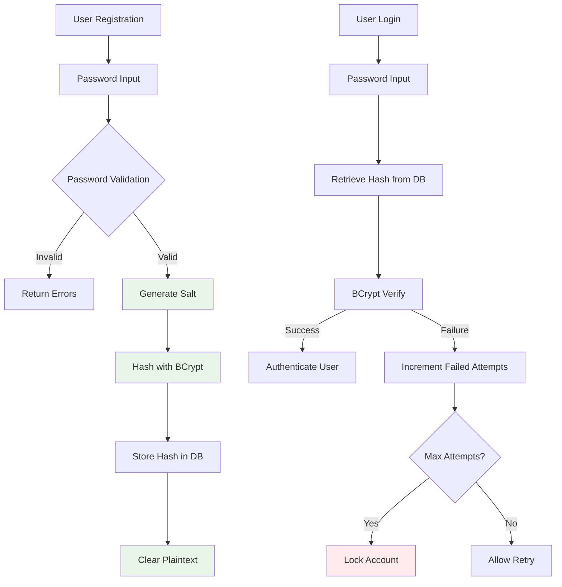
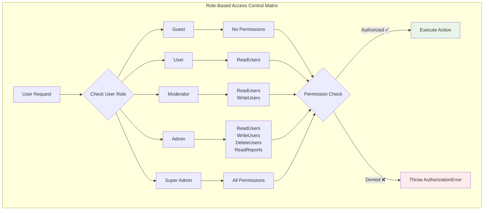
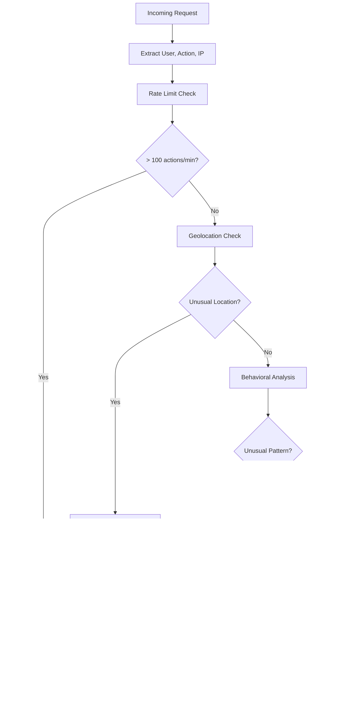

# 🔐 Security Guide for CQL

> **Secure your Crystal applications** - Essential security practices for database interactions, authentication, and data protection

Security is paramount in production applications. This guide covers essential security practices for CQL applications, from SQL injection prevention to data encryption and access control.

## 📋 Table of Contents

- [🛡️ SQL Injection Prevention](#️-sql-injection-prevention)
- [🔐 Authentication & Authorization](#-authentication--authorization)
- [🔒 Data Protection](#-data-protection)
- [🚫 Input Validation](#-input-validation)
- [🔑 Database Security](#-database-security)
- [📊 Auditing & Monitoring](#-auditing--monitoring)
- [✅ Security Checklist](#-security-checklist)

---

## 🛡️ SQL Injection Prevention

### 🎯 Parameterized Queries (Built-in Protection)

CQL automatically protects against SQL injection through parameterized queries:

```crystal
# ✅ Safe - CQL automatically parameterizes
user = User.where(email: user_input).first
users = User.where("created_at > ?", date_input).all

# ✅ Safe - Active Record methods use parameters
User.find_by(email: user_input)
User.where(id: [1, 2, 3]).all

# ⚠️ Dangerous - Raw SQL with string interpolation
User.query("SELECT * FROM users WHERE email = '#{user_input}'")  # DON'T DO THIS

# ✅ Safe - Raw SQL with parameters
User.query("SELECT * FROM users WHERE email = ?", [user_input])
```

### 🔧 Safe Dynamic Queries

```crystal
# ✅ Safe dynamic filtering
class UserFilter
  def self.build_query(filters : Hash(String, String))
    query = User.all

    if email = filters["email"]?
      query = query.where(email: email)  # Parameterized automatically
    end

    if status = filters["status"]?
      # Whitelist allowed values
      allowed_statuses = ["active", "inactive", "pending"]
      if allowed_statuses.includes?(status)
        query = query.where(status: status)
      end
    end

    query
  end
end

# ✅ Safe column ordering
class UserQuery
  ALLOWED_ORDER_COLUMNS = ["id", "name", "created_at", "email"]

  def self.ordered_by(column : String, direction : String = "asc")
    # Validate column name (prevent injection)
    unless ALLOWED_ORDER_COLUMNS.includes?(column)
      raise ArgumentError.new("Invalid order column: #{column}")
    end

    # Validate direction
    direction = direction.downcase
    unless ["asc", "desc"].includes?(direction)
      direction = "asc"
    end

    # Use string interpolation for column names (not user data)
    User.order("#{column} #{direction}")
  end
end
```

---

## 🔐 Authentication & Authorization

### 🔑 Secure Password Handling



```crystal
# User model with secure password
require "crypto/bcrypt/password"

struct User
  include CQL::ActiveRecord::Model(Int64)

  property id : Int64?
  property email : String
  property password_hash : String
  property role : String = "user"
  property active : Bool = true
  property failed_login_attempts : Int32 = 0
  property locked_at : Time?
  property last_login_at : Time?

  # Virtual password attribute
  property password : String = ""

  validates :email, presence: true, uniqueness: true, format: EMAIL_REGEX
  validates :password, length: {minimum: 12}, confirmation: true, on: :create

  before_save :hash_password, if: :password_changed?

  def authenticate(password : String) : Bool
    return false if account_locked?

    if Crypto::Bcrypt::Password.new(password_hash).verify(password)
      reset_failed_attempts
      update_last_login
      true
    else
      increment_failed_attempts
      false
    end
  end

  def account_locked? : Bool
    locked_at && locked_at.not_nil! > 30.minutes.ago
  end

  private def hash_password
    return if password.empty?

    # Use high cost factor for production
    cost = ENV["CRYSTAL_ENV"]? == "production" ? 12 : 4
    self.password_hash = Crypto::Bcrypt::Password.create(password, cost: cost).to_s
    self.password = ""  # Clear plaintext password
  end

  private def increment_failed_attempts
    self.failed_login_attempts += 1

    # Lock account after 5 failed attempts
    if failed_login_attempts >= 5
      self.locked_at = Time.utc
    end

    save
  end

  private def reset_failed_attempts
    if failed_login_attempts > 0
      update!(failed_login_attempts: 0, locked_at: nil)
    end
  end

  private def update_last_login
    update!(last_login_at: Time.utc)
  end
end
```

### 🛡️ Role-Based Access Control



```crystal
# Permission system
enum Permission
  ReadUsers
  WriteUsers
  DeleteUsers
  ReadReports
  AdminAccess
end

# Role definitions
module Roles
  PERMISSIONS = {
    "user" => [Permission::ReadUsers],
    "moderator" => [Permission::ReadUsers, Permission::WriteUsers],
    "admin" => [Permission::ReadUsers, Permission::WriteUsers, Permission::DeleteUsers, Permission::ReadReports],
    "super_admin" => Permission.values  # All permissions
  }

  def self.has_permission?(role : String, permission : Permission) : Bool
    PERMISSIONS[role]?.try(&.includes?(permission)) || false
  end
end

# Authorization mixin
module Authorizable
  def can?(permission : Permission) : Bool
    Roles.has_permission?(role, permission)
  end

  def authorize!(permission : Permission)
    unless can?(permission)
      raise AuthorizationError.new("Insufficient permissions: #{permission}")
    end
  end
end

# Include in User model
struct User
  include Authorizable

  def admin? : Bool
    role == "admin" || role == "super_admin"
  end

  def can_manage?(other_user : User) : Bool
    return false if self == other_user
    admin? && can?(Permission::WriteUsers)
  end
end

# Usage in controllers/services
class UserService
  def update_user(current_user : User, user_id : Int64, attributes : Hash)
    current_user.authorize!(Permission::WriteUsers)

    user = User.find!(user_id)

    # Additional checks
    unless current_user.can_manage?(user)
      raise AuthorizationError.new("Cannot modify this user")
    end

    user.update!(attributes)
  end
end
```

### 🔐 Session Management

```crystal
# Secure session model
struct UserSession
  include CQL::ActiveRecord::Model(String)  # UUID primary key

  property id : String = UUID.random.to_s
  property user_id : Int64
  property ip_address : String
  property user_agent : String
  property expires_at : Time
  property last_activity : Time = Time.utc

  belongs_to :user, User

  # Security configurations
  SESSION_LIFETIME = 24.hours
  ACTIVITY_TIMEOUT = 2.hours

  def self.create_for_user(user : User, ip : String, user_agent : String)
    # Clean up old sessions
    cleanup_expired_sessions(user)

    create!(
      user_id: user.id!,
      ip_address: ip,
      user_agent: user_agent,
      expires_at: SESSION_LIFETIME.from_now
    )
  end

  def valid? : Bool
    !expired? && !inactive?
  end

  def expired? : Bool
    expires_at < Time.utc
  end

  def inactive? : Bool
    last_activity < ACTIVITY_TIMEOUT.ago
  end

  def touch_activity
    update!(last_activity: Time.utc)
  end

  def invalidate!
    delete!
  end

  private def self.cleanup_expired_sessions(user : User)
    UserSession.where(user_id: user.id!)
               .where("expires_at < ? OR last_activity < ?", Time.utc, ACTIVITY_TIMEOUT.ago)
               .delete_all
  end
end
```

---

## 🔒 Data Protection

### 🔐 Sensitive Data Encryption

```crystal
# Encrypted attribute handling
require "crypto/subtle"

module EncryptedAttributes
  macro encrypted_attribute(name, type = String)
    property encrypted_{{name.id}} : String = ""

    def {{name.id}}=(value : {{type}})
      self.encrypted_{{name.id}} = Encryption.encrypt(value.to_s)
    end

    def {{name.id}} : {{type}}?
      return nil if encrypted_{{name.id}}.empty?
      decrypted = Encryption.decrypt(encrypted_{{name.id}})
      {{type}}.new(decrypted)
    rescue
      nil
    end
  end
end

# Encryption service
module Encryption
  extend self

  # Use environment variable for encryption key
  ENCRYPTION_KEY = ENV["ENCRYPTION_KEY"]? || raise("ENCRYPTION_KEY required")

  def encrypt(data : String) : String
    # Implementation would use AES-256-GCM or similar
    # This is a simplified example
    Base64.encode(data)  # Replace with actual encryption
  end

  def decrypt(encrypted_data : String) : String
    # Implementation would decrypt using the same algorithm
    Base64.decode_string(encrypted_data)  # Replace with actual decryption
  end
end

# Usage in models
struct User
  include EncryptedAttributes

  property email : String
  encrypted_attribute social_security_number
  encrypted_attribute credit_card_number

  # These fields are automatically encrypted/decrypted
end
```

### 🔍 Personal Data Handling (GDPR/Privacy)

```crystal
# Personal data tracking and management
module PersonalDataCompliance
  extend self

  # Define what constitutes personal data
  PERSONAL_DATA_FIELDS = {
    User => [:email, :name, :phone, :address],
    UserProfile => [:date_of_birth, :biography],
    Order => [:shipping_address, :billing_address]
  }

  def export_user_data(user : User) : Hash(String, Array(Hash(String, String)))
    data = {} of String => Array(Hash(String, String))

    PERSONAL_DATA_FIELDS.each do |model_class, fields|
      records = get_user_records(model_class, user)
      data[model_class.to_s] = records.map do |record|
        extract_personal_fields(record, fields)
      end
    end

    data
  end

  def anonymize_user_data(user : User)
    User.transaction do
      # Replace personal data with anonymized versions
      user.update!(
        email: "deleted_user_#{user.id}@example.com",
        name: "Deleted User",
        phone: nil,
        address: nil
      )

      # Anonymize related records
      user.profiles.each(&.anonymize!)
      user.orders.each(&.anonymize_addresses!)
    end
  end

  def delete_user_data(user : User)
    User.transaction do
      # Delete all user data in correct order (foreign keys)
      user.sessions.delete_all
      user.orders.delete_all
      user.profiles.delete_all
      user.delete!
    end
  end
end
```

---

## 🚫 Input Validation

### ✅ Comprehensive Validation

```crystal
# Secure validation patterns
struct User
  # Email validation with security considerations
  validates :email,
    presence: true,
    length: {maximum: 254},  # RFC 5321 limit
    format: /\A[a-zA-Z0-9._%+-]+@[a-zA-Z0-9.-]+\.[a-zA-Z]{2,}\z/,
    uniqueness: {case_insensitive: true}

  # Password security requirements
  validates :password,
    length: {minimum: 12, maximum: 128},
    format: {
      with: /(?=.*[a-z])(?=.*[A-Z])(?=.*\d)(?=.*[@$!%*?&])/,
      message: "must contain uppercase, lowercase, number, and special character"
    }

  # Prevent malicious content
  validates :name,
    length: {minimum: 1, maximum: 100},
    format: {
      without: /<script|javascript:|data:|vbscript:/i,
      message: "contains prohibited content"
    }

  # Custom security validations
  validate :no_sql_injection_patterns
  validate :rate_limit_creation

  private def no_sql_injection_patterns
    suspicious_patterns = [
      /union\s+select/i,
      /insert\s+into/i,
      /delete\s+from/i,
      /drop\s+table/i,
      /--/,
      /\/\*/
    ]

    [email, name].each do |field|
      next if field.nil?

      suspicious_patterns.each do |pattern|
        if field.matches?(pattern)
          errors.add(:base, "Suspicious content detected")
          break
        end
      end
    end
  end

  private def rate_limit_creation
    if new_record?
      recent_count = User.where("created_at > ?", 1.hour.ago)
                        .where(email: email)
                        .count

      if recent_count > 0
        errors.add(:email, "Too many accounts created recently")
      end
    end
  end
end
```

### 🛡️ XSS Prevention

```crystal
# HTML sanitization for user content
require "html"

module ContentSecurity
  extend self

  # Whitelist of allowed HTML tags
  ALLOWED_TAGS = %w[p br strong em ul ol li blockquote]
  ALLOWED_ATTRIBUTES = %w[class]

  def sanitize_html(content : String) : String
    # Strip all HTML except allowed tags
    # In a real implementation, use a proper HTML sanitizer
    HTML.escape(content)
  end

  def sanitize_for_display(content : String) : String
    # Remove potential XSS vectors
    content.gsub(/javascript:/i, "")
           .gsub(/data:/i, "")
           .gsub(/vbscript:/i, "")
           .gsub(/<script/i, "&lt;script")
  end
end

# Usage in models
struct Post
  property title : String
  property content : String

  before_save :sanitize_content

  private def sanitize_content
    self.title = ContentSecurity.sanitize_for_display(title)
    self.content = ContentSecurity.sanitize_html(content)
  end
end
```

---

## 🔑 Database Security

### 🔒 Connection Security

```crystal
# Secure database configuration
module DatabaseSecurity
  def self.production_config
    {
      # Use SSL/TLS for connections
      uri: "#{ENV["DATABASE_URL"]}?sslmode=require&sslcert=client-cert.pem&sslkey=client-key.pem",

      # Connection pool limits
      pool_size: 20,
      checkout_timeout: 5.seconds,

      # Security timeouts
      query_timeout: 30.seconds,
      idle_timeout: 5.minutes,

      # Connection validation
      retry_attempts: 3,
      retry_delay: 1.second
    }
  end

  def self.validate_connection_security
    # Check SSL is enabled
    result = DB.query_one("SHOW ssl", as: String)
    unless result == "on"
      raise SecurityError.new("SSL not enabled on database connection")
    end

    # Verify connection encryption
    ssl_info = DB.query_one("SELECT ssl_cipher FROM pg_stat_ssl WHERE pid = pg_backend_pid()", as: String?)
    if ssl_info.nil? || ssl_info.empty?
      raise SecurityError.new("Database connection is not encrypted")
    end
  end
end
```

### 🔐 Database User Permissions

```sql
-- Database user setup with minimal permissions
-- Create application user with limited privileges
CREATE USER app_user WITH PASSWORD 'secure_random_password';

-- Grant only necessary permissions
GRANT CONNECT ON DATABASE myapp_production TO app_user;
GRANT USAGE ON SCHEMA public TO app_user;

-- Table-specific permissions
GRANT SELECT, INSERT, UPDATE, DELETE ON users TO app_user;
GRANT SELECT, INSERT, UPDATE, DELETE ON posts TO app_user;
GRANT USAGE, SELECT ON ALL SEQUENCES IN SCHEMA public TO app_user;

-- Deny dangerous operations
REVOKE CREATE ON SCHEMA public FROM app_user;
REVOKE ALL ON pg_catalog FROM app_user;
REVOKE ALL ON information_schema FROM app_user;
```

---

## 📊 Auditing & Monitoring

### 📝 Audit Logging

```crystal
# Audit trail for sensitive operations
struct AuditLog
  include CQL::ActiveRecord::Model(Int64)

  property id : Int64?
  property user_id : Int64?
  property action : String
  property resource_type : String
  property resource_id : String
  property old_values : String = "{}"
  property new_values : String = "{}"
  property ip_address : String
  property user_agent : String
  property created_at : Time?

  def self.log_action(user : User?, action : String, resource, ip : String, user_agent : String, old_values = nil, new_values = nil)
    create!(
      user_id: user.try(&.id),
      action: action,
      resource_type: resource.class.to_s,
      resource_id: resource.id.to_s,
      old_values: old_values.try(&.to_json) || "{}",
      new_values: new_values.try(&.to_json) || "{}",
      ip_address: ip,
      user_agent: user_agent
    )
  end
end

# Auditable mixin for models
module Auditable
  macro auditable
    after_create :log_creation
    after_update :log_update
    after_delete :log_deletion

    def log_creation
      AuditLog.log_action(
        Current.user,
        "create",
        self,
        Current.ip_address,
        Current.user_agent,
        nil,
        attributes
      )
    end

    def log_update
      if changed?
        AuditLog.log_action(
          Current.user,
          "update",
          self,
          Current.ip_address,
          Current.user_agent,
          changes_before,
          changes_after
        )
      end
    end

    def log_deletion
      AuditLog.log_action(
        Current.user,
        "delete",
        self,
        Current.ip_address,
        Current.user_agent,
        attributes,
        nil
      )
    end
  end
end

# Usage
struct User
  include Auditable
  auditable
end
```

### 🚨 Security Monitoring

```crystal
# Security event monitoring
module SecurityMonitor
  extend self

  def log_suspicious_activity(event_type : String, details : Hash(String, String), user : User? = nil)
    SecurityEvent.create!(
      event_type: event_type,
      user_id: user.try(&.id),
      details: details.to_json,
      ip_address: Current.ip_address,
      severity: calculate_severity(event_type)
    )

    # Alert if high severity
    if high_severity_event?(event_type)
      SecurityAlerter.notify(event_type, details)
    end
  end

  def track_failed_login(email : String, ip : String)
    log_suspicious_activity("failed_login", {
      "email" => email,
      "ip" => ip,
      "user_agent" => Current.user_agent
    })
  end

  def track_privilege_escalation(user : User, attempted_action : String)
    log_suspicious_activity("privilege_escalation", {
      "user_id" => user.id.to_s,
      "attempted_action" => attempted_action,
      "current_role" => user.role
    }, user)
  end

  def track_data_export(user : User, record_count : Int32)
    log_suspicious_activity("data_export", {
      "user_id" => user.id.to_s,
      "record_count" => record_count.to_s,
      "export_type" => "user_data"
    }, user)
  end
end
```

---

## ✅ Security Checklist

### 🔐 Application Security

- [ ] **SQL Injection Prevention**

  - [ ] Use parameterized queries for all database interactions
  - [ ] Validate and sanitize all user inputs
  - [ ] Whitelist allowed values for dynamic queries
  - [ ] Never use string interpolation in SQL

- [ ] **Authentication & Authorization**

  - [ ] Strong password requirements (12+ characters, complexity)
  - [ ] Secure password hashing (bcrypt with high cost)
  - [ ] Account lockout after failed attempts
  - [ ] Role-based access control implemented
  - [ ] Session management with timeouts

- [ ] **Data Protection**
  - [ ] Encrypt sensitive data at rest
  - [ ] Use HTTPS/TLS for all connections
  - [ ] Implement data anonymization/deletion
  - [ ] Handle personal data compliance (GDPR)

### 🗄️ Database Security

- [ ] **Connection Security**

  - [ ] SSL/TLS enabled for database connections
  - [ ] Dedicated database user with minimal permissions
  - [ ] Connection pooling properly configured
  - [ ] Query timeouts implemented

- [ ] **Access Control**
  - [ ] Database users have minimal required permissions
  - [ ] No shared database accounts
  - [ ] Regular credential rotation
  - [ ] Network access restrictions

### 📊 Monitoring & Auditing

- [ ] **Audit Logging**

  - [ ] All sensitive operations logged
  - [ ] Audit logs tamper-proof
  - [ ] Regular audit log review
  - [ ] Long-term audit log retention

- [ ] **Security Monitoring**
  - [ ] Failed login attempt tracking
  - [ ] Privilege escalation detection
  - [ ] Suspicious query pattern detection
  - [ ] Real-time security alerts

### 🔧 Development Security

- [ ] **Code Security**

  - [ ] Security code reviews
  - [ ] Dependency vulnerability scanning
  - [ ] Secrets management (no hardcoded credentials)
  - [ ] Regular security testing

- [ ] **Environment Security**
  - [ ] Separate environments (dev/staging/prod)
  - [ ] Production data not used in development
  - [ ] Environment variable security
  - [ ] Regular security updates

---

## 🚀 Advanced Security Patterns

### 🔐 Zero-Trust Data Access

```crystal
# Implement zero-trust principle for data access
module ZeroTrustAccess
  def self.verify_access(user : User, resource, action : String) : Bool
    # Always verify permissions, even for "trusted" users
    return false unless user.active?
    return false if user.account_locked?

    # Check specific permission for action
    permission = map_action_to_permission(action)
    return false unless user.can?(permission)

    # Additional context-based checks
    case resource
    when User
      # Users can only access their own data unless admin
      resource.id == user.id || user.admin?
    when Post
      # Users can access their posts or public posts
      resource.user_id == user.id || resource.public? || user.can?(Permission::ReadAllPosts)
    else
      user.admin?  # Conservative default
    end
  end
end
```

### 🕵️ Threat Detection



```crystal
# Advanced threat detection patterns
module ThreatDetection
  extend self

  def analyze_request_pattern(user : User, action : String, ip : String)
    # Check for rate limiting violations
    recent_actions = AuditLog.where(user_id: user.id)
                           .where("created_at > ?", 1.minute.ago)
                           .count

    if recent_actions > 100  # Adjust threshold as needed
      SecurityMonitor.log_suspicious_activity("rate_limit_exceeded", {
        "user_id" => user.id.to_s,
        "action_count" => recent_actions.to_s,
        "timeframe" => "1_minute"
      }, user)
      return false
    end

    # Check for unusual access patterns
    if unusual_access_pattern?(user, action, ip)
      SecurityMonitor.log_suspicious_activity("unusual_access_pattern", {
        "user_id" => user.id.to_s,
        "action" => action,
        "ip" => ip
      }, user)
    end

    true
  end

  private def unusual_access_pattern?(user : User, action : String, ip : String) : Bool
    # Check if IP is from different geographical location
    # Check if action is unusual for this user
    # Check if access time is unusual
    false  # Implement based on your threat model
  end
end
```

---

> 🔐 **Security is not a feature, it's a foundation** - Implement security measures from the beginning of your project, not as an afterthought. Regular security reviews and updates are essential for maintaining protection.

**Next Steps:**

- **[Performance Guide →](performance-optimization.md)** - Secure performance patterns
- **[Testing Guide →](testing-strategies.md)** - Test your security measures
- **[Deployment Guide →](deployment-guide.md)** - Secure deployment practices
