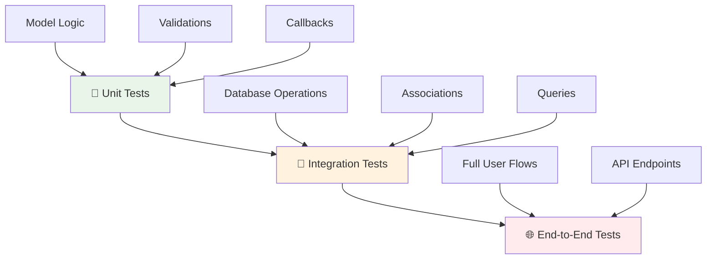
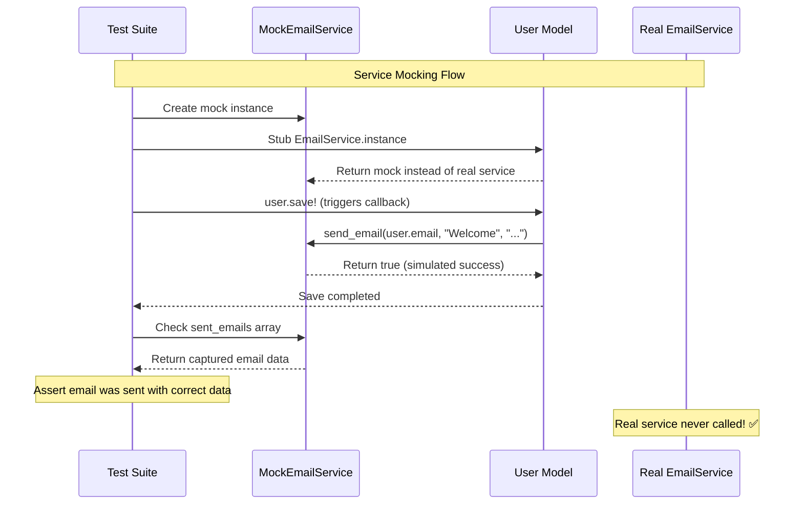
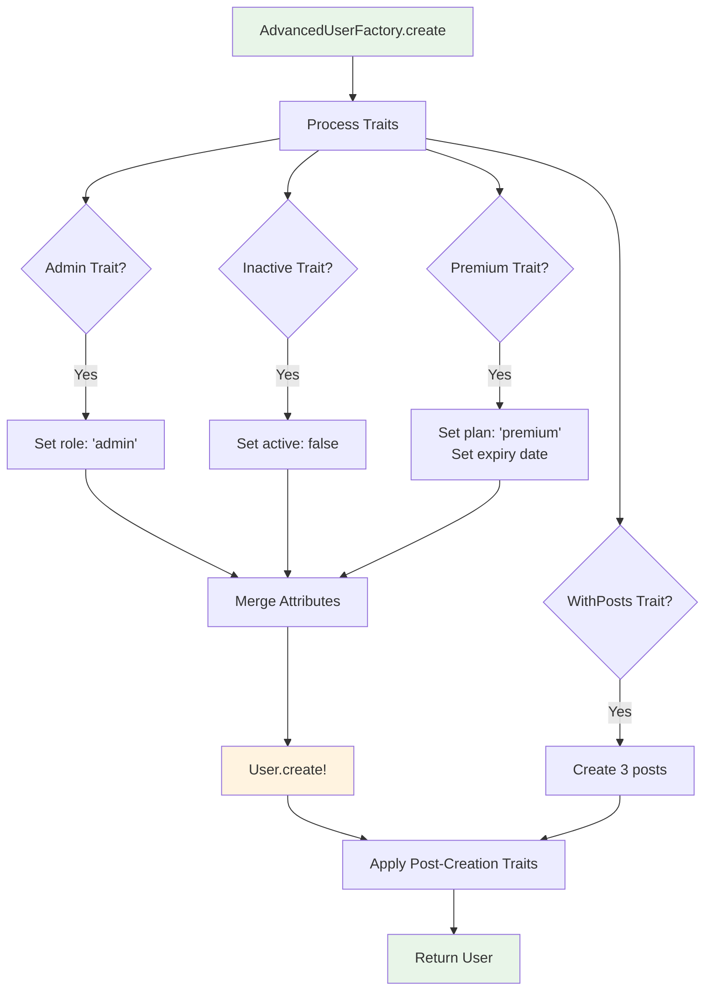
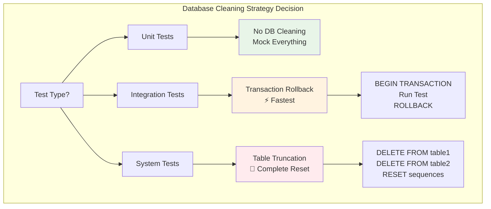

# 🧪 Testing Strategies with CQL

> **Build confidence through comprehensive testing** - Master unit testing, integration testing, and mocking strategies for robust CQL applications

Testing is essential for building reliable applications. This guide covers comprehensive testing strategies for CQL applications, from unit tests to integration tests, with practical examples and best practices.

## 📋 Table of Contents

- [🎯 Testing Fundamentals](#-testing-fundamentals)
- [🏗️ Test Environment Setup](#️-test-environment-setup)
- [🔬 Unit Testing](#-unit-testing)
- [🔗 Integration Testing](#-integration-testing)
- [🎭 Mocking and Stubbing](#-mocking-and-stubbing)
- [🏭 Test Data Factories](#-test-data-factories)
- [📊 Database Testing Patterns](#-database-testing-patterns)
- [⚡ Performance Testing](#-performance-testing)
- [🔄 Testing Relationships](#-testing-relationships)
- [🎨 Testing Best Practices](#-testing-best-practices)

---

## 🎯 Testing Fundamentals

### 🏗️ Testing Pyramid

CQL applications benefit from a well-structured testing pyramid:



### 📊 Test Types Overview

| Test Type       | Speed     | Isolation | Database   | Purpose                      |
| --------------- | --------- | --------- | ---------- | ---------------------------- |
| **Unit**        | ⚡ Fast   | 🔒 High   | ❌ Mocked  | Business logic, validations  |
| **Integration** | 🟡 Medium | 🟡 Medium | ✅ Test DB | Database operations, queries |
| **End-to-End**  | 🐌 Slow   | 🔓 Low    | ✅ Test DB | Full application flows       |

---

## 🏗️ Test Environment Setup

### 🔧 Test Database Configuration

```crystal
# spec/spec_helper.cr
require "spec"
require "../src/myapp"

# Configure test database
TestDB = CQL::Schema.define(
  :test_db,
  adapter: CQL::Adapter::SQLite,
  uri: "sqlite3://:memory:",  # In-memory for fast tests
  pool_size: 1
) do
  # Define your schema here or load from migrations
  table :users do
    primary :id, Int64, auto_increment: true
    column :name, String
    column :email, String
    column :active, Bool, default: true
    column :role, String, default: "user"
    timestamps

    unique_constraint [:email]
  end

  table :posts do
    primary :id, Int64, auto_increment: true
    column :user_id, Int64
    column :title, String
    column :content, String
    column :published, Bool, default: false
    timestamps

    foreign_key :user_id, references: :users
  end
end

# Build test database schema
TestDB.build

# Test cleanup helpers
module TestHelpers
  # Clean database between tests
  def cleanup_database
    TestDB.query("DELETE FROM posts").commit
    TestDB.query("DELETE FROM users").commit
    # Reset auto-increment counters
    TestDB.query("DELETE FROM sqlite_sequence").commit if TestDB.adapter.is_a?(CQL::Adapter::SQLite)
  end

  # Transaction rollback for faster cleanup
  def with_rollback(&block)
    TestDB.transaction do |tx|
      begin
        yield
      ensure
        tx.rollback
      end
    end
  end
end

# Configure Spec hooks
Spec.before_each do
  TestHelpers.cleanup_database
end

Spec.after_suite do
  TestDB.close
end
```

### 🌍 Environment-Specific Configuration

```crystal
# config/test.cr
module TestConfig
  # Test-specific database settings
  DATABASE_CONFIG = {
    adapter: CQL::Adapter::SQLite,
    uri: "sqlite3://:memory:",
    pool_size: 1,
    checkout_timeout: 1.second
  }

  # Use different configs for different test types
  def self.unit_test_db
    CQL::Schema.define(:unit_test, **DATABASE_CONFIG)
  end

  def self.integration_test_db
    CQL::Schema.define(:integration_test, **DATABASE_CONFIG.merge({
      uri: "sqlite3://./tmp/integration_test.db"
    }))
  end

  # Fast test data creation
  def self.enable_fast_tests
    # Disable validations for faster setup
    CQL::ActiveRecord::Base.skip_validations = true

    # Reduce bcrypt rounds for password hashing
    ENV["BCRYPT_COST"] = "1"
  end
end
```

---

## 🔬 Unit Testing

### 🎯 Testing Model Logic

```crystal
# spec/models/user_spec.cr
require "../spec_helper"

describe User do
  describe "validations" do
    it "validates presence of name" do
      user = User.new(name: "", email: "test@example.com")
      user.valid?.should be_false
      user.errors[:name].should contain("can't be blank")
    end

    it "validates email format" do
      user = User.new(name: "Test", email: "invalid-email")
      user.valid?.should be_false
      user.errors[:email].should contain("is invalid")
    end

    it "validates email uniqueness" do
      User.create!(name: "First", email: "test@example.com")

      duplicate_user = User.new(name: "Second", email: "test@example.com")
      duplicate_user.valid?.should be_false
      duplicate_user.errors[:email].should contain("has already been taken")
    end
  end

  describe "business logic" do
    it "has correct full name" do
      user = User.new(name: "John Doe", email: "john@example.com")
      user.full_name.should eq("John Doe")
    end

    it "can be activated" do
      user = User.create!(name: "Test", email: "test@example.com", active: false)

      user.activate!
      user.active?.should be_true
      user.activated_at.should_not be_nil
    end

    it "can be deactivated with reason" do
      user = User.create!(name: "Test", email: "test@example.com", active: true)

      user.deactivate!("Terms violation")
      user.active?.should be_false
      user.deactivation_reason.should eq("Terms violation")
    end
  end

  describe "scopes" do
    before_each do
      User.create!(name: "Active User", email: "active@example.com", active: true)
      User.create!(name: "Inactive User", email: "inactive@example.com", active: false)
      User.create!(name: "Admin", email: "admin@example.com", role: "admin")
    end

    it "finds active users" do
      active_users = User.active.all
      active_users.size.should eq(2)  # Active user + Admin
      active_users.all?(&.active?).should be_true
    end

    it "finds admins" do
      admins = User.admins.all
      admins.size.should eq(1)
      admins.first.role.should eq("admin")
    end
  end
end
```

### 🧪 Testing Callbacks

```crystal
# spec/models/user_callbacks_spec.cr
require "../spec_helper"

describe User do
  describe "callbacks" do
    it "normalizes email before saving" do
      user = User.new(name: "Test", email: "TEST@EXAMPLE.COM")
      user.save!
      user.email.should eq("test@example.com")
    end

    it "sends welcome email after creation" do
      # Mock the mailer
      welcome_mailer = WelcomeMailer.new
      WelcomeMailer.stub(:new).and_return(welcome_mailer)
      welcome_mailer.stub(:deliver).and_return(true)

      user = User.create!(name: "Test", email: "test@example.com")

      # Verify mailer was called
      WelcomeMailer.should have_received(:new)
      welcome_mailer.should have_received(:deliver)
    end

    it "updates timestamps on save" do
      user = User.create!(name: "Test", email: "test@example.com")
      original_updated_at = user.updated_at

      sleep 0.1  # Ensure time difference
      user.update!(name: "Updated Name")

      user.updated_at.should be > original_updated_at
    end
  end
end
```

### 🎨 Testing Custom Validators

```crystal
# spec/validators/email_validator_spec.cr
require "../spec_helper"

describe EmailValidator do
  it "validates correct email formats" do
    valid_emails = [
      "test@example.com",
      "user+tag@domain.co.uk",
      "name.surname@subdomain.example.org"
    ]

    valid_emails.each do |email|
      validator = EmailValidator.new
      validator.validate(email).should be_true
    end
  end

  it "rejects invalid email formats" do
    invalid_emails = [
      "invalid",
      "@example.com",
      "test@",
      "test..test@example.com"
    ]

    invalid_emails.each do |email|
      validator = EmailValidator.new
      validator.validate(email).should be_false
    end
  end
end
```

---

## 🔗 Integration Testing

### 🗄️ Database Integration Tests

```crystal
# spec/integration/user_persistence_spec.cr
require "../spec_helper"

describe "User Persistence" do
  describe "CRUD operations" do
    it "creates and retrieves users" do
      user = User.create!(
        name: "John Doe",
        email: "john@example.com",
        role: "admin"
      )

      # Verify database persistence
      user.id.should_not be_nil
      user.persisted?.should be_true

      # Retrieve from database
      found_user = User.find!(user.id!)
      found_user.name.should eq("John Doe")
      found_user.email.should eq("john@example.com")
      found_user.role.should eq("admin")
    end

    it "updates user attributes" do
      user = User.create!(name: "Original", email: "original@example.com")

      user.update!(name: "Updated", email: "updated@example.com")

      # Verify changes persisted
      reloaded_user = User.find!(user.id!)
      reloaded_user.name.should eq("Updated")
      reloaded_user.email.should eq("updated@example.com")
    end

    it "deletes users" do
      user = User.create!(name: "To Delete", email: "delete@example.com")
      user_id = user.id!

      user.delete!

      # Verify deletion
      User.find(user_id).should be_nil
    end
  end

  describe "complex queries" do
    before_each do
      # Create test data
      active_user = User.create!(name: "Active", email: "active@example.com", active: true)
      inactive_user = User.create!(name: "Inactive", email: "inactive@example.com", active: false)
      admin = User.create!(name: "Admin", email: "admin@example.com", role: "admin")

      # Create posts
      active_user.posts.create!(title: "Active Post", content: "Content")
      admin.posts.create!(title: "Admin Post", content: "Admin content", published: true)
    end

    it "finds users with posts" do
      users_with_posts = User.joins(:posts).distinct.all
      users_with_posts.size.should eq(2)
      users_with_posts.map(&.name).should contain("Active")
      users_with_posts.map(&.name).should contain("Admin")
    end

    it "finds published posts with authors" do
      published_posts = Post.join(:user).where(published: true).all
      published_posts.size.should eq(1)
      published_posts.first.user.name.should eq("Admin")
    end

    it "aggregates user statistics" do
      stats = User.select(
        "COUNT(*) as total_users",
        "COUNT(CASE WHEN active = 1 THEN 1 END) as active_users",
        "COUNT(CASE WHEN role = 'admin' THEN 1 END) as admin_users"
      ).first

      stats["total_users"].should eq(3)
      stats["active_users"].should eq(2)  # Active user + Admin
      stats["admin_users"].should eq(1)
    end
  end
end
```

### 🔄 Transaction Testing

```crystal
# spec/integration/transaction_spec.cr
require "../spec_helper"

describe "Transactions" do
  it "commits successful transactions" do
    User.transaction do
      User.create!(name: "User 1", email: "user1@example.com")
      User.create!(name: "User 2", email: "user2@example.com")
    end

    User.count.should eq(2)
  end

  it "rolls back failed transactions" do
    expect_raises(CQL::RecordInvalid) do
      User.transaction do
        User.create!(name: "Valid User", email: "valid@example.com")
        User.create!(name: "", email: "invalid@example.com")  # This will fail
      end
    end

    # No users should be created due to rollback
    User.count.should eq(0)
  end

  it "handles nested transactions" do
    User.transaction do
      user = User.create!(name: "Outer", email: "outer@example.com")

      User.transaction do
        user.posts.create!(title: "Inner Post", content: "Content")
        user.update!(name: "Updated in Inner")
      end

      user.reload
      user.name.should eq("Updated in Inner")
      user.posts.count.should eq(1)
    end
  end
end
```

---

## 🎭 Mocking and Stubbing

### 🔧 Database Mocking

```crystal
# spec/mocks/mock_database.cr
class MockDatabase
  getter queries : Array(String)
  getter results : Hash(String, Array(NamedTuple))

  def initialize
    @queries = [] of String
    @results = {} of String => Array(NamedTuple)
  end

  def expect_query(sql : String, result : Array(NamedTuple))
    @results[sql] = result
  end

  def query(sql : String)
    @queries << sql
    @results[sql]? || [] of NamedTuple
  end

  def reset
    @queries.clear
    @results.clear
  end
end

# Usage in tests
describe "User finder" do
  it "executes correct SQL for finding by email" do
    mock_db = MockDatabase.new
    mock_db.expect_query(
      "SELECT * FROM users WHERE email = ?",
      [{id: 1, name: "Test", email: "test@example.com"}]
    )

    # Test your finder logic with mock
    User.with_database(mock_db) do
      user = User.find_by_email("test@example.com")
      user.should_not be_nil
    end

    mock_db.queries.should contain("SELECT * FROM users WHERE email = ?")
  end
end
```

### 🎭 Service Mocking



```crystal
# spec/mocks/mock_services.cr
class MockEmailService
  getter sent_emails : Array(NamedTuple)

  def initialize
    @sent_emails = [] of NamedTuple
  end

  def send_email(to : String, subject : String, body : String)
    @sent_emails << {to: to, subject: subject, body: body}
    true
  end

  def reset
    @sent_emails.clear
  end
end

# Integration with models
describe "User email notifications" do
  it "sends welcome email on registration" do
    mock_email = MockEmailService.new
    EmailService.stub(:instance).and_return(mock_email)

    user = User.create!(name: "Test", email: "test@example.com")

    mock_email.sent_emails.size.should eq(1)
    sent_email = mock_email.sent_emails.first
    sent_email[:to].should eq("test@example.com")
    sent_email[:subject].should contain("Welcome")
  end
end
```

### 🕰️ Time Mocking

```crystal
# spec/support/time_helpers.cr
module TimeHelpers
  def travel_to(time : Time, &block)
    original_now = Time.now
    Time.stub(:now).and_return(time)
    Time.stub(:utc).and_return(time)

    begin
      yield
    ensure
      Time.unstub(:now)
      Time.unstub(:utc)
    end
  end

  def travel(duration : Time::Span, &block)
    travel_to(Time.now + duration) { yield }
  end
end

# Usage
describe "User session expiry" do
  include TimeHelpers

  it "expires sessions after 30 days" do
    user = User.create!(name: "Test", email: "test@example.com")
    session = user.create_session!

    travel 31.days do
      session.reload
      session.expired?.should be_true
    end
  end
end
```

---

## 🏭 Test Data Factories

### 🏗️ Simple Factory Pattern

```crystal
# spec/factories/user_factory.cr
class UserFactory
  @@counter = 0

  def self.build(attributes = {} of Symbol => String | Bool)
    @@counter += 1

    default_attributes = {
      name: "User #{@@counter}",
      email: "user#{@@counter}@example.com",
      active: true,
      role: "user"
    }

    merged_attributes = default_attributes.merge(attributes)

    User.new(
      name: merged_attributes[:name].as(String),
      email: merged_attributes[:email].as(String),
      active: merged_attributes[:active].as(Bool),
      role: merged_attributes[:role].as(String)
    )
  end

  def self.create(attributes = {} of Symbol => String | Bool)
    user = build(attributes)
    user.save!
    user
  end

  def self.create_with_posts(post_count = 3, user_attributes = {} of Symbol => String | Bool)
    user = create(user_attributes)

    post_count.times do |i|
      user.posts.create!(
        title: "Post #{i + 1} by #{user.name}",
        content: "Content for post #{i + 1}",
        published: i.even?  # Alternate published status
      )
    end

    user
  end
end

class PostFactory
  @@counter = 0

  def self.build(user : User? = nil, attributes = {} of Symbol => String | Bool)
    @@counter += 1

    default_attributes = {
      title: "Post #{@@counter}",
      content: "Content for post #{@@counter}",
      published: false
    }

    merged_attributes = default_attributes.merge(attributes)

    Post.new(
      title: merged_attributes[:title].as(String),
      content: merged_attributes[:content].as(String),
      published: merged_attributes[:published].as(Bool),
      user_id: user.try(&.id)
    )
  end

  def self.create(user : User? = nil, attributes = {} of Symbol => String | Bool)
    post = build(user, attributes)
    post.save!
    post
  end
end
```

### 🎯 Advanced Factory with Traits



```crystal
# spec/factories/advanced_user_factory.cr
class AdvancedUserFactory
  enum Trait
    Admin
    Inactive
    WithPosts
    Premium
  end

  def self.create(*traits, **attributes)
    user_attributes = build_attributes(traits, attributes)
    user = User.create!(**user_attributes)

    apply_post_creation_traits(user, traits)
    user
  end

  private def self.build_attributes(traits, custom_attributes)
    attributes = {
      name: "Test User",
      email: "test#{Random.rand(10000)}@example.com",
      active: true,
      role: "user"
    }

    traits.each do |trait|
      case trait
      when .admin?
        attributes = attributes.merge({role: "admin"})
      when .inactive?
        attributes = attributes.merge({active: false})
      when .premium?
        attributes = attributes.merge({
          plan: "premium",
          plan_expires_at: 1.year.from_now
        })
      end
    end

    attributes.merge(custom_attributes)
  end

  private def self.apply_post_creation_traits(user, traits)
    traits.each do |trait|
      case trait
      when .with_posts?
        3.times { |i| PostFactory.create(user, title: "Post #{i + 1}") }
      end
    end
  end
end

# Usage
describe "User permissions" do
  it "allows admins to manage users" do
    admin = AdvancedUserFactory.create(:admin)
    regular_user = AdvancedUserFactory.create

    admin.can_manage?(regular_user).should be_true
    regular_user.can_manage?(admin).should be_false
  end

  it "shows posts for users with posts" do
    user_with_posts = AdvancedUserFactory.create(:with_posts)
    user_without_posts = AdvancedUserFactory.create

    user_with_posts.posts.count.should eq(3)
    user_without_posts.posts.count.should eq(0)
  end
end
```

---

## 📊 Database Testing Patterns

### 🔄 Shared Examples

```crystal
# spec/shared/crud_examples.cr
shared_examples "CRUD operations" do |factory_class|
  describe "CRUD operations" do
    it "creates records" do
      record = factory_class.create
      record.persisted?.should be_true
      record.id.should_not be_nil
    end

    it "reads records" do
      record = factory_class.create
      found = record.class.find(record.id!)
      found.should_not be_nil
    end

    it "updates records" do
      record = factory_class.create
      original_updated_at = record.updated_at

      sleep 0.1
      record.touch

      record.updated_at.should be > original_updated_at
    end

    it "deletes records" do
      record = factory_class.create
      record_id = record.id!

      record.delete!

      record.class.find(record_id).should be_nil
    end
  end
end

# Usage
describe User do
  include_examples "CRUD operations", UserFactory
end

describe Post do
  include_examples "CRUD operations", PostFactory
end
```

### 🧹 Database Cleaning Strategies



```crystal
# spec/support/database_cleaner.cr
module DatabaseCleaner
  extend self

  # Strategy 1: Truncation (fastest for small datasets)
  def truncate_all_tables
    TestDB.tables.each do |table_name, _|
      TestDB.query("DELETE FROM #{table_name}").commit
    end
  end

  # Strategy 2: Transaction rollback (fastest overall)
  def with_clean_database(&block)
    TestDB.transaction do |tx|
      begin
        yield
      ensure
        tx.rollback
      end
    end
  end

  # Strategy 3: Selective cleanup (for specific test isolation)
  def clean_tables(*table_names)
    table_names.each do |table_name|
      TestDB.query("DELETE FROM #{table_name}").commit
    end
  end
end

# Configure for different test types
module TestConfig
  def self.configure_database_cleaning
    case ENV["TEST_TYPE"]?
    when "unit"
      # Mock everything - no database cleaning needed
    when "integration"
      # Use transaction rollback for speed
      Spec.around_each { |example| DatabaseCleaner.with_clean_database { example.run } }
    when "system"
      # Use truncation for full cleanup
      Spec.after_each { DatabaseCleaner.truncate_all_tables }
    end
  end
end
```

---

## ⚡ Performance Testing

### 📊 Query Performance Tests

```crystal
# spec/performance/query_performance_spec.cr
require "../spec_helper"
require "benchmark"

describe "Query Performance" do
  before_all do
    # Create test data
    1000.times do |i|
      user = UserFactory.create(name: "User #{i}")
      rand(0..5).times { PostFactory.create(user) }
    end
  end

  it "finds users efficiently" do
    result = Benchmark.measure do
      100.times { User.where(active: true).limit(10).all }
    end

    # Should complete within reasonable time
    result.total.should be < 1.0  # 1 second
  end

  it "avoids N+1 queries with includes" do
    query_count = 0

    # Count queries
    original_query = TestDB.method(:query)
    TestDB.define_method(:query) do |sql|
      query_count += 1
      original_query.call(sql)
    end

    # Test eager loading
    users = User.join(:posts).limit(10).all
    users.each { |user| user.posts.size }

    # Should be 2 queries: users + posts
    query_count.should be <= 3  # Allow some flexibility
  end

  it "handles large result sets efficiently" do
    memory_before = GC.stats.heap_size

    # Process in batches
    User.find_in_batches(batch_size: 100) do |batch|
      batch.each { |user| user.name.upcase }
    end

    memory_after = GC.stats.heap_size
    memory_used = memory_after - memory_before

    # Should not use excessive memory
    memory_used.should be < 10_000_000  # 10MB limit
  end
end
```

### 🔧 Load Testing

```crystal
# spec/performance/load_test_spec.cr
require "../spec_helper"

describe "Load Testing" do
  it "handles concurrent user creation" do
    channel = Channel(User?).new
    concurrent_users = 50

    # Spawn concurrent operations
    concurrent_users.times do
      spawn do
        begin
          user = UserFactory.create
          channel.send(user)
        rescue ex
          puts "Error creating user: #{ex.message}"
          channel.send(nil)
        end
      end
    end

    # Collect results
    successful_users = 0
    failed_users = 0

    concurrent_users.times do
      result = channel.receive
      if result
        successful_users += 1
      else
        failed_users += 1
      end
    end

    # Most operations should succeed
    success_rate = successful_users.to_f / concurrent_users
    success_rate.should be >= 0.9  # 90% success rate
  end
end
```

---

## 🔄 Testing Relationships

### 🔗 Association Testing

```crystal
# spec/models/associations_spec.cr
require "../spec_helper"

describe "User associations" do
  describe "has_many :posts" do
    it "returns user's posts" do
      user = UserFactory.create
      post1 = PostFactory.create(user)
      post2 = PostFactory.create(user)
      other_post = PostFactory.create  # Different user

      user_posts = user.posts.all
      user_posts.should contain(post1)
      user_posts.should contain(post2)
      user_posts.should_not contain(other_post)
    end

    it "creates posts through association" do
      user = UserFactory.create

      post = user.posts.create!(title: "New Post", content: "Content")

      post.user_id.should eq(user.id)
      user.posts.all.should contain(post)
    end

    it "deletes posts when user is deleted with dependent: :destroy" do
      user = UserFactory.create
      post = PostFactory.create(user)
      post_id = post.id!

      user.delete!

      Post.find(post_id).should be_nil
    end
  end

  describe "belongs_to :user" do
    it "returns the associated user" do
      user = UserFactory.create
      post = PostFactory.create(user)

      post.user.should eq(user)
    end

    it "handles orphaned posts" do
      user = UserFactory.create
      post = PostFactory.create(user)
      user.delete!

      post.reload
      post.user.should be_nil
    end
  end
end

describe "Many-to-many associations" do
  before_each do
    # Set up many-to-many through tags
    TestDB.query(<<-SQL).commit
      CREATE TABLE IF NOT EXISTS tags (
        id INTEGER PRIMARY KEY,
        name TEXT NOT NULL
      )
    SQL

    TestDB.query(<<-SQL).commit
      CREATE TABLE IF NOT EXISTS post_tags (
        post_id INTEGER,
        tag_id INTEGER,
        PRIMARY KEY (post_id, tag_id)
      )
    SQL
  end

  it "manages many-to-many relationships" do
    post = PostFactory.create
    tag1 = Tag.create!(name: "Crystal")
    tag2 = Tag.create!(name: "Programming")

    # Add tags to post
    post.tags << tag1
    post.tags << tag2

    # Verify associations
    post.tags.all.should contain(tag1)
    post.tags.all.should contain(tag2)
    tag1.posts.all.should contain(post)
  end
end
```

---

## 🎨 Testing Best Practices

### ✅ **Do This:**

**Test Organization:**

```crystal
# Group related tests logically
describe User do
  describe "validations" do
    # Test all validations together
  end

  describe "business logic" do
    # Test domain-specific methods
  end

  describe "associations" do
    # Test relationships
  end
end
```

**Clear Test Names:**

```crystal
# ✅ Descriptive test names
it "sends welcome email after successful registration"
it "prevents duplicate email addresses across users"
it "calculates subscription expiry based on plan duration"

# ❌ Vague test names
it "works correctly"
it "tests email"
it "validates user"
```

**Test Data Management:**

```crystal
# ✅ Use factories for consistent test data
user = UserFactory.create(:admin, name: "Custom Name")

# ✅ Create minimal data for each test
it "validates email format" do
  user = User.new(name: "Test", email: "invalid")
  # Only test what's needed
end

# ❌ Don't rely on external data
user = User.find(1)  # Brittle - user might not exist
```

**Assertions:**

```crystal
# ✅ Specific assertions
user.errors[:email].should contain("is invalid")
users.map(&.name).should eq(["Alice", "Bob", "Charlie"])

# ❌ Vague assertions
user.valid?.should be_false  # Why is it invalid?
users.empty?.should be_false  # How many users?
```

### ❌ **Avoid This:**

**Database Pollution:**

```crystal
# ❌ Don't let tests affect each other
it "creates user" do
  User.create!(name: "Test", email: "test@example.com")
end

it "finds user by email" do
  User.find_by_email("test@example.com")  # Depends on previous test
end
```

**Slow Tests:**

```crystal
# ❌ Don't create unnecessary data
it "validates email format" do
  user = UserFactory.create_with_posts(100)  # Overkill for email validation
end

# ❌ Don't use real external services
it "sends email" do
  EmailService.send_real_email("test@example.com")  # Slow and unreliable
end
```

**Brittle Tests:**

```crystal
# ❌ Don't test implementation details
it "calls save method" do
  user = User.new(name: "Test", email: "test@example.com")
  user.should receive(:save)
  user.register!
end

# ✅ Test behavior instead
it "persists user on registration" do
  user = User.new(name: "Test", email: "test@example.com")
  user.register!
  user.persisted?.should be_true
end
```

---

## 🎯 Testing Checklist

### 📋 Model Testing Checklist

- [ ] **Validations** - All validation rules tested
- [ ] **Callbacks** - Before/after hooks verified
- [ ] **Scopes** - Named scopes return correct data
- [ ] **Business Logic** - Domain methods work correctly
- [ ] **Associations** - Relationships function properly
- [ ] **Edge Cases** - Boundary conditions handled

### 📋 Integration Testing Checklist

- [ ] **CRUD Operations** - Create, read, update, delete work
- [ ] **Complex Queries** - Joins, aggregations, subqueries
- [ ] **Transactions** - Rollback and commit behavior
- [ ] **Database Constraints** - Foreign keys, unique constraints
- [ ] **Performance** - No N+1 queries, reasonable response times

### 📋 Test Quality Checklist

- [ ] **Independent** - Tests don't depend on each other
- [ ] **Isolated** - Each test has clean state
- [ ] **Fast** - Unit tests run quickly
- [ ] **Reliable** - Tests pass consistently
- [ ] **Maintainable** - Easy to understand and update
- [ ] **Comprehensive** - High test coverage

---

## 🚀 Advanced Testing Patterns

### 🎭 Contract Testing

```crystal
# spec/contracts/user_contract_spec.cr
# Test the contract between User and external services

describe "User Service Contract" do
  it "conforms to API expectations" do
    user = UserFactory.create

    # Test serialization contract
    json = user.to_json
    parsed = JSON.parse(json)

    # Verify required fields are present
    parsed["id"].should_not be_nil
    parsed["name"].should be_a(String)
    parsed["email"].should be_a(String)
    parsed["created_at"].should_not be_nil
  end
end
```

### 🔄 Property-Based Testing

```crystal
# spec/property/user_properties_spec.cr
require "quickcheck"

describe "User Properties" do
  it "always generates valid users with factory" do
    QuickCheck.check do |qc|
      # Generate random valid attributes
      name = qc.ascii_string(1, 50)
      email = "#{qc.ascii_string(1, 20)}@example.com"

      user = UserFactory.build(name: name, email: email)
      user.valid?.should be_true
    end
  end
end
```

---

> 🧪 **Testing is not about finding bugs, it's about preventing them** - Comprehensive testing strategies help you build confidence in your code and catch issues before they reach production.

**Next Steps:**

- **[Security Guide →](security-guide.md)** - Secure your tested code
- **[Performance Guide →](performance-optimization.md)** - Test performance optimizations
- **[Deployment Guide →](deployment-guide.md)** - Test in production-like environments
